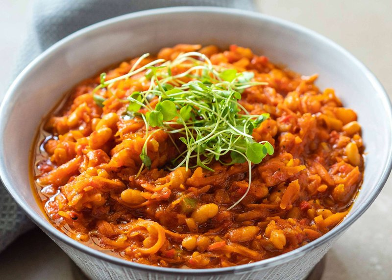

# Chakalaka

*South Africa's spiced relish: onions, peppers, carrots and chillies fried hot with curry powder, sweetened with baked beans and tomato.*

**Serves:** 6 as a side

**Prep Time:** 15 minutes

**Cook Time:** 30 minutes

## Overview
Onion is softened in oil; garlic, ginger and curry powder bloom. Carrots cook briefly to tender-crisp. Peppers (red and green) and chillies join. Tomatoes simmer everything down. Tinned baked beans go in last with a splash of vinegar to balance. Eaten warm or at room temperature; tastes better the next day.

## Ingredients

- 4 tablespoons vegetable oil
- 2 onions (large, chopped)
- 6 garlic cloves (crushed)
- 4 cm ginger (grated)
- 3 carrots (medium, coarsely grated)
- 2 red bell peppers (chopped)
- 1 green bell pepper (chopped)
- 2-3 long green chillies (sliced)
- 2 tablespoons mild curry powder
- 1 teaspoon ground turmeric
- 1 teaspoon paprika
- 1 teaspoon dried thyme
- 400 g tin chopped tomatoes
- 1 tablespoon tomato paste
- 400 g tin baked beans (in tomato sauce - the standard supermarket kind)
- 2 tablespoons cider vinegar
- 1 ½ teaspoons salt
- ½ teaspoon black pepper
- A small bunch flat-leaf parsley (or coriander, chopped)

## Method

### Stage 1 - Aromatics
1. Heat the oil in a wide heavy pan over medium heat.
1. Cook the onions 8 minutes until soft and golden.
1. Stir in the garlic and ginger; cook 1 minute.

### Stage 2 - Vegetables
1. Add the grated carrots; cook 4-5 minutes until starting to soften.
1. Add the bell peppers and green chillies; cook 4 minutes.

### Stage 3 - Spice
1. Stir in the curry powder, turmeric, paprika and thyme; cook 1 minute.
1. Add the tomato paste; stir 1 minute.

### Stage 4 - Tomatoes
1. Pour in the tinned tomatoes; add the salt and pepper.
1. Cook 12-15 minutes over medium-low heat until the mixture has reduced and the vegetables are tender but still hold shape.

### Stage 5 - Baked beans and finish
1. Stir in the baked beans (with their sauce) and the vinegar.
1. Cook 3-4 minutes more, gently - don't break up the beans.
1. Off the heat, stir in the parsley.
1. Taste; adjust salt, vinegar and chilli.

### Stage 6 - Serve
1. Eat warm, at room temperature, or cold from the fridge.
1. Pile alongside bobotie, braai meats, boerewors, or pap. Or spread on toast.

## Notes
- **Baked beans are essential:** This trips up first-time cooks. Yes, supermarket tinned baked beans in tomato sauce. They give chakalaka its characteristic texture and slight sweetness. Don't substitute fancy beans.
- **Make-ahead is better:** Chakalaka tastes deeper after a night in the fridge. Make a day ahead if you can.
- **Chilli amount:** Two chillies is moderate. Add a third for a properly Joburg version; reduce for a Cape Town gentler one.

## Storage
- Keeps 5 days refrigerated; flavour deepens.
- Freezes 3 months.
