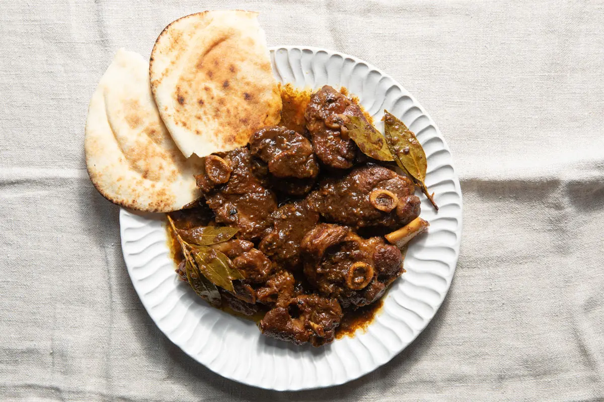

# Denningvleis

*Cape Malay lamb stew: cubed lamb slow-cooked in tamarind, vinegar, brown sugar, allspice, cloves and bay till the sauce goes deep mahogany and sweet-sour. The Cape Town funeral dish that's now a Sunday-lunch celebration across the Western Cape.*

**Serves:** 6

**Prep Time:** 25 minutes

**Cook Time:** 2 hours

## Overview
Denningvleis is the deeply traditional Cape Malay lamb stew of Cape Town and the broader Western Cape, originally a funeral and remembrance dish (the name comes from "djinn" or "ginie", a reference to its ceremonial role) that has long since become the Sunday-lunch celebration of Cape Malay families across South Africa: cubed lamb shoulder slow-cooked in a sweet-sour sauce of tamarind, brown sugar, vinegar, allspice, cloves, bay leaves and onion till the meat goes properly silky tender and the sauce reduces to a deep mahogany glaze that coats every cube. The dish bridges multiple culinary inheritances: the slow-braising technique and the meat cut come from Dutch farmer cooking; the sweet-sour balance and the allspice-clove-bay aromatics come from Indonesian and Malay sources via the enslaved cooks brought to the Cape from Java and Malaya in the 17th century; the tamarind acidic note comes from Indian-Cape-Malay fusion. The result is a uniquely South African dish that tastes like no other lamb stew in the world. Three details define proper denningvleis. First, tamarind. The signature acidic-sour note comes from tamarind paste (the pulp from the seedpod of Tamarindus indica, available from Indian, Asian and African grocers). Tamarind has a darker fruitier sourness than lemon or vinegar; nothing else gives quite the same flavour. Second, the spice trio: allspice, cloves, bay leaves. These three are what give the stew its distinctive aromatic profile. Allspice (the Caribbean spice, also called pimento or Jamaican pepper) is essential and substitutes don't work; use whole berries crushed lightly in a mortar. Cloves and bay leaves both go in whole. Third, the long slow cook. Lamb shoulder needs 2 hours of gentle braising for the connective tissue to dissolve into a silky stew; rushing gives you chewy lamb in a thin sauce. Serve over yellow rice (turmeric-and-raisin rice, the Cape Malay carb of choice), or with mashed potato for a non-traditional pairing.

## Ingredients

### Lamb
- 1.2 kg lamb shoulder (cut into 4 cm cubes; on the bone is more flavourful but boneless is easier to handle)
- 2 teaspoons fine sea salt
- 1 teaspoon ground black pepper

### Sauté base
- 4 tablespoons vegetable oil (or duck fat for a richer version)
- 3 large onions (finely sliced)
- 6 garlic cloves (crushed)
- 1 thumb (4 cm) fresh ginger (finely grated)

### The signature spices
- 2 teaspoons whole allspice berries (lightly crushed in a mortar; or 1 ½ teaspoons ground allspice)
- 6 whole cloves
- 6 bay leaves (fresh ideally; or dried)
- 1 small cinnamon stick
- 1 teaspoon black peppercorns (crushed)

### The sweet-sour element
- 3 tablespoons tamarind paste (from a jar of Indian or Asian-style smooth tamarind; or 4 tablespoons tamarind concentrate mixed with 2 tablespoons hot water)
- 4 tablespoons soft brown sugar (or muscovado; the darker the better)
- 4 tablespoons malt vinegar (or apple cider vinegar)

### Liquid and finishing
- 500 ml beef stock (or water with a stock cube)
- 1 tablespoon plain flour (for slight thickening at the end, optional)
- 2 tablespoons cold water (to mix with the flour)

### To finish
- 1 lemon (juice; for final brightening)
- Salt and pepper (to taste)

### To serve
- Yellow rice (turmeric raisin rice; or plain basmati)
- Sambals: chopped tomato-and-onion relish
- A bowl of chopped fresh coriander

## Method

### Stage 1 - Brown the lamb
1. Pat the lamb cubes dry; season with salt and pepper.
2. Heat 3 tablespoons of the oil in a wide heavy lidded casserole over high heat till shimmering.
3. Brown the lamb in 2 batches for 4-5 minutes per batch, turning to colour most sides deeply.
4. Lift the browned lamb into a bowl and set aside.

### Stage 2 - Cook the onions slow
1. Reduce the heat to medium-low.
2. Add the remaining 1 tablespoon of oil to the pan along with the sliced onions.
3. Cook the onions for 20-25 minutes, stirring every 5 minutes, till they collapse into a soft sweet golden mass. The slow onion cook is essential to the dish; rushing it loses the proper sweet base.
4. If they threaten to burn, drop the heat and add a splash of water.

### Stage 3 - Add the aromatics
1. Stir in the crushed garlic and grated ginger; cook 30 seconds.
2. Add the crushed allspice berries, whole cloves, bay leaves, cinnamon stick and crushed peppercorns.
3. Cook for 1 minute, stirring, till the spices darken the oil and the kitchen smells deeply aromatic.

### Stage 4 - Add the sweet-sour
1. Stir in the tamarind paste; cook 1 minute till it darkens.
2. Add the brown sugar; stir till it melts into the onion-tamarind mass.
3. Pour in the malt vinegar; the mixture will hiss and bubble. Cook 1-2 minutes for the vinegar to soften and meld with the sugar.

### Stage 5 - Add the lamb and braise
1. Return the browned lamb and any resting juices to the pan.
2. Stir to coat the meat in the spiced sweet-sour onion paste.
3. Pour in the beef stock; the liquid should just cover the lamb.
4. Bring to a gentle simmer, cover with the lid slightly ajar, and cook 90 minutes on low heat.
5. Stir every 20 minutes; the sauce should darken and thicken.

### Stage 6 - Check and finish
1. After 90 minutes, the lamb should be properly tender and starting to fall apart.
2. Lift the lid off entirely and continue simmering 15-20 minutes more uncovered to reduce the sauce. The proper finish is a thick mahogany glaze that coats the meat, not a thin braising liquid.
3. If the sauce isn't thickening to your liking, mix the flour with the cold water into a slurry and stir into the simmering sauce; cook 3-4 minutes more till glossy.

### Stage 7 - Final adjustments
1. Remove the cinnamon stick (if you can find it among the meat).
2. Squeeze in the lemon juice; stir.
3. Taste; the stew should be properly sweet-sour, deeply aromatic, with the lamb spoonable tender. Adjust salt, pepper, or another splash of vinegar if needed.

### Stage 8 - Serve
1. Spoon a generous portion of yellow rice (or plain basmati) into wide bowls or onto plates.
2. Ladle the denningvleis over, with plenty of the mahogany sauce.
3. Place a small bowl of chopped tomato-and-onion sambal alongside.
4. Scatter chopped fresh coriander over the top.
5. The traditional Cape Malay table serves with extra sliced banana and a small dish of grated coconut on the side for sweetness.

## Notes
- **Tamarind is the signature:** without tamarind, denningvleis tastes like a generic sweet-sour lamb stew. The dark fruity acidity is the defining note. Indian, Asian and African grocers all stock smooth tamarind paste in jars. If you genuinely can't find it, the closest substitute is 3 tablespoons of pomegranate molasses; the flavour profile shifts but works.
- **Allspice is essential:** the warm, faintly clove-cinnamon-pepper note of allspice is what gives denningvleis its distinctive aromatic profile. Don't substitute with mixed spice (which is a different blend). Whole allspice berries crushed lightly are best; ground allspice from a fresh tin works.
- **Long slow onion cook:** the 20-25 minutes of slow cooking onions at the start is what gives the stew its proper sweet base. Skipping or rushing this gives a thin one-note flavour. The onions should collapse to a soft sweet golden mass, not just soften.
- **Lamb shoulder for the right tenderness:** lamb shoulder (or neck) has the connective tissue that dissolves over slow braising into a silky finish. Leg of lamb is leaner and goes dry; loin is wrong (too tender for slow stewing). Shoulder is the cut.
- **Sweet and sour balance:** the dish lives or dies on the balance. Too sweet and it tastes like a fruity stew; too sour and it bites. Taste as you cook and adjust with brown sugar, vinegar or tamarind. The proper balance is recognisably sweet-and-sour but neither dominates.

## Variations
**Beef denningvleis:** swap lamb for beef shin or chuck cubed; cook 30 minutes longer (2.5 hours total) for proper tenderness. Slightly heavier flavour but works.
**Denningvleis with apricots:** add 100 g of dried apricots to the stew in the last 30 minutes of cooking; gives an extra sweet-fruity dimension. Common Cape Malay variation.
**Denningvleis with potato:** add 2 large potatoes (cut into 3 cm cubes) in the last 35 minutes; turns the stew into a one-pot meal that doesn't need a rice base.
**Denningvleis dry-style:** reduce the liquid significantly and serve as drier curry-style meat with rice; some Cape Malay families prefer this. Use only 250 ml stock and reduce uncovered hard at the end.

## Serving
Over yellow rice (Cape Malay turmeric-raisin rice) in deep bowls; a small chopped tomato-and-onion sambal on the side; a chopped fresh coriander garnish. Drink: a Cape rosé, a glass of Pinotage, or sweet rooibos tea after the meal.

## Storage
- Keeps refrigerated 5 days; the flavour deepens significantly overnight. Day-after denningvleis is considered better than day-of by many Cape Malay cooks.
- Freezes 3 months. Defrost in the fridge overnight and reheat gently.
- Don't microwave; the sauce splits.
- The sauce on its own is excellent ladled over rice as a simple meal if you've eaten all the meat; the depth of flavour is properly meal-worthy.
