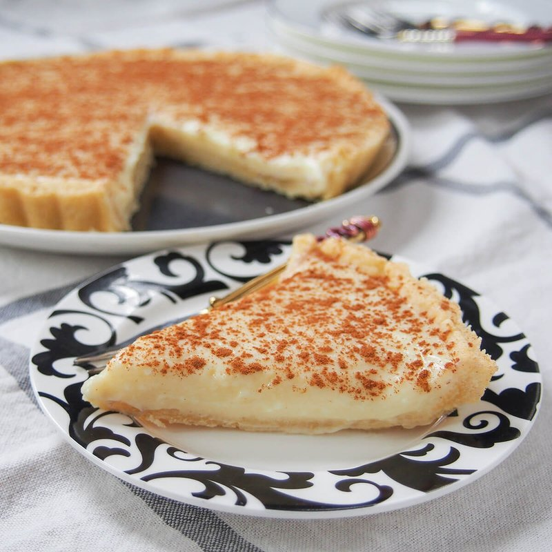

# Melktert

*South Africa's milk tart: a thin pastry shell holding a delicate milk-and-egg custard set firm enough to slice, dusted heavily with cinnamon.*

**Serves:** 8

**Prep Time:** 30 minutes (plus 1 hour chilling)

**Cook Time:** 30 minutes

## Overview
A sweet shortcrust pastry rolls thin and lines a 24 cm tart tin; blind-bakes briefly to set the base. Milk warms with butter and a cinnamon stick; sugar dissolves; cornflour and flour whisk in to form a thin custard; eggs temper in off the heat. The custard pours into the warm shell; bakes briefly until just set; cools to room temperature; gets a heavy dusting of cinnamon before serving. Sometimes served chilled.

## Ingredients

### Pastry
- 200 g plain flour
- 100 g cold unsalted butter (cubed)
- 50 g caster sugar
- 1 egg yolk (large)
- A pinch of salt
- 1-2 tablespoons cold water

### Custard
- 700 ml whole milk
- 30 g unsalted butter
- 1 cinnamon stick
- 100 g caster sugar
- 30 g cornflour
- 30 g plain flour
- 3 eggs (large, lightly beaten)
- 1 teaspoon vanilla extract
- A pinch of salt

### Topping
- 1 tablespoon ground cinnamon
- 1 tablespoon caster sugar (optional, mixed with cinnamon)

## Method

### Stage 1 - Pastry
1. Rub the butter into the flour, sugar and salt until breadcrumb texture.
1. Mix in the egg yolk and just enough cold water for the dough to come together.
1. Wrap and chill 30 minutes.

### Stage 2 - Blind bake
1. Heat the oven to 180°C (160°C fan).
1. Roll the pastry to 3 mm; line a 24 cm fluted tart tin (with removable base); trim with overhang.
1. Prick the base with a fork; chill 15 minutes.
1. Line with parchment and baking beans; bake 15 minutes.
1. Remove parchment and beans; bake 5 minutes more until pale gold.
1. Set aside (keep the oven on).

### Stage 3 - Infuse the milk
1. Heat the milk, butter and cinnamon stick in a saucepan to just below boiling.
1. Off the heat, rest 10 minutes.
1. Discard the cinnamon stick.

### Stage 4 - Custard
1. Whisk the sugar, cornflour, flour and salt in a bowl.
1. Whisk in 200 ml of the warm milk to a smooth slurry.
1. Pour the slurry slowly back into the saucepan with the rest of the milk, whisking constantly.
1. Cook over medium heat 4-5 minutes, whisking, until thickened to a thin custard.

### Stage 5 - Temper the eggs
1. Off the heat, slowly pour the hot custard over the beaten eggs while whisking continuously (this prevents scrambling).
1. Return the mixture to the pan over the lowest heat; cook 1 more minute, whisking.
1. Off the heat, stir in the vanilla.

### Stage 6 - Bake
1. Pour the custard into the warm pastry shell.
1. Bake 18-22 minutes until just set with a faint wobble in the centre - don't overbake or the surface cracks.

### Stage 7 - Cool and dust
1. Cool to room temperature (the custard firms as it cools).
1. Just before serving, dust generously with cinnamon (or cinnamon-sugar mix) using a fine sieve.

### Stage 8 - Serve
1. Cut wedges; serve at room temperature or lightly chilled.
1. Eats well with a cup of strong rooibos tea.

## Notes
- **Set, not firm:** Melktert custard should be sliceable but still wobble. Cooking it like a heavy egg custard ruins it.
- **Cinnamon at the table:** A heavy dust just before serving is correct - it's part of the flavour, not just decoration. Don't bake it on (it bitters).
- **Rooibos pairing:** Slightly oxidised rooibos is the South African choice; English breakfast tea also works.

## Storage
- Keeps 3 days refrigerated; the cinnamon may sink slightly. Re-dust before serving each time if needed.
