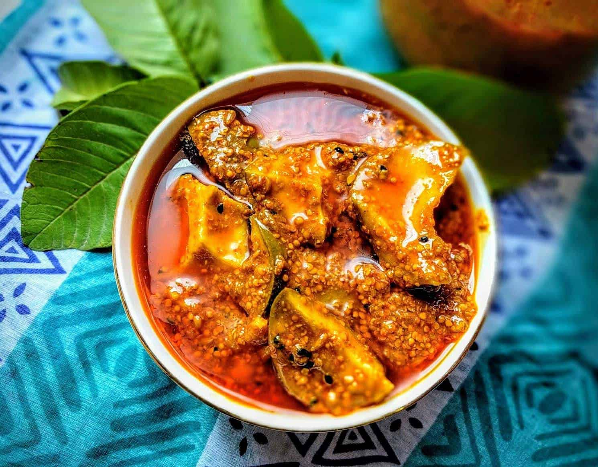

# Atchar

*South Africa's green mango pickle: grated unripe mango fermented with chilli, garlic, ginger, mustard seeds, fenugreek and oil till the pickle goes properly sharp and aromatic. Brought to South Africa by Indian indentured labour in the 19th century and now a permanent fixture in every South African pantry.*

**Serves:** Makes about 1 litre (a good jar for the household pantry)

**Prep Time:** 45 minutes (plus 24-48 hours fermenting and at least 1 week curing)

**Cook Time:** 10 minutes

## Overview
Atchar is South Africa's signature pickled condiment, brought to the country by Indian indentured labourers in the 19th century who came to work the sugar cane fields of Natal. The South African version is distinctive: grated unripe green mango fermented with fresh red chillies, garlic, ginger, mustard seeds, fenugreek seeds, turmeric and a generous quantity of vegetable oil till the pickle goes properly sharp, aromatic and slightly tangy. Every household has its own recipe; the universal element is that atchar appears on the table at almost every meal. Brilliant with bunny chow, dressed onto curry plates, stuffed into vetkoek (fried bread), or spread inside cheese sandwiches. Use firm unripe green mangoes; ripe yellow mangoes give a sweet sticky pickle that isn't atchar. Available from Indian and African grocers. Proper atchar wants at least a week of curing in the jar before it's ready; the flavours need time to marry and the gentle fermentation develops the right tang.

## Ingredients

### Mango
- 1 kg unripe green mangoes (firm, hard, properly green; not the slightly-yellow-tinged "ready in 3 days" supermarket ones)

### Aromatics
- 6 garlic cloves (crushed)
- 1 thumb (4 cm) fresh ginger (finely grated)
- 6 fresh red chillies (bird's eye, finger chillies, or Indian-style red chillies; deseeded for milder, or with seeds for fierce; finely chopped)

### Spices
- 3 tablespoons black mustard seeds
- 1 tablespoon fenugreek seeds
- 2 tablespoons whole coriander seeds (optional, traditional)
- 1 tablespoon ground turmeric
- 2 teaspoons chilli powder (Kashmiri for colour and gentle heat; or hot chilli powder if you want extra heat)
- 1 ½ tablespoons fine sea salt

### Oil and finishing
- 250 ml vegetable oil (or mustard oil for a more pungent traditional version; sunflower oil works well)
- 100 ml white wine vinegar (or apple cider vinegar)
- 2 tablespoons brown sugar

## Method

### Stage 1 - Prepare the mangoes
1. Wash the mangoes thoroughly under cold water.
2. Pat dry with a clean cloth.
3. Peel each mango with a sharp knife or vegetable peeler.
4. Stand each mango upright; cut downward along the flat stone to remove the flesh in large pieces.
5. Cut the flesh into 1.5 cm cubes (smaller than for an Indian pickle; the South African style favours small dice over long shreds).
6. Tip the diced mango into a wide non-reactive bowl.
7. Sprinkle the salt over and toss thoroughly.

### Stage 2 - Salt cure overnight
1. Cover the bowl with a clean cloth.
2. Leave at room temperature for 12-24 hours. The salt draws moisture out of the mango; you'll see liquid collecting in the bowl.
3. After 12-24 hours, drain the mango pieces in a colander; press lightly to release any extra liquid (but don't rinse).

### Stage 3 - Toast and grind the dry spices
1. In a small dry pan over medium heat, toast the mustard seeds, fenugreek seeds and whole coriander seeds (if using) for 1-2 minutes, shaking the pan, till they release their aroma and the mustard seeds start to pop.
2. Tip immediately into a mortar or spice grinder.
3. Cool slightly, then grind coarsely; you want some texture, not a fine powder. The mustard and fenugreek should still be visible as small pieces.

### Stage 4 - Build the spice paste
1. Heat the vegetable oil in a wide saucepan over medium heat.
2. Add the crushed garlic and grated ginger; cook 1 minute till fragrant but not browned.
3. Add the chopped fresh chillies; cook 30 seconds.
4. Stir in the toasted ground spices, ground turmeric and chilli powder.
5. Cook 30 seconds, stirring constantly, till the oil turns deep yellow-red and the kitchen smells properly spiced.
6. Pour in the white wine vinegar; stir well (the mixture will hiss and bubble).
7. Add the brown sugar; stir till dissolved.
8. Cook for another 2-3 minutes till the spiced oil-and-vinegar mixture goes glossy.

### Stage 5 - Combine
1. Take the spiced oil off the heat.
2. Add the salted-and-drained mango cubes to the warm spiced oil.
3. Stir thoroughly so every piece of mango is coated.

### Stage 6 - Pack and cure
1. Tip the atchar mixture into a clean wide-mouthed glass jar (about 1 litre capacity), pressing down with a clean spoon to remove any air pockets.
2. The oil should rise to the surface and cover the mango pieces. If there's not enough oil to cover, add another tablespoon or two of warm vegetable oil on top.
3. Seal the jar tightly.
4. Leave at room temperature for 48 hours; the flavours start to develop and gentle fermentation begins.
5. Then move to the refrigerator (or a cool dark cupboard if your kitchen runs cool).
6. Cure for at least 1 week before serving. The atchar improves dramatically over the first 2-3 weeks; the mango softens slightly, the spices marry, and the tang develops.

### Stage 7 - Serve
1. Take the jar out of the fridge 15 minutes before serving so the oil thins out.
2. Use a clean spoon to dish out the desired amount.
3. Serve in a small bowl alongside the main meal, or directly on the plate.

## Notes
- **Properly green mangoes are non-negotiable:** the dish doesn't work with ripe or even half-ripe mangoes. The fruit must be properly hard and green, with the tart sour character of unripe mango. Indian and African grocers stock these reliably; supermarket "ripe in 3 days" mangoes are too ripe already.
- **Salt cure pulls out moisture:** the overnight salt cure is what gives atchar its proper texture. Skipping it leaves you with mango pickle in a watery brine; doing it gives the proper concentrated firm-fleshed mango that holds up to the long curing.
- **Toasted whole spices then ground:** the technique releases the aromatic oils. Pre-ground spices would give a flatter result. Toast briefly, grind coarse, use immediately.
- **Mustard oil for the most authentic version:** Indian-South-African atchar traditionally uses mustard oil, which has a sharp pungent character that defines the pickle. Mustard oil sold for cooking is widely available at Indian grocers but is sometimes labelled "for external use only" in the UK and US (a regulatory quirk); look for the food-grade version. Vegetable oil works fine; the pungency is just less.
- **At least 1 week curing:** the atchar genuinely needs time. A freshly made atchar tastes like raw spices and salt-cured mango; properly cured atchar is unified, tangy and complex. Wait the week; don't be tempted to taste-test before then.

## Variations
**Hot atchar:** double the chilli powder and use 10 hot chillies instead of 6; gives the proper fierce Durban-style atchar.
**Carrot-and-mango atchar:** add 200 g of julienned carrot to the salted mango; the carrot adds colour and a slight sweetness. Common South African variation.
**Lemon atchar:** swap the mango for whole baby lemons or limes (8-10, quartered and salted overnight); a Cape Malay variant.
**Vegetable atchar:** mixed vegetables (carrot, cauliflower, green bean) salted and pickled the same way; the all-vegetable version, common at South African Indian shops.

## Serving
A small spoonful on the side of almost any South African plate: with bunny chow (essential), inside vetkoek with savoury mince, on roti rolls, with pap and stew, inside cheese-and-tomato sandwiches, with a curry plate, on toast for breakfast. Just a small amount; atchar is intense.

## Storage
- Keeps refrigerated 3-6 months in a sealed jar; the gentle fermentation continues slowly in the cold and the flavour deepens.
- Use a clean dry spoon every time (don't cross-contaminate; that shortens the shelf life).
- The oil layer on top is preservative; keep it intact. Top up with fresh warm oil if it's dropped below the mango surface.
- Don't freeze; the texture goes off.
- After 6 months the atchar may go very soft and quite tangy; still safe to eat but considered past its prime.
