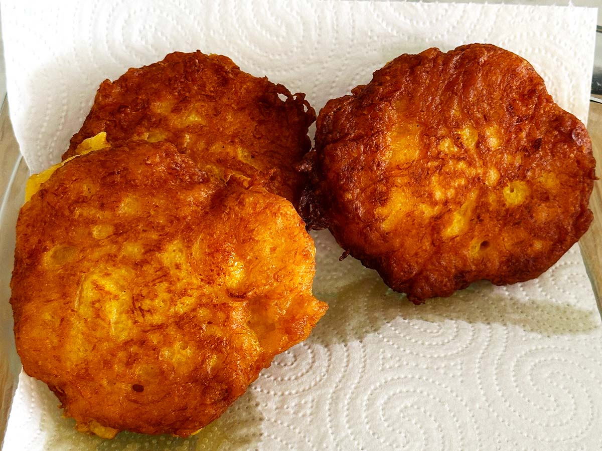

# Pampoenkoekies

*South Africa's pumpkin fritters: cooked mashed pumpkin folded with egg, flour, sugar and cinnamon, fried in spoonfuls in butter till the edges crisp gold, served with cinnamon sugar dusted over the top. A sweet-savoury side that turns up at every Sunday lunch in Afrikaans households.*

**Serves:** 4-6 (makes about 16-20 small fritters)

**Prep Time:** 20 minutes

**Cook Time:** 25 minutes

## Overview
Pampoenkoekies (literally "pumpkin little-cakes" in Afrikaans) are South Africa's beloved sweet-savoury pumpkin fritters, the dish that turns up at every Sunday lunch in Afrikaans-speaking households alongside the roast meat: cooked mashed pumpkin folded with egg, flour, baking powder, sugar and cinnamon into a thick batter, fried in spoonfuls in butter till the edges go gold-crisp and the centres stay soft and tender, dusted with cinnamon sugar at the table. The dish sits in the sweet-savoury borderland that defines much of Afrikaans cooking; not quite a vegetable side (too sweet), not quite a dessert (eaten with roast meat). The pumpkin must be properly dry; pressing the cooked mash through a sieve or leaving it overnight in a colander to drain is what separates a proper crisp-edged fritter from a soggy one. Butter is essential to the flavour. Fry at medium, never higher; the sugar in the batter will burn before the centre cooks through. Served warm in a small bowl beside the roast lamb or beef.

## Ingredients

### Pumpkin
- 800 g pumpkin or butternut squash (peeled and cubed; you'll get about 500 g of cooked mashed pumpkin)
- 1 tablespoon water (for steaming/boiling)
- ½ teaspoon fine sea salt

### Batter
- 2 large eggs (beaten)
- 4 tablespoons whole milk
- 150 g plain flour
- 2 teaspoons baking powder
- 2 tablespoons caster sugar
- 1 teaspoon ground cinnamon
- ½ teaspoon ground nutmeg
- ½ teaspoon fine sea salt

### For frying
- 80 g butter (plus more as needed)

### Cinnamon sugar topping
- 3 tablespoons caster sugar
- 2 teaspoons ground cinnamon

## Method

### Stage 1 - Cook the pumpkin
1. Peel the pumpkin, scrape out the seeds, and cut into 3 cm cubes.
2. Place in a saucepan with the tablespoon of water and the salt.
3. Cover and steam over medium heat for 15-20 minutes till the pumpkin is properly tender when tested with a fork.
4. Drain in a colander.

### Stage 2 - Mash and drain (this matters)
1. Tip the cooked pumpkin into a sieve set over a bowl, or onto a clean folded tea towel.
2. Press the pumpkin firmly with the back of a spoon (or fold the towel around the pumpkin and squeeze) to expel as much water as possible. The pumpkin will release a surprising amount of liquid; this drainage is essential for crisp fritters.
3. Tip the drained pumpkin into a wide bowl and mash with a fork or potato masher to a smooth purée.
4. Let cool to room temperature (or use cold leftover mashed pumpkin).

### Stage 3 - Build the batter
1. In a separate bowl, whisk the eggs and milk together.
2. In a third bowl, sift together the flour, baking powder, sugar, cinnamon, nutmeg and salt.
3. Pour the egg-milk mixture over the dry ingredients and whisk till smooth.
4. Add 300 g of the mashed drained pumpkin (set aside any extra for another use).
5. Fold the pumpkin into the batter with a wooden spoon till just combined; don't overmix.
6. The batter should be thick (a wooden spoon stands almost upright in it) but spoonable. If it's too stiff, add another tablespoon of milk; if too loose, sprinkle in another tablespoon of flour.

### Stage 4 - Mix the cinnamon sugar
1. In a small bowl, combine the 3 tablespoons of caster sugar with the 2 teaspoons of cinnamon.
2. Set aside.

### Stage 5 - Fry the koekies
1. Heat a wide heavy frying pan over medium heat.
2. Add a knob of butter (about 25 g) and let it melt and start to foam.
3. Drop spoonfuls of batter into the hot pan (a heaped dessertspoon per fritter; you should get 4-5 per pan-load).
4. Spread each spoonful into a small round about 6 cm across with the back of the spoon.
5. Cook 2-3 minutes till the underside is gold and slightly crispy at the edges, and the surface starts to show small bubbles.
6. Flip with a spatula and cook the other side 2-3 minutes more till gold and the centre is cooked through (test by pressing; it should spring back gently).
7. Lift onto a warm plate.
8. Add a fresh small knob of butter to the pan before each batch.

### Stage 6 - Serve
1. Pile the warm fritters in a serving bowl or onto a plate.
2. Dust generously with the cinnamon-sugar mixture; the sugar should glisten on the warm fritters and start to slightly melt into the surface.
3. Serve immediately, while warm, alongside the roast meat or as a sweet-savoury treat in their own right.

## Notes
- **Drain the pumpkin thoroughly:** the most common pampoenkoekie failure is wet pumpkin giving a soggy fritter. Press hard with a spoon, or use a clean cloth to squeeze out the moisture, or leave the cooked pumpkin in a colander overnight. Dry pumpkin is the difference between a proper crisp-edged koekie and a damp pancake.
- **Butter over oil:** the rich butter flavour is part of the dish. Vegetable oil works but you lose half the character. If you're worried about the butter burning, use clarified butter or ghee, which has a higher smoke point.
- **Medium heat, not high:** the sugar in the batter burns easily. Medium heat is the right temperature; if your koekies are going dark too fast and the centre is still raw, drop the heat. Take time.
- **Don't crowd the pan:** four or five fritters per batch is right. Crowding drops the pan temperature and the koekies steam instead of frying crisp.
- **Cinnamon sugar at the end, while warm:** dust the koekies the moment they come out of the pan, while they're still hot. The sugar adheres to the warm surface and starts to slightly melt in, giving the proper finish. Cold koekies don't take cinnamon sugar properly.

## Variations
- **Savoury pampoenkoekies:** halve the sugar in the batter, skip the cinnamon sugar dusting, and serve with sour cream and chives instead. A modern South African brunch dish.
- **With chopped nuts:** fold 50 g of finely chopped walnuts or pecans into the batter for textural contrast.
- **With ginger:** add 1 teaspoon of ground ginger to the batter alongside the cinnamon and nutmeg; gives a warming spice character. A traditional Cape variation.
- **Pampoenmoes (the side-dish version):** the same cooked-pumpkin-with-sugar-and-cinnamon mixture but served unfried as a sweet mash side; literally "pumpkin mash". The lazier weeknight version.

## Serving
- In a small bowl alongside the roast meat (lamb, beef, pork) at Sunday lunch; or as a tea-time treat with hot strong coffee. Some families serve with a small jug of cream or a dollop of plain yoghurt for dipping. Drink: strong coffee, sweet rooibos tea, or a glass of cold milk.

## Storage
- Best eaten warm from the pan; the texture goes denser as they cool.
- Keeps refrigerated 2 days; reheat in a hot dry pan for 1-2 minutes per side, or in a 180 C oven for 5-7 minutes.
- Don't microwave; they go rubbery.
- Day-old pampoenkoekies, sliced and toasted under a grill with extra butter, make a nice breakfast.
- Freeze cooked koekies 1 month; defrost at room temperature and reheat in a pan.
