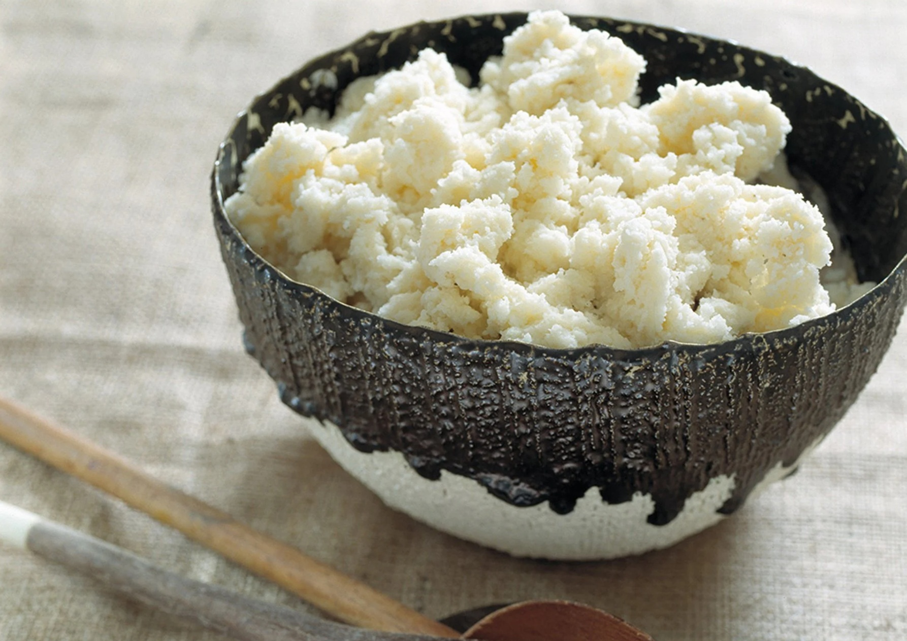

# Pap

*South Africa's stiff maize porridge: white cornmeal stirred into boiling salted water and worked hard till it pulls cleanly from the pot in a glossy ribbon. Eat at every braai with grilled boerewors or chakalaka, the everyday starch staple across the country.*

**Serves:** 6

**Prep Time:** 5 minutes

**Cook Time:** 30 minutes

## Overview
Pap (pronounced "pup", from the Afrikaans for porridge) is South Africa's everyday starch staple: white maize meal stirred steadily into boiling salted water and worked hard with a wooden spoon till the porridge stiffens into a smooth glossy mass that pulls cleanly from the pot in a ribbon. The South African counterpart to Ugandan posho, Kenyan ugali, Zimbabwean sadza and Malawian nsima; the technique is the same across all of them, with regional variations in consistency and accompaniments. Turns up at every braai alongside grilled boerewors and chakalaka, as the starch foundation for stews like denningvleis and bobotie, and even as breakfast (mieliepap with milk and sugar). Three consistency variations exist: krummelpap (crumbly, dry, the proper braai-side); slap pap (loose, soft, the breakfast version); stywe pap (stiff, properly worked, scoopable into balls with the hands, the celebration version). This recipe gives the stiff stywe pap.

## Ingredients

- 500 g white maize meal (mealie meal; medium-grind for braai pap, fine for breakfast pap)
- 1.2 litres water
- 1 teaspoon fine sea salt

## Method

### Stage 1 - Slurry
1. Tip 150 g of the maize meal into a heavy-bottomed saucepan.
2. Add 400 ml of the cold water.
3. Whisk into a smooth slurry. No lumps; whisking dry meal into cold water first gives a smooth base that won't lump when you cook it.
4. Add the salt.

### Stage 2 - Bring to a boil
1. Place the pan over medium-high heat.
2. Add the remaining 800 ml of water.
3. Bring to the boil, stirring constantly with a wooden spoon.

### Stage 3 - First cook
1. Once boiling, reduce to medium-low.
2. Continue stirring for 4-5 minutes till you have a thick loose porridge.
3. This is the slap pap (loose porridge) stage; if you stop here and add a splash of milk, you have breakfast porridge.

### Stage 4 - Build to stywe pap
1. Begin adding the remaining maize meal a small handful at a time, stirring hard with a wooden spoon between each addition.
2. The porridge stiffens noticeably with each handful; keep going.
3. Continue till you've added about another 350 g and the pap pulls cleanly from the sides of the pot in a smooth dense mass.
4. The proper stywe pap should be dense, glossy, and pull in ribbons that hold their shape.

### Stage 5 - Steam-finish
1. Smooth the top of the pap with the back of the spoon.
2. Drop the heat to the absolute lowest setting.
3. Cover the pan tightly with a lid.
4. Steam-finish for 8-10 minutes for the inside to cook through and the raw-meal taste to cook off.

### Stage 6 - Serve
1. Stir the pap one more time to bring it together.
2. Tip onto a wooden board or large warmed plate; a quick whack with the pan upside-down releases it as a mound.
3. Cut into thick wedges with a wet knife, or scoop into balls with a wet hand.
4. Serve immediately alongside the main dish, ideally with a generous spoonful of chakalaka on top.

## Notes
- **Slurry-first technique:** the single most important rule. Whisking maize meal into cold water makes a smooth lump-free base. Tipping dry meal into boiling water gives you immediate hard lumps that no amount of stirring will smooth out.
- **Work the pap hard:** like its African porridge cousins, pap needs proper stirring to develop the gloss and stretch. Underworked pap is pale, sticky and crumbly; properly worked stywe pap is glossy and pulls in clean ribbons.
- **Three consistencies, one technique:** stywe pap (stiff, worked hard till it pulls clean), krummelpap (crumbly, less water, cooked till the grains stay distinct), slap pap (loose, less worked, eaten as breakfast porridge). Same starting technique; the difference is the water-to-meal ratio and how hard you work it. This recipe is stywe pap.
- **White or yellow maize meal:** South African pap is typically white maize meal. Yellow maize meal is used too in some homes, particularly in rural areas; it gives a slightly sweeter porridge with more pronounced corn flavour. White is the traditional braai-pap; yellow is fine but less traditional.
- **Eats well cold:** leftover pap can be sliced and pan-fried in oil for the next day's breakfast (called braaibroodjie when also pressed with cheese), or shaped into balls and dropped into clear stews. Don't waste pap; it has lots of secondary uses.

## Variations
- **Krummelpap:** use 1 litre of water (instead of 1.2 litres) and stir less hard; the porridge stays grainier and falls apart in crumbs. The proper braai krummelpap is the rural Afrikaans version; serve with grilled boerewors and chakalaka.
- **Slap pap (breakfast porridge):** use 1.5 litres of water and skip the final adding of dry meal; cook for 10 minutes till you have a loose porridge. Serve with milk and brown sugar for breakfast.
- **Mieliemeel met melk (with milk):** finish the cooked pap with 100 ml of milk stirred through in the last 2 minutes; richer pap for a celebration meal.
- **Putu pap:** the Zulu version where the maize meal is steamed rather than boiled, giving a properly crumbly texture; uses a couscoussier-style steamer.
- **Yellow maize pap:** swap white maize meal for yellow; sweeter and more colourful. Common in rural Limpopo and Mpumalanga.

## Serving
- Alongside grilled boerewors (sausage), with a generous dollop of [chakalaka](../chakalaka.md) on top, at every South African braai. Also wonderful with bobotie, denningvleis, oxtail stew, or any saucy main. Eat with the right hand by tearing pieces, rolling into small balls, and using to scoop sauce. A small dish of fresh chopped chilli for those who want heat.

## Storage
- Best eaten warm from the pot.
- Keeps wrapped in cling film at room temperature for 24 hours.
- Sliced cold pap can be pan-fried in oil for breakfast; the resulting "fried pap" with an egg on top is a Sunday-morning South African classic.
- Refrigerate up to 3 days; reheat by slicing and pan-frying, or by steaming in a covered pan with a splash of water to soften.
- Doesn't freeze well; the texture goes off.
