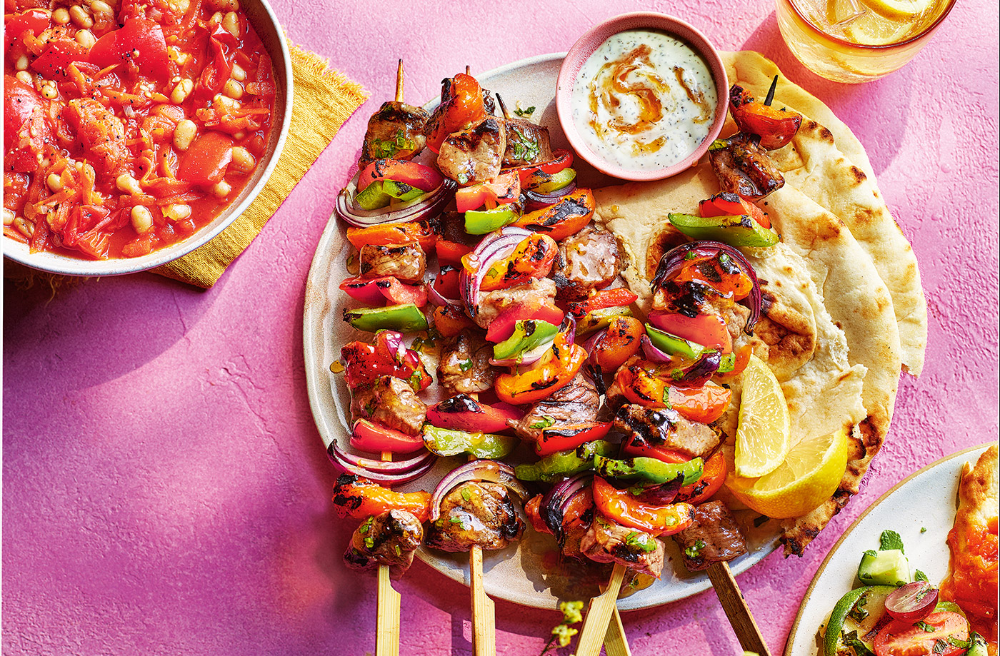

# Sosaties

*The Cape Malay skewers: cubes of lamb (or chicken) marinated overnight in a sweet-sour curry sauce of onion, apricot jam, vinegar, garlic, curry powder and bay leaves, then threaded onto skewers with apricot dried fruit and grilled hard over coals till the marinade caramelises into a sticky glaze. The braai (barbecue) classic of the Western Cape.*

**Serves:** 4-6

**Prep Time:** 30 minutes (plus 24 hours marinating)

**Cook Time:** 15 minutes

## Overview
Sosaties are the Cape Malay-style grilled skewers that anchor every braai in the Western Cape: cubes of lamb marinated overnight in a complex sweet-sour curry sauce of onion, apricot jam, vinegar, garlic, ginger, curry powder, turmeric and bay leaves, threaded with red onion and dried apricots, grilled hard over coals till the marinade caramelises into a sticky burnt-gold glaze. The name comes from the Malay word "sate" via the Dutch language route through 17th-century Cape Town, when enslaved Malay people brought their cooking traditions to South Africa and fused them with Dutch, Khoekhoe and African influences. The most direct culinary link from satay to South Africa. The 24-hour marinade is non-negotiable; four hours doesn't cut it. The dried apricots threaded between the meat cubes are the signature; use a thick syrupy apricot jam (Mrs H S Ball's is the traditional South African choice) which reduces into the sticky grilling glaze.

## Ingredients

### Meat
- 1 kg boneless lamb shoulder or leg (cut into 3 cm cubes; or boneless chicken thigh)
- 24-30 large dried apricots (the soft chewy kind, not hard dried)
- 2 large red onions (cut into 2 cm wedges; about 12-16 wedges)

### Marinade
- 2 tablespoons vegetable oil
- 2 large onions (very finely chopped)
- 6 garlic cloves (crushed)
- 1 thumb (3 cm) fresh ginger (finely grated)
- 3 tablespoons mild [curry powder](../../base-ingredients/curry-powder/bir-curry-powder.md) (Cape Malay or mild Madras; not fiery)
- 1 teaspoon ground turmeric
- 1 teaspoon ground coriander
- 1 teaspoon ground cumin
- 4 bay leaves
- 200 g smooth apricot jam (Mrs Balls-style; or any quality smooth apricot conserve)
- 100 ml white wine vinegar (or apple cider vinegar)
- 100 ml water
- 1 ½ teaspoons fine sea salt
- 1 teaspoon ground black pepper
- 1 tablespoon brown sugar (if your jam is on the tarter side)

### For grilling
- Vegetable oil (for brushing the grill or grill plate)

### To serve
- Plain boiled rice or yellow rice (rice cooked with turmeric and raisins)
- A simple green salad
- Sambals: chopped tomato-and-onion relish

## Method

### Stage 1 - Make the marinade
1. Heat the vegetable oil in a small saucepan over medium heat.
2. Add the very finely chopped onions and sweat 8-10 minutes till soft and lightly golden.
3. Stir in the crushed garlic and grated ginger; cook 1 minute.
4. Add the curry powder, turmeric, coriander and cumin. Stir for 30 seconds to bloom the spices in the oil.
5. Add the bay leaves.
6. Stir in the apricot jam, vinegar, water, salt, pepper and brown sugar (if using).
7. Bring to a gentle simmer; cook 3-4 minutes till the jam has dissolved and the marinade looks like a thick syrupy sauce.
8. Taste; the marinade should be properly sweet-sour, gently spiced, with the curry powder evident but not overwhelming. Adjust with extra vinegar (more sour), jam (more sweet), or salt as needed.
9. Take off the heat and let cool completely (about 30 minutes); the marinade thickens slightly as it cools.

### Stage 2 - Marinate the meat
1. Place the cubed lamb in a wide non-reactive bowl or large zip-top bag.
2. Pour the cooled marinade over the meat; toss thoroughly so every cube is coated.
3. Cover and refrigerate for at least 24 hours, ideally 36-48 hours for deepest flavour. Stir or turn the meat once or twice during the marinating time.

### Stage 3 - Soak the wooden skewers
1. If using wooden skewers (8 long ones), soak them in cold water for at least 30 minutes before threading; this stops them charring through during grilling.

### Stage 4 - Soak the dried apricots
1. Place the dried apricots in a bowl and cover with warm water for 15 minutes.
2. Drain. This softens them slightly so they thread onto skewers without splitting and they cook to plump tender on the grill.

### Stage 5 - Thread the skewers
1. Take the marinated meat out of the fridge 30 minutes before grilling.
2. Set up your station: bowl of marinated meat, bowl of softened apricots, bowl of red onion wedges, soaked skewers.
3. Thread each skewer: a piece of red onion, a cube of meat, an apricot, another cube of meat, another apricot, another piece of meat, another piece of onion. About 4-5 cubes of meat per skewer plus apricots and onion in between.
4. Reserve the leftover marinade in a small saucepan; you'll cook it briefly and use as a basting sauce or finishing glaze.

### Stage 6 - Heat the grill
1. Light a charcoal braai or barbecue and let it burn down to medium-hot coals (white-grey ash visible on the embers); or heat a gas grill to medium-high; or heat a heavy ridged grill pan over medium-high heat indoors.
2. Brush the grates lightly with vegetable oil.

### Stage 7 - Boil the reserved marinade (for basting and sauce)
1. While the grill heats, bring the reserved marinade in a small saucepan to a rolling boil for 2 full minutes; this kills any bacteria from the raw meat and makes the marinade safe to use as a baste and sauce.
2. Reduce to a simmer; thin with a tablespoon or two of water if it's too thick.
3. Keep warm.

### Stage 8 - Grill the sosaties
1. Lay the skewers on the hot grill.
2. Grill 4-5 minutes per side (total 12-15 minutes), turning every 3-4 minutes so all four sides cook. The meat should be cooked through but still juicy; the marinade glaze should caramelise into a sticky burnt-gold finish on the meat; the apricots should soften and char in spots; the onion wedges should char and soften.
3. Brush with the boiled marinade-baste during the last few minutes of grilling for extra glaze.

### Stage 9 - Rest and serve
1. Lift the skewers off the grill onto a warm platter.
2. Let rest 3-4 minutes (the meat juices redistribute).
3. Serve with the warm marinade-sauce in a small jug alongside.
4. Plain boiled rice or yellow rice (turmeric raisin rice) underneath; a small bowl of fresh chopped tomato-and-onion sambals for brightness; a green salad on the side.

## Notes
- **Overnight marinating is non-negotiable:** the 24-hour minimum is what gives sosaties their proper flavour. Skip it and the result tastes like a generic curry-grilled lamb. The apricot jam acid plus the vinegar gently tenderises the lamb; the curry powder penetrates the meat; the dish improves dramatically with marinating time.
- **Apricots between the meat are the signature:** the dried apricots threaded between meat cubes are what make sosaties identifiably sosaties. They soften on the grill and provide the sweet bites between the savoury meat. Don't skip them; the dish becomes generic Cape kebabs without them.
- **Apricot jam quality matters:** look for a proper smooth apricot conserve, not a chunky jam with bits of fruit. The South African brand Mrs H S Ball's smooth apricot is the traditional choice; any good UK or Australian smooth apricot conserve works. Bonne Maman thinned with a tablespoon of warm water also substitutes well.
- **Boil the reserved marinade if you want to baste:** any marinade that's touched raw meat must be boiled (2 full minutes at a rolling boil) before being used as a baste or sauce. The cooked version makes a beautiful sticky glaze.
- **Medium-hot coals, not screaming hot:** the marinade contains sugar from the jam and burns easily. Medium-hot is the right temperature; if your coals are too hot, the marinade will char black before the meat cooks through. Move the skewers to a cooler part of the grill if they're scorching.

## Variations
- **Chicken sosaties:** swap lamb for boneless chicken thigh cubes; same marinade and technique, slightly shorter cook (10-12 minutes total).
- **Pork sosaties:** less common but traditional; use pork shoulder cubes. Cook to 70 C internal temperature.
- **With pineapple:** swap the dried apricots for fresh pineapple chunks; gives a tropical fresh twist on the classic. Less Cape Malay, more modern braai.
- **Skewer-less version:** cook the marinated meat and onion in a heavy pan or hot oven (220 C for 25 minutes); the dried apricots are added in the last 5 minutes. Quicker if you don't have a grill.

## Serving
- On a wide platter at the centre of a braai (barbecue) gathering, with the apricot-marinade sauce in a small jug. Yellow rice (turmeric and raisin) underneath; a chopped tomato-and-onion sambal on the side; a green salad for freshness. Drink: cold lager (Castle or Black Label from SA), a chilled Cape rosé, or a glass of red Pinotage if you want to lean South African.

## Storage
- Best eaten fresh from the grill; the meat goes from tender to dry quickly.
- Keeps refrigerated 2 days; reheat briefly under a grill for 3-4 minutes (don't microwave; the meat goes rubbery and the marinade splits).
- The marinade itself keeps refrigerated 4 days unused; use to marinate a fresh batch of meat for another braai.
- Boiled marinade (used as sauce) keeps refrigerated 1 week.
- Don't freeze cooked sosaties; the texture suffers. Freeze the marinade if you've made too much.
