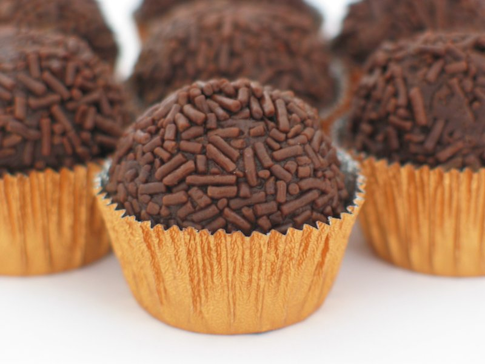

# Brigadeiro

*Brazil's iconic chocolate truffle: condensed milk and cocoa cooked together until thick and glossy, cooled, rolled into balls, then dropped in chocolate sprinkles. Eat at every Brazilian children's birthday party - and every adult party too. Soft, fudgy, slightly chewy at the edges.*

**Makes:** 24 brigadeiros

**Prep Time:** 15 minutes (plus 4 hours cooling)

**Cook Time:** 12 minutes

## Overview
Brigadeiros are Brazil's chocolate truffles, the soft fudgy little balls rolled in chocolate sprinkles that turn up at every children's birthday party in the country and most of the adult ones too. Three ingredients in a pan: sweetened condensed milk, cocoa powder and butter, cooked together with a pinch of salt over medium-low heat while you stir constantly. Watch for two signs of doneness: the brigadeiro pulls cleanly away from the bottom of the pan when the spoon is drawn through (you see the pan base for a moment), and a scoop holds its shape on a plate without spreading. Cool to room temperature, then refrigerate at least three hours and ideally overnight so the texture firms enough to roll. Buttered hands, teaspoon-sized pieces, rolled into 2 cm balls, dropped into chocolate sprinkles and turned till fully coated. Set in small paper cases.

## Ingredients

- 397 g tin sweetened condensed milk
- 30 g unsalted butter (plus more for greasing hands and plate)
- 4 tablespoons cocoa powder (good-quality, sifted)
- ¼ teaspoon salt

### Coating
- 100 g chocolate sprinkles (Brazilian "chocolate granulado", or hundreds-and-thousands at a push)

## Method

### Stage 1 - Cook
1. Combine the condensed milk, butter, cocoa and salt in a heavy non-stick saucepan over medium heat.
1. Whisk to dissolve the cocoa.
1. Reduce to medium-low; cook 8-12 minutes, stirring constantly with a wooden spoon, until the mixture thickens.
1. The brigadeiro is ready when:
   - The mixture pulls cleanly away from the bottom of the pan when the spoon is drawn through (you can see the pan base for a moment).
   - It holds its shape when scooped onto a plate (doesn't spread).

### Stage 2 - Cool
1. Pour onto a buttered plate; spread to about 2 cm thick.
1. Cool to room temperature 30 minutes; cover and refrigerate at least 3 hours, ideally overnight - this firms up the texture for rolling.

### Stage 3 - Roll
1. Lightly butter your hands.
1. Pinch off teaspoon-sized pieces; roll into balls (around 2 cm).
1. Drop each ball into a bowl of chocolate sprinkles; roll to coat.
1. Place in small paper cases (traditional) or on a tray.

### Stage 4 - Serve
1. Serve at room temperature.

## Notes
- **Don't undercook:** Underdone brigadeiro is a soft, sticky mess that won't roll. Cook until you can clearly see the pan base when the spoon passes through.
- **Don't overcook:** Overdone brigadeiro turns hard and grainy. Pull from the heat the moment it pulls cleanly.
- **Stir constantly:** Once the cocoa-condensed milk mixture starts to thicken, it scorches in seconds if unattended. Don't walk away.

## Storage
- Keeps 5 days in an airtight tin at room temperature; the texture firms slightly.
- Don't refrigerate - they go too hard.
