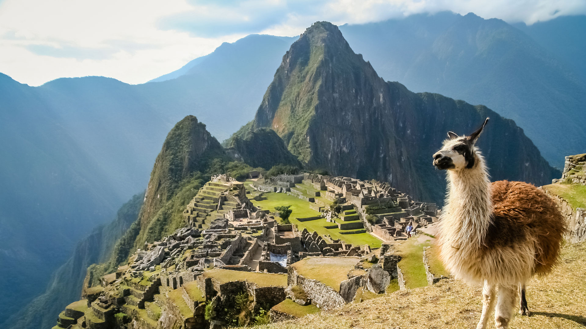

# South American Cuisine

A continent's cuisines folded together: Argentine asado and chimichurri; Brazilian feijoada, pão de queijo and brigadeiro; Peruvian ceviche, lomo saltado and aji-driven heat; Colombian and Venezuelan arepas; Chilean shellfish; Bolivian salteñas. Native ingredients (corn, potato, cassava, quinoa, cacao, yerba mate, aji chillies) meet European technique and African (especially Brazilian) and Asian (Peruvian chifa) influences. Big shared meals, charcoal grilling and street food run through every country.
