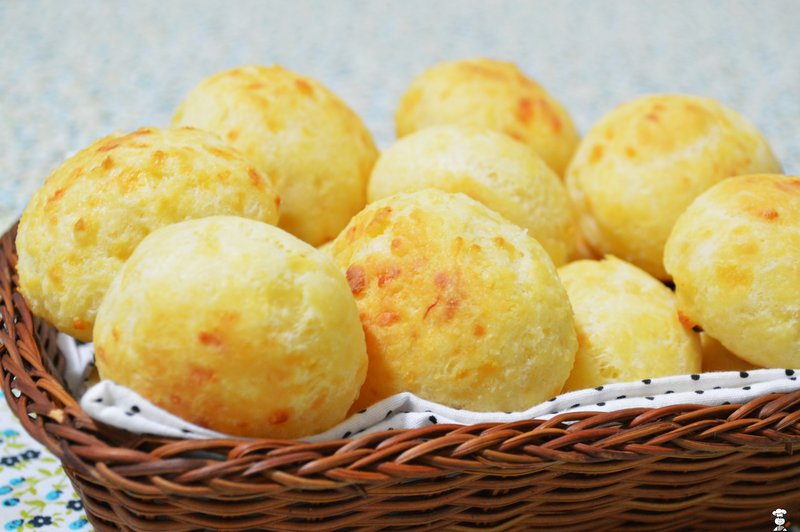

# Pão de Queijo

*Brazilian cheese bread: small puffs of tapioca-flour dough enriched with eggs, milk and cheese, baked golden and chewy on the outside, soft and stretchy inside. Naturally gluten-free; eats hot from the oven, with coffee for breakfast or alongside any Brazilian meal. Snack-sized; you'll eat several.*

**Makes:** 30 small rolls

**Prep Time:** 20 minutes

**Cook Time:** 25 minutes

## Overview
Pão de queijo is the Brazilian cheese bread of Minas Gerais: small puffs of tapioca-flour dough baked golden and chewy outside and soft-stretchy inside, eaten hot with morning coffee or piled in a basket alongside any meal. Naturally gluten-free, and impossible to stop eating. The defining ingredient is polvilho (tapioca starch) sold at Brazilian grocers, either sour (azedo, fermented for a slight tang and more lift) or sweet (doce, milder); cornflour or cassava flour is not the same and doesn't give the chew that defines the bread. The hot milk-and-oil mixture poured over the starch is what activates it; without that scald, the dough won't stretch right. Eat hot from the oven within ten minutes for the proper chewy-stretchy character.

## Ingredients

- 250 ml whole milk
- 80 ml vegetable oil (or 80 g unsalted butter)
- ½ teaspoon salt
- 250 g sour tapioca starch (polvilho azedo) or sweet tapioca starch (polvilho doce; both work; sour gives the proper Minas style)
- 2 eggs (large)
- 200 g parmesan (or a mix of parmesan and a soft, mild Brazilian-style cheese like queso fresco or feta)

## Method

### Stage 1 - Scald
1. Combine the milk, oil and salt in a small pan.
1. Bring to a steady boil - pull off the heat the moment it bubbles up.

### Stage 2 - Mix with starch
1. Place the tapioca starch in a wide bowl.
1. Pour the hot milk mixture over; stir with a wooden spoon - the starch will go from powder to a stringy, lumpy paste.
1. Cool 10 minutes (you'll be adding eggs; don't cook them).

### Stage 3 - Eggs and cheese
1. Beat the eggs in one at a time, fully incorporating before the next. The mixture will look broken; keep mixing - it comes together.
1. Stir in the grated cheese.
1. The dough will be sticky and a bit unruly.

### Stage 4 - Rest
1. Refrigerate 30 minutes; the dough firms up significantly.

### Stage 5 - Shape
1. Heat the oven to 200°C (180°C fan).
1. Wet your hands; pinch off walnut-sized pieces; roll into balls.
1. Place on lined baking trays, 3 cm apart (they puff).

### Stage 6 - Bake
1. Bake 22-25 minutes until puffed and deep golden.

### Stage 7 - Serve
1. Eat hot from the oven, ideally within 10 minutes of baking.

## Notes
- **Tapioca starch only:** Cornflour or cassava flour is not the same - they don't give the chew that defines pão de queijo. Polvilho is sold at Brazilian grocers and online.
- **Sour vs sweet polvilho:** Sour (azedo) is fermented, gives a slight tang and more lift. Sweet (doce) is milder. Both work; many recipes mix 50/50.
- **Eat fresh:** The chew is at its best within 10 minutes of baking. Cooled pão de queijo is still tasty but loses its character - re-warm at 180°C for 5 minutes to revive.

## Storage
- Best fresh. Frozen unbaked dough balls keep 2 months - bake from frozen, adding 5 minutes.
