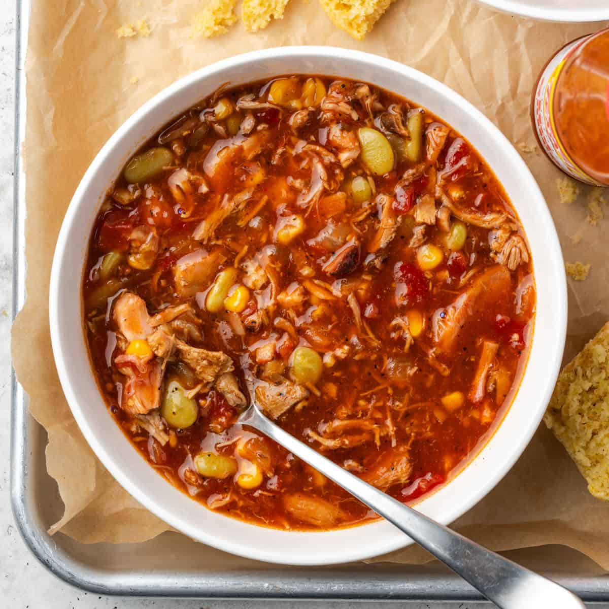

# Brunswick Stew

*The South's traditional game stew: a tomato-based stew of pulled pork (and sometimes chicken), corn, lima beans, potato, okra and tomato slow-cooked with smoky BBQ flavours. Originally made with squirrel and rabbit in Brunswick, Georgia (or Brunswick County, Virginia); the modern version uses pork. The state stew of Virginia.*

**Serves:** 8

**Prep Time:** 25 minutes

**Cook Time:** 2 hours

## Overview
Brunswick stew is one of the South's most beloved game stews and the source of one of America's most enduring inter-state rivalries (Brunswick, Georgia and Brunswick County, Virginia both claim invention): originally made with whatever game was available (squirrel, rabbit, opossum), the modern Southern version uses pulled pork (often leftover smoked BBQ pork; this gives the dish its smoky BBQ character), shredded chicken, slow-cooked with onion, garlic, tomato, corn, lima beans (or butter beans), cubed potato, okra and Worcestershire sauce. Tomato-based with smoky depth from the BBQ pork. Served in deep bowls with cornbread.

## Ingredients

### Meat
- 600 g leftover pulled BBQ pork (or shredded smoked brisket; the smoky leftover is the secret)
- 400 g cooked shredded chicken (rotisserie works)

### Cooking
- 4 tablespoons vegetable oil (or bacon fat)
- 2 large onions (chopped)
- 6 garlic cloves (crushed)
- 1 large green bell pepper (chopped)
- 1 tin (400 g) chopped tomatoes
- 3 tablespoons tomato paste
- 1 tin (400 g) crushed tomatoes
- 1.5 litres chicken stock
- 3 tablespoons Worcestershire sauce
- 4 tablespoons BBQ sauce
- 2 tablespoons brown sugar
- 2 tablespoons cider vinegar
- 1 tablespoon smoked paprika
- 2 tablespoons hot sauce
- 1 tablespoon dried thyme
- 1 tablespoon dried oregano
- 4 bay leaves

### Vegetables
- 3 medium potatoes (cubed)
- 300 g frozen lima beans (or butter beans)
- 300 g frozen sweet corn (or 4 ears fresh, kernels removed)
- 200 g okra (sliced; optional; if used add in last 10 min)

### Seasoning
- 1 ½ teaspoons fine sea salt
- 1 teaspoon ground black pepper

### To finish
- 1 small bunch fresh parsley (chopped)
- Spring onion (sliced)

### To serve
- Cornbread
- Hot sauce
- Sweet tea

## Method

### Stage 1 - Sauté base
1. Heat oil in large heavy pot.
2. Add chopped onions and bell pepper; cook 10 min.
3. Add garlic; cook 30 sec.

### Stage 2 - Build sauce
1. Add tomato paste; cook 2 min.
2. Add chopped and crushed tomatoes; cook 3 min.
3. Pour in stock.
4. Stir in Worcestershire, BBQ sauce, brown sugar, vinegar, smoked paprika, hot sauce, thyme, oregano, bay leaves, salt and pepper.

### Stage 3 - Add meats and potatoes
1. Add pulled pork, shredded chicken and cubed potatoes.
2. Bring to simmer.
3. Cover slightly ajar; cook 60 min.

### Stage 4 - Add corn and beans
1. Add lima beans and corn.
2. Cook 30 more min till everything is tender and the stew thickens.

### Stage 5 - Add okra (optional)
1. Add sliced okra in last 10 min.

### Stage 6 - Finish
1. Discard bay leaves.
2. Stir in parsley.
3. Taste; adjust salt.

### Stage 7 - Serve
1. Ladle into deep bowls.
2. Scatter spring onions.
3. Cornbread on the side.

## Notes
- **Leftover smoked pork:** the secret to authentic flavour.
- **Multiple vegetables:** the variety is the point.
- **Slow-cook properly:** 90 min total.

## Variations
- **With smoked brisket:** swap leftover pork for brisket.
- **With game:** add 200 g of cubed venison or rabbit; the traditional version.
- **Spicier:** double the hot sauce.

## Serving
- In deep bowls with cornbread. Sweet tea.

## Storage
- Keeps refrigerated 5 days; flavour deepens.
- Freezes 3 months.
- Day-after Brunswick is even better.
