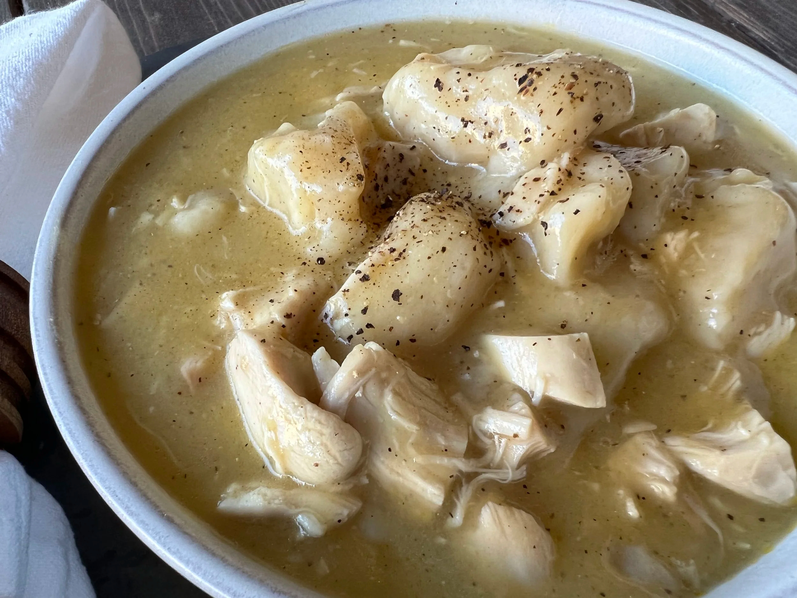

# Chicken and Dumplings

*The South's most comforting dish: a rich chicken broth with shredded poached chicken, onion, celery, carrot and pillowy soft dumplings dropped in to steam-cook through. The Southern grandmother's standard, the dish that defines Southern comfort food.*

**Serves:** 6

**Prep Time:** 25 minutes

**Cook Time:** 1 hour 30 minutes

## Overview
Chicken and dumplings is one of the South's most beloved comfort dishes and a grandmotherly classic that varies by region: chicken (whole or pieces) poached till tender, the meat shredded, the broth strained and seasoned, with sautéed onion, celery and carrot added, then soft pillowy biscuit-style dumplings (a wet thick batter dropped in by spoonfuls; or rolled and cut into pieces for the "rolled dumpling" Tennessee/Appalachian style) added to the simmering broth and cooked covered for 15 minutes till the dumplings puff up and float. The dish is what every Southern grandmother makes when the family is sick, when comfort is needed, when winter sets in.

## Ingredients

### Chicken and broth
- 1.5 kg whole chicken (or 6 bone-in thighs and 4 drumsticks)
- 2 large onions (1 quartered for broth; 1 chopped for stew)
- 4 carrots (2 whole for broth; 2 sliced for stew)
- 3 celery stalks (1 whole for broth; 2 sliced for stew)
- 6 garlic cloves (whole for broth)
- 4 bay leaves
- 1 tablespoon whole black peppercorns
- 2 ½ litres water
- 1 ½ teaspoons fine sea salt

### Stew base
- 4 tablespoons butter
- 4 tablespoons plain flour (for thickening)
- 1 ½ teaspoons fine sea salt
- 1 teaspoon ground black pepper
- 1 teaspoon dried thyme
- 1 teaspoon dried sage

### Dumplings (drop-style)
- 250 g plain flour
- 1 tablespoon baking powder
- 1 teaspoon fine sea salt
- 60 g cold butter (cubed)
- 200 ml whole milk

### To finish
- 1 small bunch fresh parsley (chopped)
- Black pepper

## Method

### Stage 1 - Make broth and chicken
1. Place chicken in large pot with quartered onion, whole carrots and celery, garlic, bay leaves, peppercorns and water with salt.
2. Bring to simmer; cook 50 min.
3. Lift out chicken; shred meat.
4. Strain broth.

### Stage 2 - Build stew
1. In a wide heavy pot, melt butter.
2. Add chopped onion, sliced carrots and celery; cook 8 min.
3. Sprinkle flour; whisk 2 min to make a roux.
4. Gradually whisk in 1.5 litres of broth.
5. Add salt, pepper, thyme, sage.
6. Simmer 10 min till slightly thickened.

### Stage 3 - Add chicken
1. Add shredded chicken to the broth.

### Stage 4 - Make dumplings
1. Whisk together flour, baking powder, salt.
2. Rub in cold butter till crumbly.
3. Add milk; stir to a soft dough.

### Stage 5 - Drop dumplings
1. Scoop heaping tablespoons of dough into the simmering broth.
2. Cover the pot tightly.
3. Don't peek for 15 minutes; the dumplings steam-cook.

### Stage 6 - Check and serve
1. After 15 min, lift the lid; the dumplings should be puffed and cooked through.
2. Scatter parsley and pepper.
3. Ladle into deep bowls.

## Notes
- **Make broth fresh:** essential.
- **Don't lift the lid:** dumplings need the steam.
- **Drop dumplings into simmering (not boiling) broth.**
- **Eat immediately:** dumplings get soggy on standing.

## Variations
**Rolled dumplings (Tennessee/Appalachian):** roll the dough thin; cut into squares; drop into broth.
**With biscuit dumplings:** use store-bought biscuit dough.
**With herbs in dumplings:** add chopped parsley and thyme to the dough.
**Slow-cooker version:** cook the chicken and broth in slow-cooker; add dumplings at the end.

## Serving
In deep bowls with bread. As Southern winter comfort.

## Storage
- Keeps refrigerated 3 days; dumplings get soft on reheating.
- Freezes 2 months.
- Best eaten fresh.
