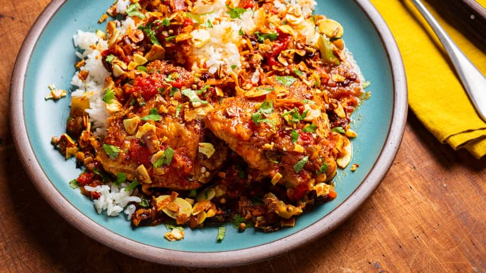

# Country Captain

*The South's curried chicken: bone-in chicken pieces slow-braised in a sauce of onion, garlic, bell pepper, tomato, curry powder, raisins and almonds. The South Carolina-Georgia coast classic, brought from India via British colonial trade, served over rice with chutney.*

**Serves:** 6

**Prep Time:** 20 minutes

**Cook Time:** 1 hour 15 minutes

## Overview
Country Captain is one of the South's most distinctive dishes and reflects the historical trade routes between the American South (particularly Charleston and Savannah) and British colonial India: bone-in chicken pieces lightly floured and browned, then slow-braised in a sauce of sautéed onion, bell pepper, garlic, tomato, curry powder, ginger, cinnamon, with raisins and toasted almonds added, making a sweet-savoury chicken curry that's distinctly Anglo-Indian-Southern. Served over plain white rice with mango chutney, chopped fresh coriander and lime wedges. The dish supposedly arrived in Charleston via a British sea captain in the 19th century; became a staple of upper-class Southern entertaining.

## Ingredients

### Chicken
- 600 g bone-in chicken thighs
- 600 g bone-in chicken drumsticks
- 1 ½ teaspoons fine sea salt
- 1 teaspoon ground black pepper
- 4 tablespoons plain flour (for dusting)
- 4 tablespoons vegetable oil

### Cooking
- 1 large onion (chopped)
- 1 large green bell pepper (chopped)
- 6 garlic cloves (crushed)
- 1 thumb fresh ginger (grated)
- 1 tin (400 g) chopped tomatoes
- 3 tablespoons tomato paste
- 600 ml chicken stock
- 3 tablespoons [curry powder](../../base-ingredients/curry-powder/bir-curry-powder.md) (medium)
- 1 tablespoon ground cumin
- 1 tablespoon ground coriander
- 1 teaspoon ground cinnamon
- 1 teaspoon ground turmeric
- 1 teaspoon paprika
- 2 bay leaves
- 1 cinnamon stick
- 80 g raisins
- 80 g blanched almonds (slivered, toasted)
- 1 ½ teaspoons fine sea salt
- 1 teaspoon ground black pepper

### To finish
- 1 small bunch fresh coriander (chopped)
- Juice of 1 lime

### To serve
- Plain white rice
- Mango chutney
- Toasted almonds (extra)
- Lime wedges
- Fresh coriander

## Method

### Stage 1 - Brown chicken
1. Season chicken; toss with flour.
2. Heat oil in heavy casserole; brown chicken 5 min per side.
3. Set aside.

### Stage 2 - Sauté
1. Add chopped onion and bell pepper; cook 8 min.
2. Add garlic and ginger; cook 30 sec.
3. Add tomato paste and spices; cook 2 min.

### Stage 3 - Add liquid and chicken
1. Add chopped tomatoes and chicken stock.
2. Return chicken to pot.
3. Add bay leaves and cinnamon stick.
4. Bring to simmer; cover slightly ajar.
5. Cook 40-50 min till chicken is tender.

### Stage 4 - Add raisins and almonds
1. Add raisins; cook 5 min.
2. Stir in most of the toasted almonds.

### Stage 5 - Finish
1. Take off heat; lift out bay leaves and cinnamon stick.
2. Squeeze lime juice.
3. Stir in chopped coriander.

### Stage 6 - Serve
1. Over plain white rice.
2. Top with extra almonds.
3. Mango chutney, lime, coriander on side.

## Notes
- **Curry powder traditional:** the colonial-era spice mix.
- **Raisins and almonds:** the Anglo-Indian touch.
- **Slow-cook properly:** 50 min for tender chicken.
- **Mango chutney essential:** the traditional accompaniment.

## Variations
- **With coconut milk:** add 200 ml coconut milk; gives a richer creamier version.
- **Slow-cooker version:** 8 hours low.
- **With shrimp:** add 200 g peeled shrimp in last 5 min for surf-and-turf.
- **Spicier:** add 2 chopped fresh chillies.

## Serving
- Over rice with chutney. As Sunday dinner or special-occasion meal.

## Storage
- Keeps refrigerated 4 days; flavour deepens.
- Freezes 3 months.
- Day-after is excellent.
