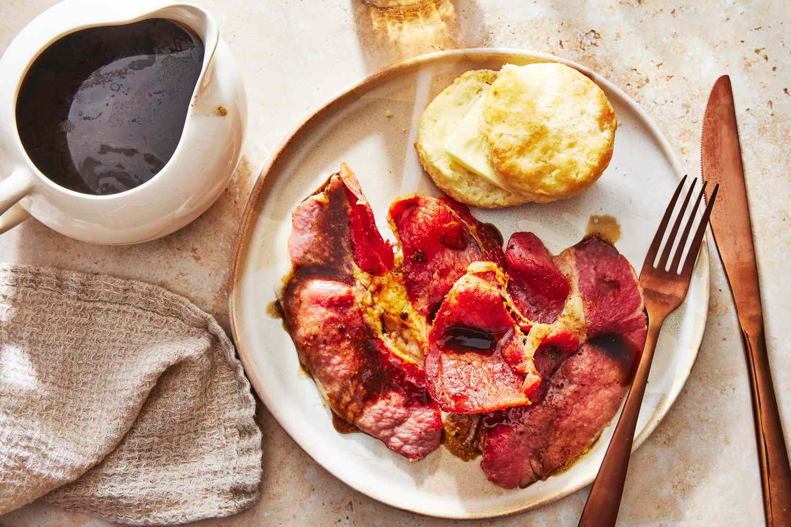

# Country Ham with Red Eye Gravy

*The South's mountain breakfast: salt-cured country ham (Kentucky or Tennessee dry-cured) pan-fried till crispy at the edges, served with red eye gravy (made from the ham drippings deglazed with strong black coffee). The Appalachian mountain breakfast classic, eaten with grits, biscuits and fried eggs.*

**Serves:** 4

**Prep Time:** 5 minutes

**Cook Time:** 15 minutes

## Overview
Country ham with red eye gravy is one of the South's most distinctive breakfast dishes and a Kentucky-Tennessee Appalachian mountain tradition: thick slices of country ham (the dry-cured salt-aged ham from the Appalachian South; substitute with prosciutto or Spanish jamón outside the US) pan-fried in a hot cast-iron pan till the edges crisp and the meat heats through; the pan is then deglazed with strong black coffee and a touch of water to create "red eye gravy" - a thin, deeply savoury, slightly bitter-coffee-flavoured pan sauce. Served with creamy grits, hot buttermilk biscuits, fried eggs (over-easy), butter and the gravy poured over everything. The dish is what mountain folks eat for breakfast in the Appalachian South.

## Ingredients

- 4 thick slices country ham (about 150 g each); or substitute with prosciutto or Spanish jamón
- 2 tablespoons butter (or lard, or bacon fat)
- 250 ml strong brewed black coffee
- 60 ml water
- 1 teaspoon brown sugar (optional; balances the bitterness)
- ½ teaspoon ground black pepper

### To serve
- Creamy grits
- Hot buttermilk biscuits
- 4 fried eggs (sunny-side up)
- Butter for biscuits and grits
- Strawberry jam
- Hot sauce
- Strong black coffee for the table

## Method

### Stage 1 - Fry ham
1. Heat butter in a wide cast-iron pan over medium heat.
2. Add ham slices; cook 2-3 minutes per side till heated through and the edges are crispy.
3. Don't overcook; ham is already cured.
4. Lift onto a warm plate.

### Stage 2 - Make red eye gravy
1. With pan still hot, pour in the strong black coffee.
2. Add water.
3. Bring to a simmer; scrape the pan to release all the fond (browned bits at the bottom - the source of the flavour).
4. Add brown sugar (if using) and black pepper.
5. Simmer 2-3 minutes till slightly reduced.

### Stage 3 - Serve
1. Place a slice of ham on each plate.
2. Add a fried egg.
3. Add a heap of grits.
4. Add a buttered biscuit.
5. Pour red eye gravy over the ham (or alongside; some prefer to dip).
6. Strawberry jam, hot sauce, more coffee at the table.

## Notes
- **Country ham canonical:** look for "country ham" at Southern markets.
- **Coffee for deglaze:** essential for proper red eye.
- **Don't overcook ham:** already cured.
- **Eat immediately.**

## Variations
**With chicory coffee:** swap for chicory coffee; gives Louisiana-Cajun twist.
**With cracklings:** scatter pork rind cracklings over for crunch.
**Modern with apple cider:** swap half the coffee for apple cider; sweeter version.

## Serving
At a Southern mountain breakfast. With grits, biscuits, eggs, hot coffee.

## Storage
- Best eaten immediately.
- Ham keeps refrigerated 2 weeks (it's cured).
- Gravy doesn't keep well; make fresh.
