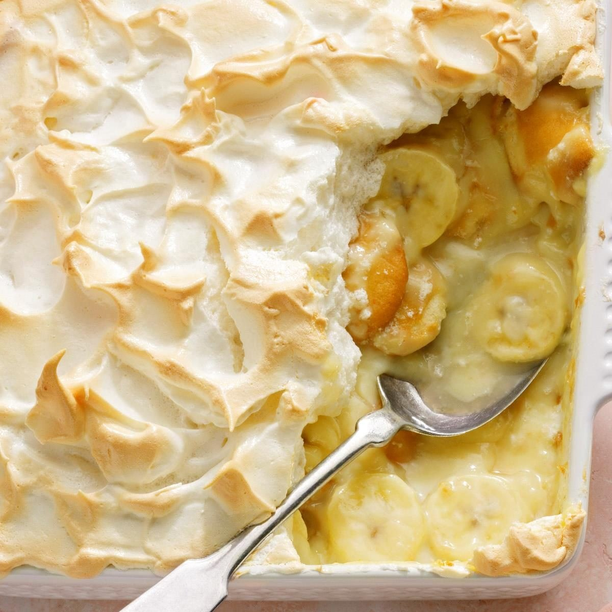

# Southern Banana Pudding

*The South's no-bake banana dessert: layers of sliced bananas, vanilla custard (or Jell-O instant vanilla pudding for the canonical 20th-century version), Nilla wafers (the canonical Southern wafer biscuit) and whipped cream, chilled till the wafers soften into the custard. The Southern church-potluck and family-reunion classic.*

**Serves:** 8

**Prep Time:** 25 minutes (plus 4 hours chilling)

**Cook Time:** 15 minutes (custard)

## Overview
Banana pudding is one of the South's most iconic desserts and a fixture at every family reunion, church potluck and Sunday dinner across the South: layers of sliced ripe bananas (5-6 ripe yellow-spotted bananas; the dish depends on banana quality), vanilla custard (made from scratch with egg yolks, milk, sugar and cornstarch; or the canonical 20th-century shortcut version using Jell-O instant vanilla pudding mix with milk), Nilla wafers (the iconic Nabisco vanilla wafer biscuits; the canonical Southern choice - substitute with shortbread biscuits or any small vanilla wafers), and finally whipped cream (or meringue topping for fancier versions). Layered in a deep glass dish or trifle bowl, refrigerated 4 hours so the wafers soften into the custard, and served chilled. Three details: ripe bananas (yellow-with-spots, the sweeter the better), Nilla wafers (the canonical biscuit), chill for 4 hours (the wafers MUST soften).

## Ingredients

### Custard (from scratch)
- 800 ml whole milk
- 100 ml double cream
- 200 g caster sugar
- 6 large egg yolks
- 4 tablespoons cornstarch
- 80 g unsalted butter
- 2 teaspoons vanilla extract
- Pinch of salt

### Layers
- 500 g Nilla wafer biscuits (or shortbread cookies; or any small vanilla wafer)
- 6 large ripe bananas (yellow-with-spots; sliced)

### Whipped cream topping
- 500 ml double cream
- 80 g icing sugar
- 1 teaspoon vanilla extract

### Optional garnish
- Crumbled Nilla wafers (for top)
- Extra banana slices
- Mint leaves

## Method

### Stage 1 - Make custard
1. In a heavy saucepan, combine milk, cream and half the sugar.
2. Heat over medium till just below boiling.
3. In a bowl, whisk yolks, remaining sugar, cornstarch and salt till smooth.
4. Pour the warm milk in a thin stream into the yolks while whisking.
5. Return to the pan; cook over medium heat, whisking constantly, 5-7 min till the custard thickens to a thick pourable consistency.
6. Take off heat; whisk in butter and vanilla.
7. Strain through a sieve.
8. Cool 10-15 min (still warm but not hot).

### Stage 2 - Whip cream
1. Whip cream with icing sugar and vanilla to soft peaks.

### Stage 3 - Layer
1. In a wide deep glass dish (or trifle bowl):
2. Layer 1: a layer of Nilla wafers on the bottom.
3. Layer 2: sliced bananas (cover the wafers).
4. Layer 3: warm custard (about 1/3).
5. Layer 4: more wafers.
6. Layer 5: more bananas.
7. Layer 6: more custard.
8. Repeat once or twice till all ingredients are used; end with custard on top.

### Stage 4 - Chill
1. Cover with cling film.
2. Refrigerate at least 4 hours (overnight is better) so the wafers soften into the custard.

### Stage 5 - Top
1. Just before serving, top with whipped cream.
2. Sprinkle with crumbled Nilla wafers and a few banana slices.
3. Mint leaves.

### Stage 6 - Serve
1. Spoon into bowls.
2. Serve chilled.

## Notes
- **Ripe bananas:** sweeter is better.
- **Nilla wafers canonical:** the Southern signature.
- **Chill 4+ hours:** wafers MUST soften.
- **From-scratch custard is the upgrade; Jell-O instant is the canonical shortcut.**

## Variations
**Jell-O instant version (the canonical 20th-century):** mix 2 boxes of Jell-O instant vanilla pudding with 1 litre of cold milk; layer as recipe.
**With meringue topping:** instead of whipped cream, top with a 7-minute frosting (Italian meringue) and toast briefly.
**With caramel sauce:** drizzle caramel sauce between layers.
**Smaller individual portions:** layer in 6-8 small glass jars.

## Serving
Chilled. At Southern church potlucks, family reunions, Sunday dinners. With sweet tea or strong coffee.

## Storage
- Keeps refrigerated 3 days; wafers continue to soften.
- Don't freeze.
- Best 24 hours after assembly.
