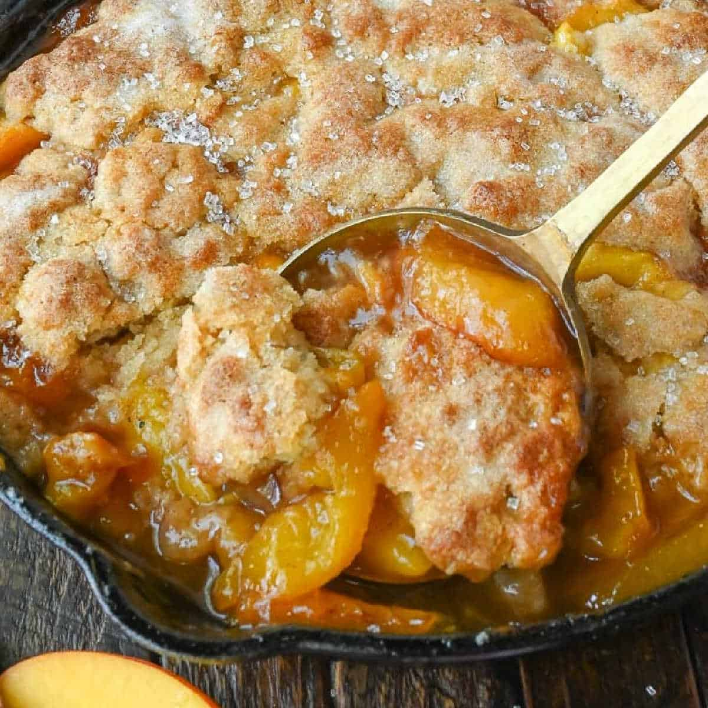

# Southern Peach Cobbler

*The South's iconic peach dessert: sliced fresh peaches with sugar, butter, vanilla and cinnamon, topped with a biscuit-style batter or buttermilk drop dumplings, baked till the top crusts golden over the bubbling sweet peach filling. Served warm with vanilla ice cream - the canonical Southern summer dessert.*

**Serves:** 8

**Prep Time:** 20 minutes

**Cook Time:** 50 minutes

## Overview
Southern peach cobbler is one of the most beloved Southern desserts and a Georgia-Carolina summer institution: fresh sliced peaches tossed with brown sugar, vanilla, lemon juice, cornstarch, butter and cinnamon, poured into a baking dish, topped with a sweet biscuit-style batter (a wet thick batter - not a pie crust) made from flour, sugar, baking powder, salt, milk and melted butter, and baked till the batter rises and bakes into a golden crust over the bubbling peach filling. Served warm with a generous scoop of vanilla ice cream or a heap of whipped cream. The dish is a Southern summer institution, particularly during peach season (June-August across the South), and a fixture at every Sunday dinner, family reunion and church potluck.

## Ingredients

### Peach filling
- 1.5 kg fresh peaches (peeled, pitted, sliced); or 1.2 kg frozen peach slices
- 200 g brown sugar
- 2 tablespoons cornstarch
- 1 tablespoon ground cinnamon
- 1 teaspoon ground nutmeg
- 1 teaspoon vanilla extract
- 2 tablespoons fresh lemon juice
- 80 g unsalted butter (cubed)
- Pinch of salt

### Biscuit batter
- 250 g plain flour
- 150 g caster sugar
- 2 teaspoons baking powder
- ½ teaspoon fine sea salt
- 1 teaspoon ground cinnamon
- 200 ml whole milk
- 100 g unsalted butter (melted)
- 1 teaspoon vanilla
- 1 large egg

### Topping
- 2 tablespoons demerara sugar
- 1 teaspoon cinnamon

### To serve
- Vanilla ice cream
- Whipped cream

## Method

### Stage 1 - Prep peaches
1. Preheat oven to 180°C (350°F).
2. Grease a 25 × 35 cm baking dish.

### Stage 2 - Mix peach filling
1. In a wide bowl, combine peach slices, brown sugar, cornstarch, cinnamon, nutmeg, vanilla, lemon juice, salt.
2. Toss.
3. Tip into baking dish.
4. Dot butter on top.

### Stage 3 - Make batter
1. In a bowl, whisk flour, sugar, baking powder, salt, cinnamon.
2. In another, whisk milk, melted butter, vanilla, egg.
3. Combine; stir to just combined.

### Stage 4 - Top
1. Drop batter in spoonfuls over peaches (rustic dollops).
2. Sprinkle demerara sugar and cinnamon.

### Stage 5 - Bake
1. Bake 40-50 min till topping is golden and filling bubbles.

### Stage 6 - Rest and serve
1. Rest 10 min.
2. Serve warm with ice cream or whipped cream.

## Notes
- **Fresh peaches in season.**
- **Biscuit topping, not pie crust.**
- **Don't smooth the topping:** rustic dollops.
- **Serve warm:** the contrast with ice cream.

## Variations
**With blueberries:** add 200 g blueberries.
**With bourbon:** add 2 tablespoons bourbon.
**Spiced:** add ¼ tsp cloves.
**Mixed stone fruit:** combine with plums.

## Serving
Warm with ice cream. After Southern dinner.

## Storage
- Keeps refrigerated 4 days.
- Reheat in oven.
- Best fresh and warm.
