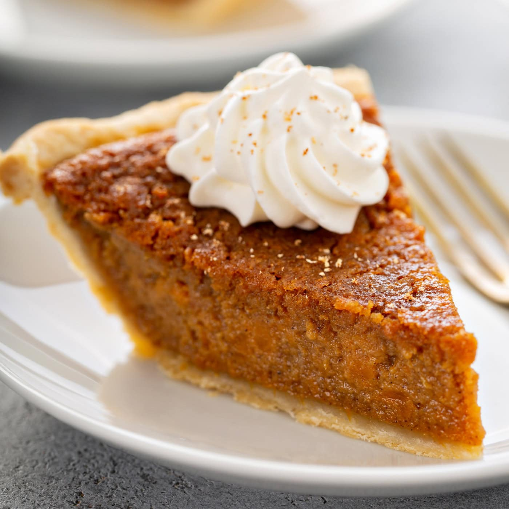

# Sweet Potato Pie

*The South's Thanksgiving alternative: a deeply spiced sweet potato custard pie in a flaky butter crust. Often considered the proper Southern answer to pumpkin pie - same warm spices, deeper sweet potato flavour. The canonical Southern Thanksgiving dessert.*

**Serves:** 8

**Prep Time:** 30 minutes (plus crust resting)

**Cook Time:** 1 hour

## Overview
Sweet potato pie is the South's iconic Thanksgiving dessert and the Southern alternative (or, depending on whom you ask, the proper original) to pumpkin pie: a flaky butter pie crust filled with a deeply spiced custard made from roasted-and-mashed sweet potatoes, brown sugar, butter, eggs, cream, vanilla, cinnamon, nutmeg, cloves, ginger and a touch of orange zest, baked till the centre is just set with a slight wobble. Cooled slightly, dusted with powdered sugar, served with whipped cream. The Southern preference for sweet potato over pumpkin reflects the abundance of sweet potatoes in Southern agriculture; the result is a deeper, slightly sweeter pie.

## Ingredients

### Pie crust
- 250 g plain flour
- 150 g cold butter (cubed)
- 1 tablespoon caster sugar
- ½ teaspoon fine sea salt
- 1 large egg yolk
- 3-4 tablespoons ice-cold water

### Sweet potato filling
- 1 kg sweet potatoes (whole; roasted)
- 200 g dark brown sugar
- 100 g unsalted butter (melted)
- 3 large eggs
- 250 ml double cream
- 100 ml whole milk
- 2 teaspoons vanilla extract
- 1 tablespoon ground cinnamon
- 2 teaspoons ground nutmeg
- 1 teaspoon ground cloves
- 1 teaspoon ground ginger
- Zest of 1 orange
- 1 teaspoon fine sea salt

### To finish
- Icing sugar for dusting
- Whipped cream
- A pinch of cinnamon for the cream

## Method

### Stage 1 - Make pie crust
1. In a wide bowl, whisk flour, sugar, salt.
2. Rub in cold butter till coarse crumbs.
3. Add egg yolk and 3 tablespoons ice water; stir to form dough (add more water if needed).
4. Wrap; chill 30 min.

### Stage 2 - Roast sweet potatoes
1. Preheat oven to 200°C (400°F).
2. Place whole sweet potatoes (skin on) on a tray.
3. Roast 50-60 min till tender.
4. Cool; peel; mash smooth (you need about 700g of cooked flesh).

### Stage 3 - Roll and blind-bake crust
1. Roll dough on floured surface to 4mm thick.
2. Line a 23cm pie dish.
3. Trim and crimp edges.
4. Prick base with fork.
5. Line with parchment + beans.
6. Blind-bake 200°C for 15 min.
7. Remove beans; bake 5 min more.
8. Cool.

### Stage 4 - Make filling
1. Reduce oven to 180°C (350°F).
2. In a wide bowl, combine mashed sweet potato (700g), brown sugar, melted butter, eggs, cream, milk, vanilla, cinnamon, nutmeg, cloves, ginger, orange zest, salt.
3. Whisk till smooth.

### Stage 5 - Bake
1. Pour filling into the par-baked crust.
2. Bake 45-55 min till the centre is just set with slight wobble.
3. If edges brown too fast, cover with foil.

### Stage 6 - Cool
1. Cool completely 2 hours.

### Stage 7 - Serve
1. Dust with icing sugar.
2. Whipped cream + cinnamon alongside.

## Notes
- **Roast sweet potatoes:** boiling gives wet pie.
- **Don't overbake:** slight wobble in centre.
- **Cool fully before slicing.**
- **Better the day after baking.**

## Variations
**With bourbon:** add 2 tablespoons bourbon.
**With pecan streusel:** top with pecan-brown-sugar-butter streusel before baking.
**Spiced pumpkin variation:** swap half the sweet potato for pumpkin purée.
**Without crust (lighter):** bake as custard in ramekins.

## Serving
At Southern Thanksgiving alongside turkey, mashed potatoes, collards. With whipped cream.

## Storage
- Keeps refrigerated 4 days; flavour deepens.
- Freezes 2 months.
- Better the day after baking.
