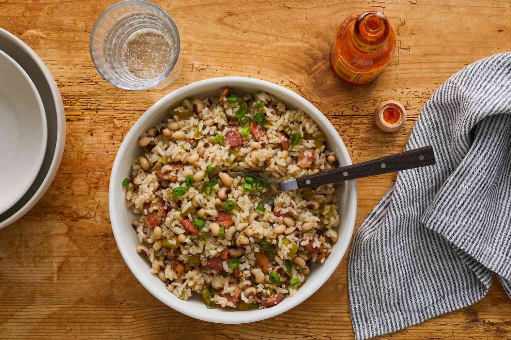

# Hoppin' John

*The South's New Year's dish: black-eyed peas slow-cooked with smoked ham hock, onion, garlic, bell pepper and bay leaves, served over white rice. The Lowcountry-Gullah-South Carolina classic, traditionally eaten on New Year's Day for good luck and prosperity in the coming year.*

**Serves:** 6

**Prep Time:** 15 minutes (plus overnight pea soaking)

**Cook Time:** 2 hours

## Overview
Hoppin' John (also called "Carolina Hoppin' John" or "Lowcountry red rice with peas") is the traditional Southern New Year's Day dish and a year-round Lowcountry-Gullah staple: black-eyed peas (the traditional Southern legume - symbol of luck for the new year) slow-cooked with a smoked ham hock (or smoked turkey wing for a leaner version), chopped onion, green bell pepper, garlic, bay leaves, fresh thyme, and chicken stock, till the peas are tender and the broth thickens. Served over plain white rice with sliced raw onion, hot sauce and chopped parsley. Traditionally eaten on New Year's Day for prosperity in the coming year; collard greens accompany (the green of greens symbolises dollars) and cornbread (the gold of corn symbolises coins).

## Ingredients

### Peas
- 500 g dried black-eyed peas (soaked overnight)
- 1 smoked ham hock (or 200 g smoked turkey wing; or 200 g bacon for vegetarian-leaning)

### Cooking
- 3 tablespoons vegetable oil (or bacon fat)
- 1 large onion (chopped)
- 1 medium green bell pepper (chopped)
- 1 medium red bell pepper (chopped)
- 8 garlic cloves (crushed)
- 1 fresh jalapeño (deseeded, chopped; optional)
- 1.5 litres chicken stock (or water + ham hock liquid)
- 2 bay leaves
- 3 sprigs fresh thyme
- 1 tablespoon ground cumin
- 1 ½ teaspoons fine sea salt (taste; ham hock is salty)
- 1 teaspoon ground black pepper
- 2 tablespoons apple cider vinegar (at the end)

### Rice
- 400 g long-grain white rice (rinsed)
- 800 ml hot chicken stock
- 1 teaspoon fine sea salt

### To finish
- 1 small bunch fresh parsley (chopped)
- 4 spring onions (sliced)
- 1 small white onion (chopped raw, for topping)
- Hot sauce (Tabasco)

### To serve (the New Year's spread)
- Collard greens
- Cornbread
- Sweet iced tea

## Method

### Stage 1 - Sauté aromatics
1. Heat oil in heavy pot over medium heat.
2. Add chopped onion and bell peppers; cook 8 minutes.
3. Add garlic and jalapeño; cook 30 seconds.

### Stage 2 - Cook peas
1. Add soaked-and-drained black-eyed peas.
2. Add the ham hock (or substitute).
3. Pour in chicken stock.
4. Add bay leaves, thyme, cumin, salt and pepper.
5. Bring to simmer; cover slightly ajar.
6. Cook 90-120 minutes till peas are tender.

### Stage 3 - Cook rice
1. In a separate pot, combine rinsed rice, hot stock and salt.
2. Bring to simmer; cover; cook 18 minutes covered.
3. Rest 10 minutes covered.
4. Fluff with fork.

### Stage 4 - Finish peas
1. Remove ham hock from pea pot; shred meat from bone; return to pot.
2. Stir in apple cider vinegar.
3. Taste; adjust salt and pepper.
4. Discard bay leaves.

### Stage 5 - Serve
1. Spoon white rice into bowls.
2. Top with peas and broth.
3. Scatter parsley, spring onions, raw onion.
4. Hot sauce on the table.
5. Collard greens and cornbread on the side.

## Notes
- **Black-eyed peas traditional:** the New Year's bean.
- **Smoked ham hock essential** (or substitute).
- **Cooked separately from rice:** then served together.
- **Vinegar brightens at the end.**

## Variations
**With sausage:** add 200 g sliced andouille or smoked sausage.
**Vegetarian:** skip ham hock; double the smoked paprika; use vegetable stock.
**Spicier:** double the jalapeños.
**With tomato (red rice variation):** add 2 chopped tomatoes; gives Lowcountry red rice.

## Serving
On New Year's Day with collards and cornbread for the proper Southern good-luck spread. Year-round as Southern comfort food.

## Storage
- Keeps refrigerated 5 days; flavour deepens.
- Freezes 3 months.
- Day-after Hoppin' John is even better.
