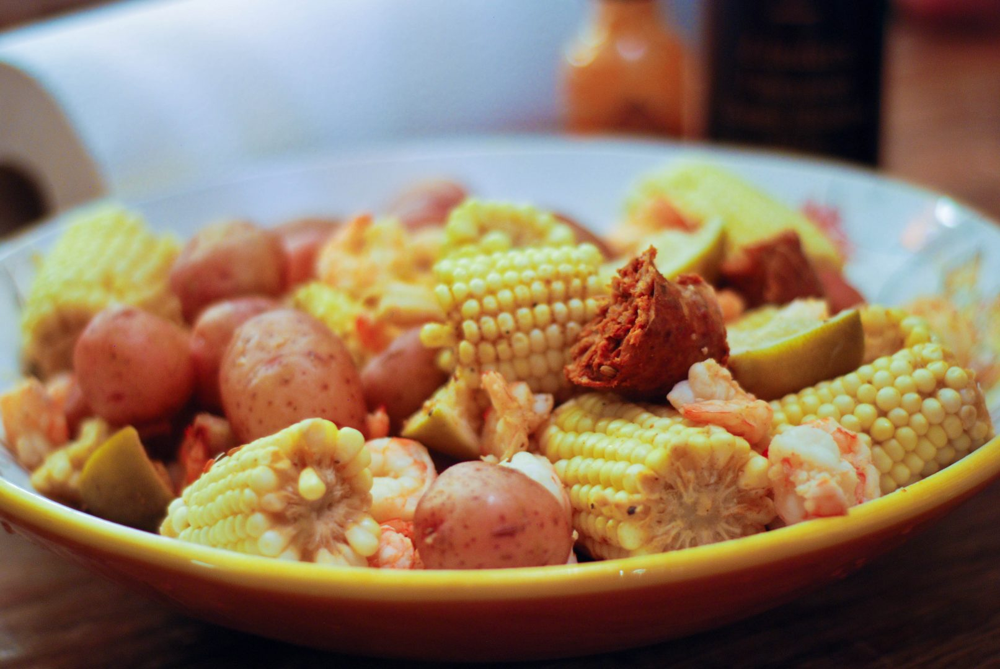

# Low Country Boil

*The Carolina coast's one-pot seafood feast: a giant pot of shrimp, smoked sausage, corn on the cob, red potatoes and Old Bay seasoning boiled together, then dumped onto a newspaper-covered table for family-style eating. The Lowcountry Carolina-Georgia coastal classic - the "Frogmore Stew" of Saint Helena Island.*

**Serves:** 8

**Prep Time:** 15 minutes

**Cook Time:** 35 minutes

## Overview
Low country boil (also called "Frogmore stew" after Frogmore community on Saint Helena Island, or "Beaufort boil") is the iconic one-pot seafood feast of the South Carolina and Georgia Lowcountry coast: a very large pot of boiling water heavily seasoned with Old Bay or shrimp/crab boil seasoning, into which are added baby red potatoes, corn on the cob (cut into thirds), smoked sausage (kielbasa or Conecuh), and finally large shrimp in their shells - everything cooked together in stages, then the entire pot drained and dumped onto a newspaper-covered outdoor table for family-style "pile-in" eating. Diners pick from the pile with their hands, peeling shrimp, biting corn, eating sausage and potato chunks. The dish defines Lowcountry summer entertaining. Three details: stages of cooking (different cook times for different items), heavy seasoning of the water, family-style dumping presentation.

## Ingredients

- 6 litres water
- 4 tablespoons Old Bay seasoning
- 2 tablespoons salt
- 1 tablespoon black peppercorns
- 4 bay leaves
- 1 lemon (halved)
- 2 large onions (quartered)
- 4 garlic cloves (whole)

### To cook in stages
- 1.5 kg small red baby potatoes
- 1 kg smoked sausage (kielbasa, Conecuh, or andouille; cut into 3 cm chunks)
- 8 ears corn on the cob (cut into thirds)
- 2 kg large shrimp in shells

### To serve
- Lemon wedges
- Cocktail sauce
- Melted butter
- Hot sauce
- Fresh parsley (chopped)
- Crusty bread
- Cold beer

## Method

### Stage 1 - Boil water
1. In a very large pot (12L+), combine water, Old Bay, salt, peppercorns, bay leaves, lemon, onions, garlic.
2. Bring to a rolling boil.
3. Cook 5 minutes.

### Stage 2 - Add potatoes
1. Add red potatoes.
2. Cook 12-15 minutes till just tender.

### Stage 3 - Add sausage and corn
1. Add chunks of sausage and corn pieces.
2. Cook 8 minutes.

### Stage 4 - Add shrimp
1. Add the shrimp.
2. Cook 3-4 minutes till pink (don't overcook).

### Stage 5 - Drain and serve
1. Drain everything in a large colander.
2. Discard the boiling water (or save 200 ml for sauce).
3. Cover an outdoor table with newspaper or butcher paper.
4. Dump the entire contents onto the table in a heap.
5. Place lemon wedges, melted butter, cocktail sauce, hot sauce around the pile.

### Stage 6 - Eat
1. Family-style with hands.
2. Peel shrimp; bite corn; eat sausage and potato.
3. Crusty bread for mopping; cold beer.

## Notes
- **Stages of cooking:** potatoes longest, then sausage and corn, then shrimp.
- **Heavy seasoning of water:** Old Bay essential.
- **Dump onto table:** the canonical Lowcountry presentation.
- **Don't overcook shrimp:** 3-4 minutes max.

## Variations
**With crab:** add 8 crab claws or 4 whole small crabs.
**With andouille:** for spicier kick.
**Indoor version:** serve in deep bowls instead of dumping on table.
**Spicier:** double the Old Bay; add cayenne.

## Serving
Family-style at outdoor tables in summer. Cold beer or sweet tea.

## Storage
- Best eaten immediately.
- Leftover shrimp/sausage/potatoes refrigerate 3 days; cold versions excellent in salads.
