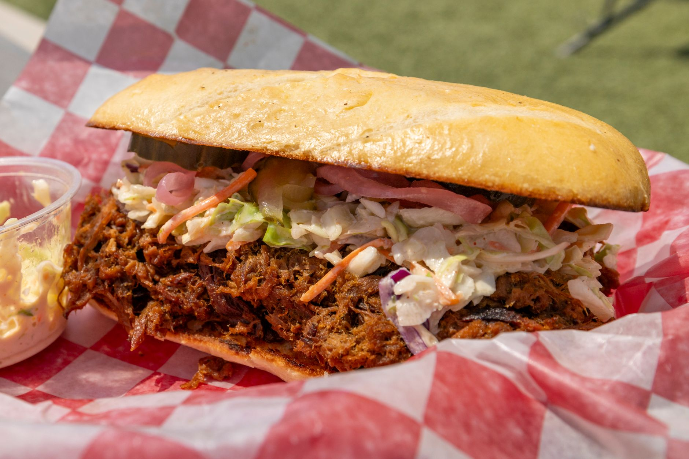

# Southern Pulled Pork BBQ

*The South's slow-smoked pork shoulder: a bone-in pork shoulder rubbed with a Southern spice blend, smoked over hickory or apple wood for 10-12 hours till the meat falls apart, pulled into shreds and dressed with vinegar-pepper sauce (Eastern Carolina) or tomato-vinegar sauce (Western Carolina). Served on soft white buns with coleslaw.*

**Serves:** 10-12

**Prep Time:** 25 minutes (plus overnight resting)

**Cook Time:** 10-12 hours

## Overview
Southern pulled pork BBQ is one of America's great regional barbecue traditions, with North Carolina being the historical heart: a whole bone-in pork shoulder (Boston butt; about 4-5 kg) rubbed overnight with a Southern spice blend (salt, brown sugar, paprika, garlic powder, onion powder, mustard powder, cumin, cayenne), then smoked low-and-slow at 110°C / 225°F over hickory or apple wood for 10-12 hours till the meat is fall-apart tender and the bark crusts deep mahogany. Pulled into long shreds with two forks and dressed with either Eastern Carolina vinegar-pepper sauce (vinegar, salt, pepper, hot sauce; thin and pungent) or Western Carolina tomato-vinegar sauce (vinegar, ketchup, brown sugar, hot sauce; thicker and sweeter). Served on soft white buns with a heap of coleslaw on top of the pulled pork (the canonical Carolina way - slaw goes on the sandwich, not alongside).

## Ingredients

### Pork
- 1 bone-in pork shoulder (Boston butt; about 4-5 kg)

### Spice rub
- 80 g dark brown sugar
- 4 tablespoons salt
- 3 tablespoons paprika (smoked or sweet)
- 2 tablespoons garlic powder
- 2 tablespoons onion powder
- 2 tablespoons mustard powder
- 2 tablespoons ground cumin
- 2 tablespoons ground black pepper
- 1 tablespoon ground cayenne pepper

### Smoking
- Hickory or apple wood chunks

### Eastern Carolina vinegar sauce
- 500 ml apple cider vinegar
- 100 ml white vinegar
- 4 tablespoons brown sugar
- 2 tablespoons salt
- 2 tablespoons crushed red pepper flakes
- 1 tablespoon ground black pepper
- 1 tablespoon hot sauce

### Western Carolina sauce
- 300 ml apple cider vinegar
- 250 g ketchup
- 80 g brown sugar
- 2 tablespoons Worcestershire sauce
- 2 tablespoons hot sauce
- 1 tablespoon paprika
- 2 teaspoons salt
- 1 teaspoon black pepper

### To serve
- Soft white hamburger buns (or "potato rolls")
- Coleslaw (canonical to put on the sandwich)
- Pickles
- Pickled jalapeños

## Method

### Stage 1 - Rub (the night before)
1. Mix all spice rub ingredients.
2. Rub thoroughly all over the pork.
3. Refrigerate uncovered overnight.

### Stage 2 - Set up smoker
1. Heat smoker to 110°C (225°F).
2. Add hickory or apple wood chunks.

### Stage 3 - Smoke
1. Place pork fat-side-up on smoker.
2. Smoke 10-12 hours till the internal temperature reaches 95°C (203°F) and the meat probes like butter.
3. Spritz with apple juice every 2 hours (optional).

### Stage 4 - Rest
1. Wrap in butcher paper.
2. Place in a cooler.
3. Rest 1-2 hours.

### Stage 5 - Pull
1. Place on a board.
2. Use two forks (or insulated gloves) to pull the pork into long shreds.
3. Remove the bone and excess fat.

### Stage 6 - Make sauce (pick one)
1. Eastern Carolina: combine all ingredients; stir till sugar dissolves; rest 30 min.
2. Western Carolina: combine all in saucepan; simmer 10 min; cool.

### Stage 7 - Dress
1. Toss pulled pork with about 200 ml of the vinegar sauce.
2. Reserve extra sauce for serving.

### Stage 8 - Serve
1. Pile pulled pork on soft buns.
2. Top with coleslaw (the canonical Carolina way).
3. Add pickles, jalapeños.
4. Extra sauce on the side.

## Notes
- **Bone-in shoulder essential.**
- **Smoke 10-12 hours low-and-slow.**
- **Internal 95°C / 203°F:** doneness test.
- **Rest 1-2 hours before pulling.**
- **Vinegar sauce canonical Carolina.**

## Variations
**Kansas City style:** use thick sweet tomato-molasses sauce.
**Memphis dry style:** no sauce; serve plain pulled pork with rub.
**Slow-cooker version:** cook 8 hours on low; less smoke flavour but accessible.
**Oven version:** roast wrapped at 110°C for 10 hours; add liquid smoke for smoky flavour.

## Serving
On soft buns with coleslaw, pickles. Beans, slaw, mac-and-cheese on the side. Sweet tea, beer.

## Storage
- Keeps refrigerated 5 days; flavour deepens.
- Freezes 6 months in portions.
- Day-after pulled pork is excellent.
