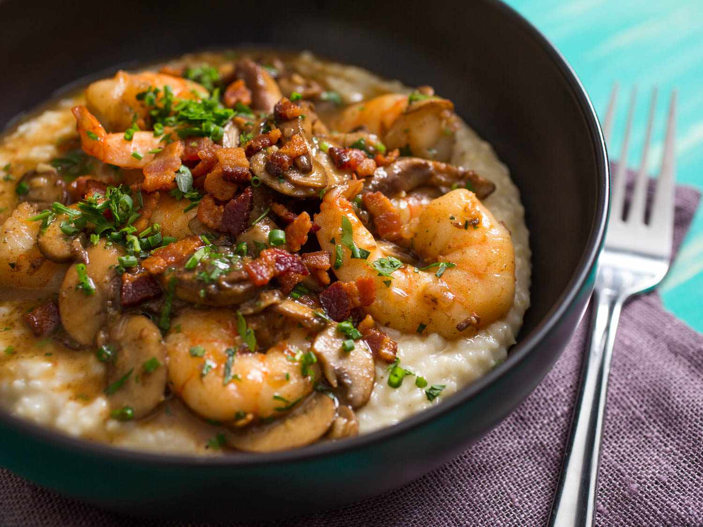

# Shrimp and Grits

*The South's shrimp-over-creamy-grits classic: shrimp sautéed in butter with garlic, smoked paprika and a touch of bacon, served over creamy stone-ground grits with cheese and butter. The Lowcountry Carolina specialty and Southern brunch star.*

**Serves:** 4

**Prep Time:** 20 minutes

**Cook Time:** 40 minutes

## Overview
Shrimp and grits is one of the South's most beloved dishes, particularly associated with the Lowcountry of South Carolina and Georgia (Charleston and Savannah): large shrimp sautéed in butter and bacon fat with garlic, smoked paprika, lemon juice and a splash of white wine or chicken stock, served over a creamy bowl of stone-ground white grits cooked with milk and chicken stock, enriched with butter, cream cheese, and sharp cheddar. Topped with crispy bacon, sliced spring onions, fresh parsley and lemon wedges.

## Ingredients

### Grits
- 250 g stone-ground white grits
- 500 ml whole milk
- 500 ml chicken stock
- 80 g butter
- 100 g cream cheese
- 200 g grated sharp cheddar
- 1 ½ teaspoons fine sea salt
- 1 teaspoon ground black pepper

### Bacon
- 6 strips smoked bacon (diced)

### Shrimp
- 600 g large shrimp (peeled, deveined)
- 4 garlic cloves (crushed)
- 2 tablespoons butter
- 100 ml dry white wine (or chicken stock)
- 1 teaspoon smoked paprika
- 1 teaspoon [Old Bay seasoning](../../base-ingredients/spices/old-bay-seasoning.md) (or paprika + celery salt)
- Juice of 1 lemon
- 1 teaspoon hot sauce
- 1 ½ teaspoons fine sea salt
- 1 teaspoon ground black pepper

### To finish
- 4 spring onions (sliced)
- 1 small bunch fresh parsley (chopped)
- Lemon wedges

## Method

### Stage 1 - Make grits
1. In a heavy pot, bring milk and stock to a simmer with salt.
2. Slowly pour in grits, whisking constantly.
3. Reduce to lowest; cook 30-40 minutes, stirring frequently, till tender and creamy.
4. Whisk in butter, cream cheese and cheddar.
5. Keep warm.

### Stage 2 - Cook bacon
1. Cook diced bacon in wide pan 5 minutes till crispy.
2. Lift bacon out; keep fat.

### Stage 3 - Cook shrimp
1. Season shrimp with salt, pepper, smoked paprika and Old Bay.
2. Heat bacon fat in pan; add butter.
3. Add garlic; cook 30 seconds.
4. Add shrimp; cook 90 seconds per side.
5. Add wine; let bubble 30 seconds.
6. Squeeze lemon; add hot sauce.

### Stage 4 - Serve
1. Ladle grits into deep bowls.
2. Top with shrimp and sauce.
3. Scatter bacon, spring onions, parsley.
4. Lemon wedges.

## Notes
- **Stone-ground grits:** essential.
- **Don't overcook shrimp:** 3 minutes max.
- **Plenty of butter and cheese in grits.**
- **Bacon fat for shrimp.**

## Variations
- **With Andouille sausage:** add sliced sausage to the shrimp.
- **Without bacon:** vegetarian-friendly version (without shrimp).
- **Spicier:** double the hot sauce.

## Serving
- For Southern brunch or dinner. Sweet tea, sparkling wine.

## Storage
- Best eaten immediately.
- Grits keep refrigerated 3 days; reheat with milk.
- Don't freeze.
