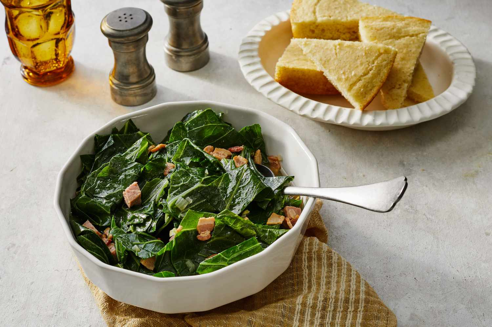

# Southern Collard Greens

*The South's slow-cooked greens: collard greens slow-simmered with a smoked ham hock, onion, garlic, hot sauce, vinegar and a touch of brown sugar till the greens go silky-tender. The traditional Southern side, the "money greens" of New Year's Day, the green vegetable of every Southern plate.*

**Serves:** 6-8

**Prep Time:** 15 minutes

**Cook Time:** 2 hours

## Overview
Southern collard greens is one of the most beloved sides in Southern cooking and the traditional green vegetable that turns up alongside every Southern plate: fresh collard greens (the tough cabbage-family leaf widely grown in the South; substitute with kale or Swiss chard outside) trimmed of ribs and roughly chopped, then slow-simmered with a smoked ham hock (or smoked turkey wing for a leaner version), chopped onion, crushed garlic, hot sauce, apple cider vinegar, a touch of brown sugar and chicken stock for 90+ minutes till the greens are silky-tender and the "pot liquor" (the cooking liquid) has thickened into a deeply flavoured broth. On New Year's Day, collards are eaten alongside Hoppin' John for luck (the green of greens symbolises dollars).

## Ingredients

- 1.5 kg fresh collard greens (or substitute with kale or chard)
- 1 smoked ham hock (or 200 g smoked turkey wing; or 200 g bacon)
- 4 tablespoons bacon fat or vegetable oil
- 1 large onion (chopped)
- 8 garlic cloves (crushed)
- 1 small fresh chilli (chopped, optional)
- 1.5 litres chicken stock (or water)
- 4 tablespoons apple cider vinegar
- 2 tablespoons brown sugar
- 2 tablespoons hot sauce
- 1 ½ teaspoons fine sea salt
- 1 teaspoon ground black pepper
- 1 teaspoon red pepper flakes (optional)

### To finish
- 1 small splash extra vinegar (at end)
- Hot sauce for serving

## Method

### Stage 1 - Prep collards
1. Wash collards thoroughly.
2. Strip the leaves off the tough central ribs (discard ribs).
3. Roughly chop the leaves.

### Stage 2 - Sauté base
1. Heat bacon fat in a large pot over medium heat.
2. Add chopped onion; cook 6 min.
3. Add garlic; cook 30 sec.

### Stage 3 - Add ham hock and liquid
1. Add ham hock (or substitute) and chilli (if using).
2. Pour in chicken stock.
3. Add vinegar, brown sugar, hot sauce, salt, pepper, red pepper flakes.
4. Bring to simmer.

### Stage 4 - Add collards
1. Stir in chopped collards (they'll seem too much; they wilt).
2. Push down so all are submerged.
3. Reduce heat; cover slightly ajar.
4. Cook 90 min till the greens are silky-tender.

### Stage 5 - Shred meat
1. Remove ham hock; shred meat from bone; return to pot.

### Stage 6 - Finish
1. Add a splash of vinegar to brighten.
2. Taste; adjust salt and hot sauce.

### Stage 7 - Serve
1. Ladle into bowls or alongside Southern mains.
2. Make sure to include some "pot liquor" (the broth).
3. Hot sauce on the table.

## Notes
- **Smoked ham hock essential** (or substitute).
- **Slow-cook properly:** 90 min minimum.
- **Pot liquor is the prize:** the broth is the best part.
- **Cornbread for soaking:** the traditional Southern combination.

## Variations
- **With smoked turkey wing:** leaner version.
- **Vegetarian:** skip the meat; add 2 tablespoons smoked paprika and 2 tablespoons soy sauce for umami.
- **Spicier:** double the chilli and hot sauce.
- **With sweet potato:** add cubed sweet potato in the last 30 min.

## Serving
- Alongside fried chicken, BBQ, ham. With cornbread for soaking the pot liquor. On New Year's Day with Hoppin' John.

## Storage
- Keeps refrigerated 5 days; flavour deepens.
- Freezes 3 months.
- Day-after collards are excellent.
