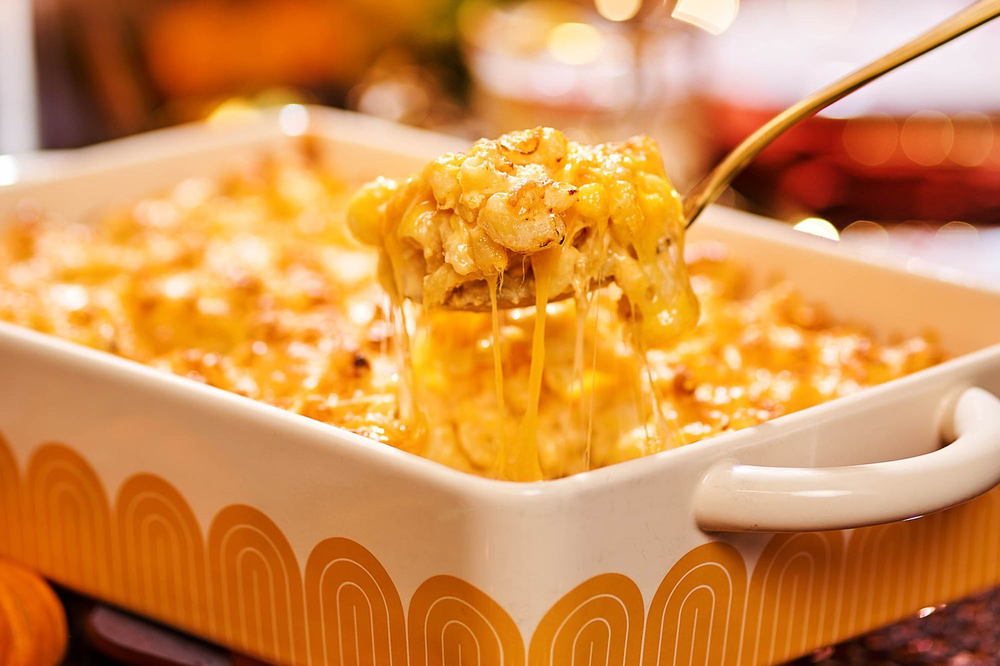

# Southern Mac and Cheese

*The South's baked macaroni-and-cheese: elbow macaroni tossed with a custardy cheese sauce (eggs, milk, butter, sharp cheddar, Monterey Jack and cream cheese), baked till the top crusts deep golden. The Southern Sunday-dinner side, the "fourth meat" of the Soul Food trinity.*

**Serves:** 8

**Prep Time:** 20 minutes

**Cook Time:** 40 minutes

## Overview
Southern mac and cheese (often called "Soul Food mac and cheese" to distinguish from creamy stovetop versions) is one of the South's most beloved sides and a fixture of every Southern Sunday dinner, Thanksgiving table and church potluck: elbow macaroni cooked to al dente, tossed with a rich custardy cheese mixture made from eggs, whole milk, evaporated milk, butter, sharp cheddar, Monterey Jack and cream cheese (plus seasonings, salt, pepper, garlic powder, mustard powder, paprika), poured into a deep baking dish, topped with more grated cheddar, and baked till the cheese melts into the custard, the top crusts deep golden and the edges crisp. The Southern version distinguishes itself from Northern white-sauce-based mac-and-cheese by using eggs in the custard (gives a denser sliceable texture), multiple cheeses (depth), and baking till deeply golden.

## Ingredients

### Pasta
- 500 g elbow macaroni
- 2 tablespoons salt (for cooking water)

### Cheese custard
- 4 large eggs
- 500 ml evaporated milk
- 250 ml whole milk
- 80 g unsalted butter (melted)
- 200 g cream cheese (room temperature)
- 2 teaspoons fine sea salt
- 1 teaspoon ground black pepper
- 1 teaspoon garlic powder
- 1 teaspoon mustard powder
- 1 teaspoon paprika
- ½ teaspoon ground white pepper

### Cheese
- 400 g grated sharp cheddar (best quality)
- 300 g grated Monterey Jack
- 100 g grated Parmesan (optional, for tang)

### Topping
- 200 g grated sharp cheddar (extra)
- 1 teaspoon paprika

## Method

### Stage 1 - Cook pasta
1. Bring salted water to boil; cook macaroni 1 min less than packet.
2. Drain; rinse briefly with cold water; drain again.
3. Toss with 2 tablespoons melted butter to prevent sticking.

### Stage 2 - Make custard
1. In a wide bowl, whisk eggs.
2. Whisk in evaporated milk and whole milk.
3. Whisk in melted butter and cream cheese (work the cream cheese in well).
4. Add salt, pepper, garlic powder, mustard powder, paprika, white pepper.

### Stage 3 - Combine
1. In a large bowl, combine cooked macaroni, the cheddar-Monterey-Parmesan mix, and the custard.
2. Toss thoroughly.

### Stage 4 - Assemble
1. Preheat oven to 180°C (350°F).
2. Grease a wide deep baking dish (25 × 35 cm).
3. Tip the mac-and-cheese mixture in.
4. Top with the extra grated cheddar.
5. Sprinkle paprika.

### Stage 5 - Bake
1. Bake 30-35 min till the top is deeply golden and the centre is bubbling.

### Stage 6 - Rest and serve
1. Let rest 10 min (the layers set).
2. Cut into squares.
3. Serve warm.

## Notes
- **Eggs in custard essential:** Southern technique.
- **Multiple cheeses for depth.**
- **Don't overcook pasta:** finishes baking.
- **Rest before serving.**

## Variations
**With breadcrumb topping:** add panko + butter on top.
**With bacon:** crumble cooked bacon in the layers.
**With lobster:** add 200 g lobster meat.
**Spicier:** add chopped jalapeño + cayenne.

## Serving
Alongside Southern Sunday dinner: fried chicken, collards, cornbread.

## Storage
- Keeps refrigerated 5 days; reheat in oven.
- Freezes 3 months.
