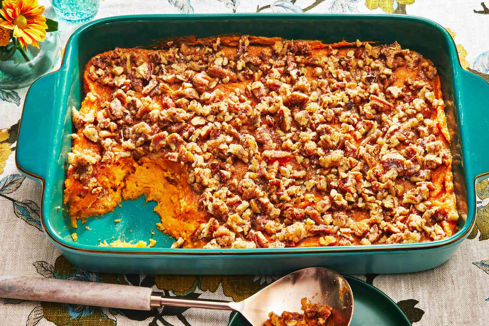

# Sweet Potato Casserole

*The South's marshmallow-or-pecan topped sweet potato side: mashed sweet potatoes mixed with butter, brown sugar, cinnamon and vanilla, topped with either toasted marshmallows or a brown-sugar-pecan streusel, baked till golden. The canonical Southern Thanksgiving side, the "fourth dessert" of the holiday plate.*

**Serves:** 8

**Prep Time:** 25 minutes

**Cook Time:** 45 minutes

## Overview
Sweet potato casserole is one of the South's most iconic Thanksgiving sides and a year-round Southern dinner staple: roasted or boiled sweet potatoes mashed with butter, brown sugar, milk, eggs, cinnamon, nutmeg, vanilla and a touch of orange zest, poured into a baking dish, then topped with either toasted mini marshmallows (the canonical Southern Thanksgiving topping; controversial outside the South) or a brown-sugar-pecan streusel (the more "refined" topping). Baked till the top is deep golden. The dish sits between side and dessert; sweet enough to be either. Three details: well-mashed sweet potato (smooth, not chunky), generous brown sugar and butter, topping of choice (marshmallows or pecans).

## Ingredients

### Sweet potato base
- 1.5 kg sweet potatoes (peeled, cubed)
- 100 g unsalted butter (melted)
- 200 g dark brown sugar
- 100 ml whole milk
- 2 large eggs
- 2 teaspoons vanilla extract
- 1 tablespoon ground cinnamon
- 1 teaspoon ground nutmeg
- Zest of 1 orange
- 1 teaspoon fine sea salt

### Marshmallow topping (canonical Southern)
- 200 g mini marshmallows

### OR Pecan streusel topping
- 150 g pecans (chopped)
- 100 g dark brown sugar
- 50 g plain flour
- 60 g cold butter (cubed)
- 1 teaspoon ground cinnamon

## Method

### Stage 1 - Cook sweet potatoes
1. Place cubed sweet potatoes in pot of salted water.
2. Boil 15-18 min till tender.
3. Drain; mash smooth.

### Stage 2 - Make filling
1. Add melted butter, brown sugar, milk, eggs, vanilla, cinnamon, nutmeg, orange zest, salt.
2. Mix thoroughly.

### Stage 3 - Assemble
1. Preheat oven to 180°C (350°F).
2. Grease a baking dish (23×33 cm).
3. Spread the sweet potato mixture in.

### Stage 4 - Add topping
- **Marshmallow:** scatter mini marshmallows over.
- **Pecan streusel:** mix pecans, brown sugar, flour and cold butter (rub in); sprinkle over.

### Stage 5 - Bake
1. Bake 30-40 min till golden and bubbling.
2. For marshmallow version, finish under grill 30 sec for toasting (watch carefully).

### Stage 6 - Serve
1. Let rest 10 min.
2. Serve warm.

## Notes
- **Well-mashed sweet potato.**
- **Topping of choice:** marshmallows (canonical) or pecans (refined).
- **Don't burn marshmallows:** finish briefly under grill.

## Variations
**Both toppings:** scatter pecans first, then marshmallows; the maximalist Southern Thanksgiving.
**Bourbon version:** add 2 tablespoons bourbon to the filling.
**Pumpkin pie spice:** swap cinnamon-nutmeg for 2 teaspoons pumpkin pie spice.
**Less sweet:** halve the brown sugar.

## Serving
At Thanksgiving alongside turkey, gravy, mashed potatoes, green bean casserole. Year-round with ham.

## Storage
- Keeps refrigerated 4 days; reheat in oven.
- Freezes 2 months (without marshmallow topping).
