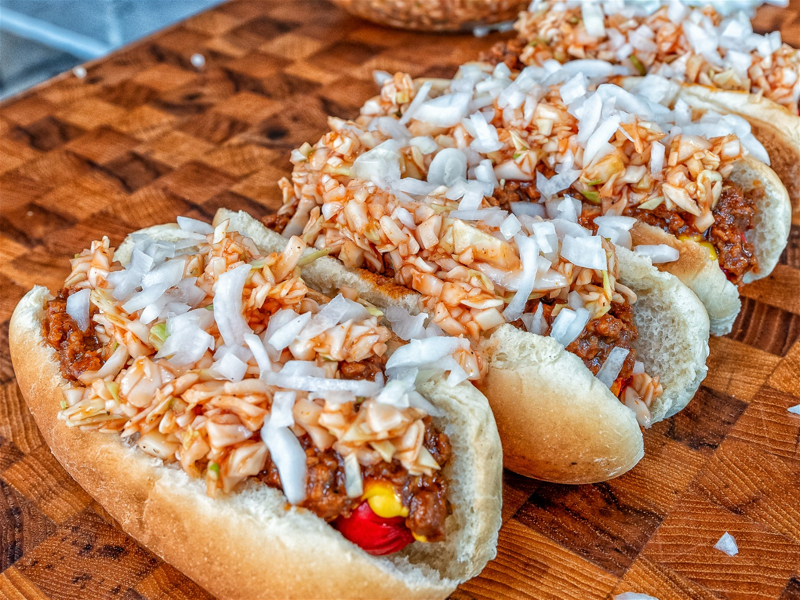

# Carolina Hot Dog

*The Carolinas' regional hot dog: an all-beef frankfurter in a soft white bun, topped with a beef-tomato chili sauce, finely chopped raw onion, and a generous heap of vinegar-tangy red cabbage coleslaw. The North and South Carolina drive-in standard; the slaw on top is the distinguishing feature.*

**Serves:** 4

**Prep Time:** 25 minutes

**Cook Time:** 35 minutes (mostly chili)

## Overview
The Carolina hot dog (sometimes called a "slaw dog") is the regional hot dog of North and South Carolina and the dish that defines drive-in and roadside hot dog stands across the Carolinas (Bill's Hot Dogs in Washington, NC, has been making them since 1928; Don Beans Hot Dogs and dozens of small stands serve them across both states): an all-beef frankfurter (or sometimes a red-dyed Carolina-style "red hot") in a soft steamed bun, topped with a thin tomato-and-beef chili sauce (the Carolina chili is thinner and less spiced than Coney sauce or Texas chili, more like a sloppy meat-tomato gravy), a heap of finely chopped raw white onion, yellow mustard, and the defining Carolina ingredient: a heap of red cabbage slaw with a vinegar-and-mustard dressing that contrasts the warm dog with cold, tangy, slightly sweet crunch. The slaw is what separates the Carolina dog from every other chili dog; it's not optional, and it's piled high enough to obscure the dog.

## Ingredients

### Carolina chili
- 500 g ground beef (80/20)
- 1 small onion (very finely chopped)
- 4 garlic cloves (crushed)
- 2 tablespoons tomato paste
- 1 tin (400 g) tomato sauce or passata
- 400 ml water (or beef stock)
- 2 tablespoons mild chilli powder
- 1 teaspoon ground cumin
- 1 teaspoon paprika
- 1 teaspoon dried oregano
- 1 tablespoon Worcestershire sauce
- 1 tablespoon apple cider vinegar
- 2 teaspoons brown sugar
- 1 ½ teaspoons fine sea salt
- 1 teaspoon ground black pepper

### Red cabbage slaw
- 300 g red cabbage (finely shredded)
- 100 g white cabbage (finely shredded)
- 1 small carrot (grated)
- 4 tablespoons mayonnaise
- 3 tablespoons apple cider vinegar
- 2 tablespoons yellow mustard
- 2 tablespoons caster sugar
- 1 teaspoon celery seed
- 1 teaspoon fine sea salt
- ½ teaspoon ground black pepper

### Dogs and build
- 4 all-beef frankfurters
- 4 soft white hot dog buns
- 1 small white onion (very finely chopped, for topping)
- Yellow mustard (for the build)

### To serve
- Sweet tea
- Crinkle-cut fries

## Method

### Stage 1 - Make Carolina chili
1. Brown the ground beef in a heavy pan 8 minutes, breaking up.
2. Add chopped onion; cook 6 minutes.
3. Add garlic; cook 30 seconds.
4. Stir in tomato paste; cook 1 minute.
5. Add tomato sauce, water, chilli powder, cumin, paprika, oregano, Worcestershire, vinegar, sugar, salt and pepper.
6. Simmer 25-30 minutes till thickened to a thin sloppy meat-sauce consistency (not as thick as Coney; not as runny as a sauce; somewhere in between).

### Stage 2 - Make slaw
1. Whisk mayonnaise, vinegar, mustard, sugar, celery seed, salt and pepper.
2. Toss in shredded cabbages and grated carrot.
3. Refrigerate 30 minutes to soften and meld.

### Stage 3 - Cook the dogs
1. Bring a wide pan of water to a gentle simmer.
2. Add frankfurters; warm 5-6 minutes.

### Stage 4 - Steam the buns
1. Lightly steam the buns in a steamer basket 30 seconds (or microwave in a damp paper towel 15 seconds) till soft.

### Stage 5 - Build "all the way"
1. Place dog in bun.
2. A zigzag of yellow mustard down the dog.
3. A generous ladle of warm Carolina chili.
4. A heap of finely chopped raw white onion.
5. A generous heap of red cabbage slaw on top.
6. The slaw should mound up; that's the Carolina way.

### Stage 6 - Serve immediately
1. With sweet tea and crinkle fries.

## Notes
- **Carolina chili is thinner than Coney:** the texture distinguishes it.
- **Red cabbage slaw, not white-only:** the colour contrast is the visual signature.
- **Vinegar-based slaw, not heavy creamy mayo:** the tang cuts the chili.
- **"All the way" = chili, mustard, onion, slaw:** order it that way at a stand.

## Variations
**With a red hot:** swap the standard frankfurter for a North Carolina red-dyed hot dog (Bright Leaf brand).
**Spicier:** add chopped jalapeños to the slaw or 1 teaspoon cayenne to the chili.
**With BBQ pork:** swap the dog for pulled pork (the Carolina BBQ-and-slaw shortcut).
**Without onion ("three-way"):** chili + mustard + slaw only.

## Serving
At a Carolinas drive-in. At a Saturday cookout. At home with sweet tea and fries.

## Storage
- Chili refrigerates 5 days; freezes 3 months.
- Slaw refrigerates 3 days.
- Cooked dogs refrigerate 3 days.
- Don't assemble; the bun goes soggy.
