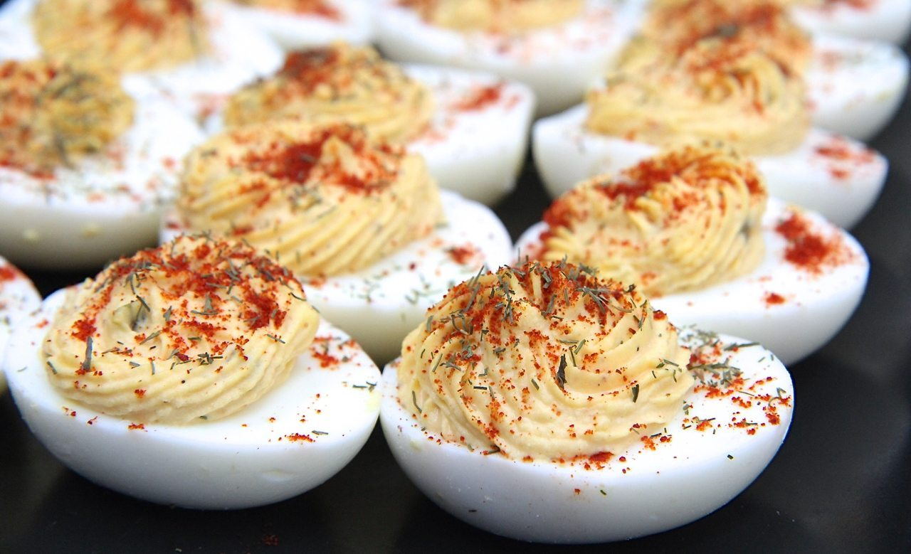

# Southern Deviled Eggs

*The South's filled egg classic: hard-boiled eggs halved, yolks mashed with mayonnaise, mustard, sweet pickle relish, and a touch of hot sauce, then piped back into the egg whites and dusted with paprika. The canonical Southern church potluck and family-reunion appetiser.*

**Serves:** 6-8 (12 deviled egg halves)

**Prep Time:** 25 minutes (plus egg cooling)

**Cook Time:** 12 minutes

## Overview
Southern deviled eggs are one of the South's most beloved appetisers and a fixture of every church potluck, family reunion, picnic and Sunday dinner: hard-boiled eggs halved lengthwise, the yolks scooped out and mashed with mayonnaise (Duke's canonical Southern), yellow mustard, sweet pickle relish (or finely chopped sweet pickles), a touch of hot sauce, paprika, salt and pepper, then piped or spooned back into the egg whites and dusted with paprika and chopped chives. The Southern version distinguishes itself from generic deviled eggs by the sweet pickle relish (the Southern touch - gives sweet-sour balance), Duke's mayo, and the generous paprika dusting.

## Ingredients

- 12 large eggs
- 1 teaspoon salt (for the boiling water)
- 1 teaspoon white vinegar (helps with peeling)

### Filling
- 200 g Duke's mayonnaise
- 3 tablespoons sweet pickle relish (or finely chopped sweet pickles + their brine)
- 2 tablespoons yellow mustard
- 1 tablespoon Dijon mustard
- 1 teaspoon hot sauce
- 1 teaspoon paprika
- 1 teaspoon garlic powder
- 1 teaspoon onion powder
- 1 teaspoon fine sea salt
- ½ teaspoon ground black pepper

### Garnish
- 2 teaspoons paprika (for dusting)
- 2 tablespoons chopped fresh chives
- Optional: chopped pickled jalapeños
- Optional: cooked crumbled bacon

## Method

### Stage 1 - Boil eggs
1. Place eggs in a pot of cold water; add salt and vinegar.
2. Bring to a boil; reduce heat to medium-low.
3. Cook 11-12 min (don't boil hard; gives grey-green ring around yolks).
4. Plunge into ice water; cool fully.

### Stage 2 - Peel and halve
1. Peel cool eggs.
2. Halve lengthwise.
3. Scoop yolks into a wide bowl.
4. Arrange whites on a serving platter.

### Stage 3 - Make filling
1. Mash yolks finely with a fork (or push through a sieve for the smoothest finish).
2. Add mayo, relish, both mustards, hot sauce, paprika, garlic powder, onion powder, salt and pepper.
3. Mix till smooth.

### Stage 4 - Fill the whites
1. Transfer filling to a piping bag fitted with a star tip.
2. Pipe filling generously into each egg-white half.
3. (Or use 2 spoons to mound the filling.)

### Stage 5 - Garnish
1. Dust with paprika.
2. Scatter chopped chives.
3. Optional: top each with a tiny piece of pickled jalapeño or crumbled bacon.

### Stage 6 - Serve
1. Arrange on a platter.
2. Refrigerate till serving.

## Notes
- **Don't over-boil:** 11-12 min is right.
- **Sweet pickle relish canonical Southern.**
- **Pipe through a star tip:** the iconic look.
- **Dust with paprika:** Southern touch.

## Variations
**With bacon:** crumbled bacon on top.
**Spicy:** double hot sauce; add chopped jalapeños.
**Avocado deviled:** swap half the mayo for mashed avocado.
**With smoked salmon:** top each with a small slice of smoked salmon.

## Serving
At Southern church potlucks, family reunions, picnics. With sweet tea or cocktails.

## Storage
- Keeps refrigerated 2 days.
- Don't freeze.
