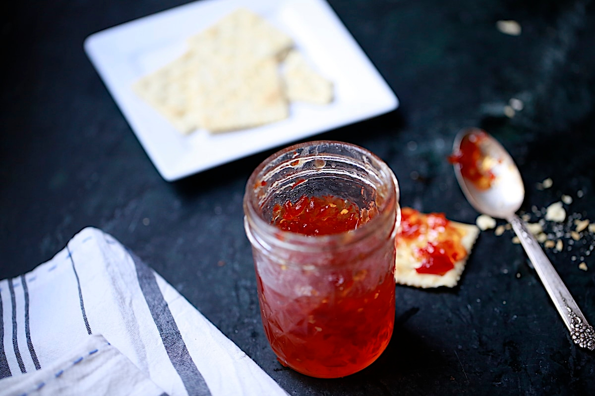

# Hot Pepper Jelly

*The South's sweet-spicy jelly: fresh red bell peppers and hot chillies blitzed and cooked into a clear sweet-spicy red jelly. Spread on crackers with cream cheese, glazed on grilled chicken, swirled into BBQ sauce. The Southern condiment that bridges sweet and savoury.*

**Serves:** Makes 4 small jars (about 1 litre total)

**Prep Time:** 20 minutes

**Cook Time:** 25 minutes

## Overview
Hot pepper jelly is one of the South's most distinctive condiments and a beloved Southern Christmas gift: fresh red bell peppers and fresh hot red chillies blitzed in a food processor with apple cider vinegar, sugar and pectin, brought to a boil till the pectin sets, poured into sterilised jars and sealed. The result is a beautiful clear red jelly with visible flecks of pepper, sweet-spicy in flavour, with enough heat to bite but enough sugar to balance. Used as a spread (on crackers with cream cheese - the canonical Southern appetiser), glazed on grilled chicken or ham, brushed on cheese for charcuterie boards, swirled into BBQ sauce. Three details: bell peppers + hot chillies (combination), apple cider vinegar (not white), pectin (essential for proper set).

## Ingredients

- 4 large red bell peppers (about 800 g; deseeded and chopped)
- 6 fresh red hot chillies (jalapeño, serrano, or red Thai; deseeded for milder)
- 250 ml apple cider vinegar
- 800 g caster sugar
- 1 packet (50 g) liquid pectin (Certo brand or similar)
- 1 ½ teaspoons fine sea salt

### Optional
- 1 small handful fresh coriander (for a green pepper version)
- 1 tablespoon lemon juice (for brightness)

### Equipment
- 4 small canning jars (250 ml) with lids; sterilised
- Large heavy saucepan
- Food processor or blender
- Candy thermometer (optional but helpful)

## Method

### Stage 1 - Prep peppers
1. Wash, deseed and roughly chop bell peppers and hot chillies.
2. Place in a food processor.

### Stage 2 - Pulse
1. Pulse 6-8 times to a coarse texture (not smooth purée).
2. The peppers should be finely chopped but visible.

### Stage 3 - Cook
1. Transfer to a heavy saucepan.
2. Add vinegar, sugar, salt.
3. Bring to a rolling boil over high heat, stirring.
4. Boil 5 minutes.

### Stage 4 - Add pectin
1. Stir in liquid pectin.
2. Continue boiling 1 minute (the pectin needs to activate at full boil for the proper set).

### Stage 5 - Skim and pour
1. Take off heat.
2. Skim any foam.
3. Pour into sterilised jars; leave 5mm headspace.
4. Wipe rims; seal with lids.

### Stage 6 - Set
1. Let cool at room temperature.
2. The jelly will set as it cools (over 2-4 hours).
3. Refrigerate after opening.

### Stage 7 - Use
1. Spread on crackers with cream cheese.
2. Glaze grilled chicken or pork in the last 5 minutes.
3. Stir into BBQ sauce.
4. Serve with cheese on a board.

## Notes
- **Bell pepper + hot chillies:** the canonical combination.
- **Apple cider vinegar canonical:** white vinegar gives a different flavour.
- **Pectin essential for set.**
- **Boil briefly after adding pectin:** activates.
- **Sterilised jars:** for proper preservation.

## Variations
**Green pepper jelly:** use green bell peppers + green chillies; same technique.
**Spicier:** double the hot chillies; include seeds.
**With rosemary:** add 2 sprigs fresh rosemary to the cooking; gives herbaceous depth.
**With cranberries:** add 100 g fresh cranberries; gives a Christmas variation.

## Serving
On crackers with cream cheese (canonical Southern appetiser). As glaze on grilled meats. With cheese boards. Drink: champagne, white wine.

## Storage
- Sealed unopened jars keep 1 year at room temperature.
- Once opened, refrigerated 3 months.
- Don't freeze; the texture suffers.
