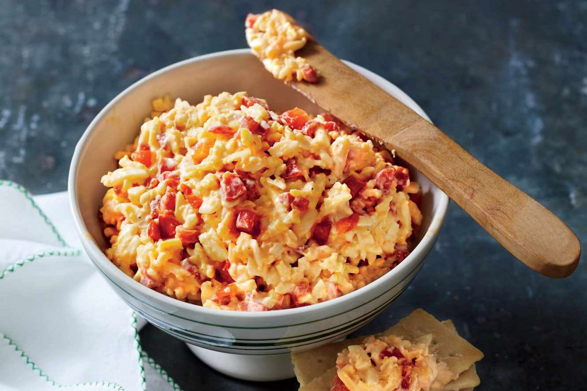

# Pimento Cheese

*The South's cheese-and-pimento spread: grated sharp cheddar, mayonnaise, diced pimentos (sweet red peppers), grated onion, hot sauce and seasoning whipped into a thick spreadable cheese mixture. The Southern "caviar of the South", on crackers, in sandwiches, on burgers, with crudités.*

**Serves:** Makes 600 ml

**Prep Time:** 15 minutes

**Cook Time:** 0 minutes

## Overview
Pimento cheese is the South's most beloved cheese spread and one of the most iconic Southern foods, often called "the caviar of the South": grated sharp cheddar (the traditional Southern choice is extra-sharp Wisconsin or Vermont cheddar), mixed with mayonnaise (Duke's mayo is the traditional Southern brand), diced jarred pimentos (sweet red peppers, jarred and drained), grated onion, hot sauce, mustard powder, garlic powder, salt and black pepper, all stirred together by hand into a thick chunky spread (not a smooth purée). Served on saltine crackers, in white-bread sandwiches, on burgers, stuffed into celery sticks, with crudités.

## Ingredients

- 400 g extra-sharp cheddar (freshly grated; the traditional Southern choice)
- 200 g Monterey Jack (grated; for melt-quality)
- 200 g Duke's mayonnaise (the traditional Southern brand; or any good-quality mayo)
- 1 small jar (200 g) diced pimentos (drained well)
- 1 small onion (grated; about 2 tablespoons)
- 2 teaspoons mustard powder
- 1 teaspoon garlic powder
- 1 teaspoon onion powder
- 1 teaspoon ground black pepper
- 1 teaspoon fine sea salt
- 1 tablespoon hot sauce (Tabasco or Frank's)
- ½ teaspoon cayenne pepper
- 1 tablespoon Worcestershire sauce
- 1 tablespoon apple cider vinegar

### Optional additions
- 1 tablespoon Dijon mustard
- 2 chopped pickled jalapeños

## Method

### Stage 1 - Grate cheese
1. Grate cheddar and Monterey Jack into a wide bowl.

### Stage 2 - Add aromatics
1. Add diced pimentos, grated onion, mustard powder, garlic powder, onion powder, pepper, salt, hot sauce, cayenne, Worcestershire, vinegar.

### Stage 3 - Add mayo and mix
1. Add mayonnaise.
2. Stir vigorously by hand till everything is combined into a thick chunky spread.
3. Don't use a blender or food processor, texture must stay chunky.

### Stage 4 - Rest
1. Cover and refrigerate at least 2 hours (overnight is better).
2. The flavours marry over time.

### Stage 5 - Use
1. As a spread on crackers (saltines traditional).
2. In sandwiches between two slices of white bread.
3. Stuffed into celery sticks.
4. Melted on burgers.
5. Dolloped onto deviled eggs.

## Notes
- **Hand-mixed chunky:** don't blend smooth.
- **Duke's mayonnaise traditional Southern.**
- **Freshly grate cheese:** pre-shredded won't bind.
- **Rest overnight:** flavours improve.

## Variations
**With bacon:** add 6 strips crumbled cooked bacon.
**Spicier:** double the cayenne; add chopped jalapeños.
**With smoked cheddar:** swap half the cheddar for smoked cheddar.
**Without onion (purist):** some Southerners omit onion.

## Serving
On crackers, in sandwiches, on burgers, with crudités. At Southern parties, gameday gatherings, hors d'oeuvres.

## Storage
- Keeps refrigerated 1 week.
- Don't freeze; mayo splits.
- Better after 24 hours.
