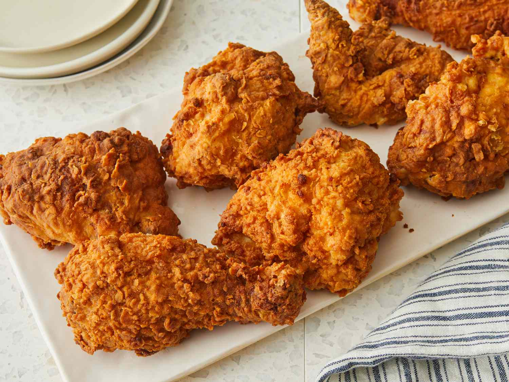

# Southern Fried Chicken

*The Deep South's iconic fried chicken: bone-in chicken pieces brined overnight in buttermilk and hot sauce, double-dredged in seasoned flour, and fried in hot oil till the outside crusts deep golden and the inside stays juicy. The Southern Sunday dinner centerpiece, the bar against which all other fried chicken is judged.*

**Serves:** 4-6

**Prep Time:** 30 minutes (plus overnight buttermilk brine)

**Cook Time:** 30 minutes

## Overview
Southern fried chicken is the most iconic dish of the American South and one of America's greatest contributions to world cooking: bone-in chicken pieces (the traditional Southern preference is a mix of thighs, drumsticks, breasts and wings, the "8-piece cut") brined overnight in buttermilk with hot sauce, salt, garlic and herbs, then dredged in seasoned flour (a mix of flour, salt, pepper, paprika, garlic powder, onion powder, cayenne), dipped briefly in buttermilk again, dredged a second time for the traditional thick crispy crust, and fried in oil at 165°C till the outside is deeply golden-crusted and the inside is just cooked through. The overnight buttermilk brine is non-negotiable; the acid tenderises while the milk solids help the crust adhere. The double-dredge (flour, buttermilk, flour) is what gives the proper thick crispy crust. Fry at 165°C, not hotter; lower temperature gives even cooking through to the bone without burning the crust.

## Ingredients

### Chicken
- 1500 g bone-in chicken pieces (4-6 pieces: a mix of thighs, drumsticks, breasts and wings)

### Buttermilk brine
- 1 litre buttermilk
- 4 tablespoons hot sauce (Tabasco or Frank's RedHot)
- 4 tablespoons fine sea salt
- 1 tablespoon ground black pepper
- 1 tablespoon paprika
- 8 garlic cloves (crushed)

### Seasoned flour (double-dredge)
- 500 g plain flour
- 3 tablespoons fine sea salt
- 2 tablespoons ground black pepper
- 2 tablespoons paprika
- 2 tablespoons garlic powder
- 2 tablespoons onion powder
- 1 tablespoon ground cayenne pepper
- 1 tablespoon dried thyme

### Frying
- Vegetable oil for deep-frying (about 1.5 litres; or beef fat for old-school Southern)

### To serve
- Mashed potatoes with gravy
- Buttermilk biscuits
- Collard greens
- Coleslaw
- Hot sauce
- Lemon wedges
- Sweet iced tea

## Method

### Stage 1 - Buttermilk brine (the night before)
1. Combine all brine ingredients in a wide container.
2. Add chicken pieces; toss to coat.
3. Refrigerate 12-24 hours.

### Stage 2 - Mix seasoned flour
1. Combine all seasoned flour ingredients in a wide shallow dish.

### Stage 3 - Double-dredge
1. Lift each chicken piece from buttermilk; let drip briefly.
2. Dredge in seasoned flour; press firmly to coat.
3. Dip back into buttermilk briefly.
4. Dredge in flour a second time; press firmly.
5. Place on a wire rack.
6. Let stand 15 minutes (the coating sets and adheres better).

### Stage 4 - Heat oil
1. Pour oil into a wide heavy deep pan to a depth of 5 cm.
2. Heat to 165°C (330°F).

### Stage 5 - Fry
1. Lower chicken pieces into hot oil; don't overcrowd.
2. Fry 12-15 minutes for dark meat (thighs, drumsticks); 10-12 minutes for white meat (breasts, wings).
3. Turn once halfway.
4. The chicken is done when the crust is deep golden and an internal thermometer reads 75°C (165°F).
5. Lift onto a wire rack; let cool 5 minutes.

### Stage 6 - Serve
1. Pile on a serving platter.
2. Lemon wedges, hot sauce on the side.
3. With mashed potatoes, gravy, biscuits, collards, slaw.

## Notes
- **Buttermilk brine overnight:** essential.
- **Double-dredge:** for thick crispy crust.
- **165°C oil temperature:** cook through without burning.
- **Don't overcrowd:** drops temperature.
- **Internal 75°C:** doneness test.

## Variations
- **Hot honey:** drizzle hot honey on top after frying.
- **Nashville hot chicken:** brush with cayenne-and-butter sauce after frying.
- **Without buttermilk:** use milk + 2 tablespoons lemon juice + hot sauce.
- **Spicier:** double the cayenne in the flour.

## Serving
- On a platter at the Southern Sunday table. Mashed potatoes, gravy, biscuits, collards, slaw, sweet tea.

## Storage
- Best eaten within 1 hour of frying.
- Refrigerated 3 days; reheat in oven at 175°C for 15 minutes to recrisp.
- Cold leftover fried chicken is famously excellent.
