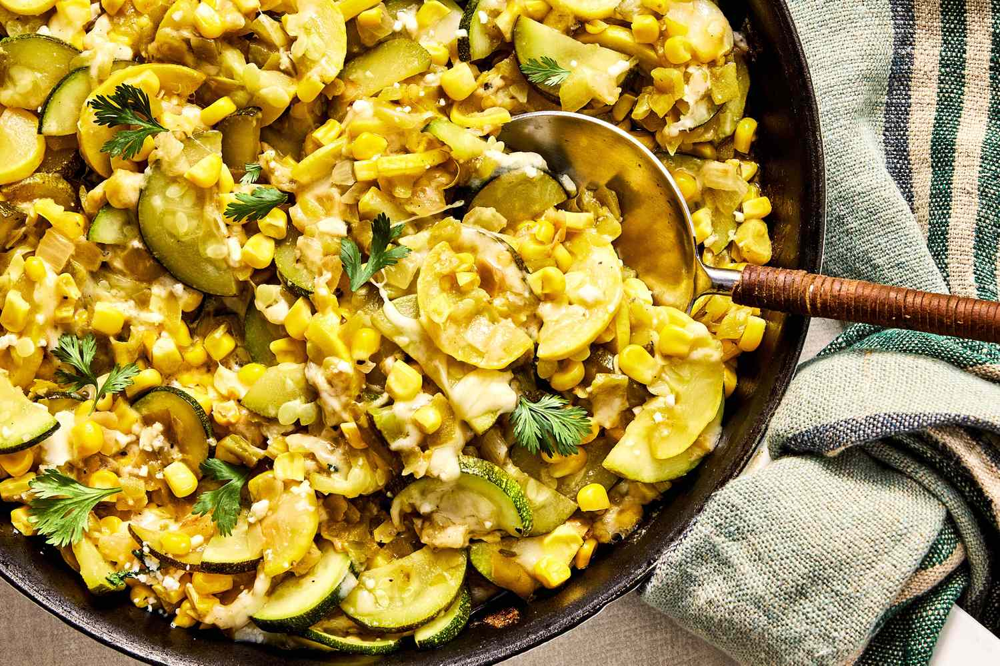

# Calabacitas (Southwest Style)

*The Southwest's squash-corn-and-green-chile sauté: cubes of zucchini and yellow squash sautéed with sweet corn kernels, roasted green chillies, onion, garlic and a touch of cream, finished with grated Monterey Jack. The New Mexico-Pueblo vegetable side, vegetarian, perfect with grilled meats.*

**Serves:** 4-6

**Prep Time:** 15 minutes

**Cook Time:** 25 minutes

## Overview
Calabacitas (literally "little squashes") is the iconic Southwest vegetable side and a New Mexico-Pueblo classic: cubes of zucchini and yellow summer squash sautéed with sweet corn kernels (fresh in season, frozen otherwise), chopped onion, crushed garlic, roasted-and-peeled green chillies (Hatch chiles or Anaheim), and a touch of cream and grated Monterey Jack cheese for the traditional Southwest creamy finish. The dish is vegetarian (or vegan without the cheese), takes 25 minutes, and is the traditional Pueblo-Southwest vegetable preparation. Distinct from the Mexican calabacitas (which doesn't typically include cream); the Southwestern New Mexican version adds the dairy for richness.

## Ingredients

- 2 large zucchini (cubed into 1 cm pieces)
- 2 large yellow summer squash (cubed)
- 300 g sweet corn kernels (fresh or frozen)
- 1 large onion (chopped)
- 6 garlic cloves (crushed)
- 4 roasted green chillies (Hatch or Anaheim; deseeded; chopped): or 1 small tin chopped roasted green chillies
- 4 tablespoons butter (or olive oil)
- 100 ml double cream (or sour cream)
- 200 g grated Monterey Jack cheese
- 1 ½ teaspoons fine sea salt
- 1 teaspoon ground black pepper
- 1 teaspoon ground cumin
- 1 teaspoon dried Mexican oregano

### To finish
- 2 tablespoons fresh coriander (chopped)
- Sliced spring onion
- Extra cheese

## Method

### Stage 1 - Sauté aromatics
1. Melt butter in a wide pan over medium heat.
2. Add chopped onion; cook 6 minutes till soft.
3. Add garlic; cook 30 seconds.

### Stage 2 - Add squash and corn
1. Add cubed zucchini and yellow squash; cook 5 minutes.
2. Add corn kernels; cook 3 minutes.

### Stage 3 - Add chillies and seasonings
1. Stir in chopped roasted green chillies, cumin, oregano, salt and pepper.
2. Cook 3 minutes.

### Stage 4 - Add cream and cheese
1. Add the cream; stir to combine.
2. Add the grated Monterey Jack; stir till melted (about 1-2 minutes).
3. Take off the heat.

### Stage 5 - Finish
1. Scatter chopped coriander and spring onion.

### Stage 6 - Serve
1. Tip onto a serving plate.
2. Top with extra cheese.

## Notes
- **Roasted green chillies essential.**
- **Don't overcook the squash:** crisp-tender.
- **Add cheese off heat.**
- **Vegan-friendly:** skip cheese and cream; use cashew cream + nutritional yeast.

## Variations
- **With pinto beans:** add tin of drained beans; turns into a main.
- **Spicier:** include hot Hatch chillies.
- **With chicken:** add cubed cooked chicken.
- **Pueblo style with mint:** add fresh mint at the end; traditional Pueblo touch.

## Serving
- Alongside grilled meats, Southwest dinners, or as vegetarian main with tortillas.

## Storage
- Keeps refrigerated 3 days.
- Reheat briefly.
- Don't freeze; squash suffers.
