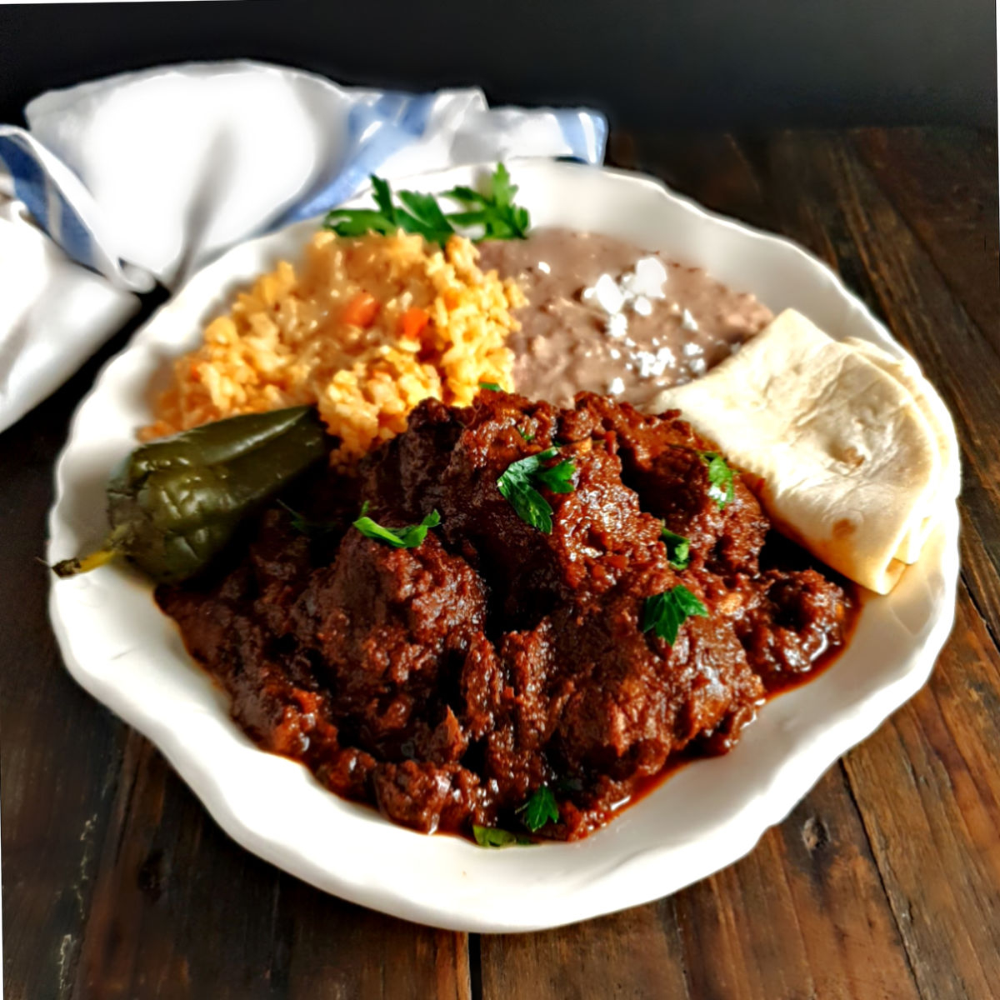

# Carne Adovada

*The Southwest's red-chile pork: cubes of pork shoulder marinated overnight in red New Mexico chile sauce (rehydrated dried chillies, garlic, oregano), then slow-cooked till the pork is fall-apart tender and the chile sauce coats it like a glaze. The New Mexico-Pueblo-Southwest classic, eaten in burritos, with eggs at breakfast, or with tortillas at any meal.*

**Serves:** 6-8

**Prep Time:** 30 minutes (plus 12 hours marinating)

**Cook Time:** 2 hours 30 minutes

## Overview
Carne adovada (literally "marinated meat") is the iconic Southwestern Hispanic pork dish, particularly associated with New Mexico and the Pueblo Indian Southwest tradition: cubes of pork shoulder marinated overnight in a thick paste of rehydrated dried New Mexico red chillies (chimayo, Hatch red, or substitute with ancho + guajillo), crushed garlic, ground cumin, dried Mexican oregano, salt and lime juice; then slow-cooked in the marinade till the pork is fall-apart tender and the chile sauce reduces to a thick mahogany coating. Served in burritos, with eggs at breakfast (huevos con carne adovada), with warm tortillas, or as a main with rice and beans.

## Ingredients

### Pork
- 1.2 kg pork shoulder (cubed into 3 cm pieces)

### Marinade
- 8 dried New Mexico red chillies (or 4 ancho + 4 guajillo); stems and seeds removed
- 500 ml hot water (for soaking chillies)
- 10 garlic cloves
- 1 large onion (chopped)
- 2 tablespoons ground cumin
- 2 tablespoons dried Mexican oregano
- 1 tablespoon ground coriander seed
- Juice of 2 limes
- 4 tablespoons olive oil
- 2 teaspoons fine sea salt
- 1 teaspoon ground black pepper

### Cooking
- 4 tablespoons vegetable oil
- 200 ml chicken stock (more as needed)
- 2 bay leaves

### To finish
- 1 small bunch fresh coriander (chopped)
- Lime wedges

### To serve
- Warm flour or corn tortillas
- Fried eggs
- Refried beans
- Mexican rice
- Sliced avocado
- Sour cream
- Cheese (grated Monterey Jack)
- Hot sauce

## Method

### Stage 1 - Toast and rehydrate chillies
1. Briefly toast chillies in a dry pan.
2. Soak in hot water 30 minutes.
3. Drain; reserve soaking liquid.

### Stage 2 - Blend marinade
1. In blender, combine soaked chillies, garlic, chopped onion, cumin, oregano, coriander seed, lime juice, olive oil, salt and pepper.
2. Add 200 ml of the chilli soaking liquid.
3. Blitz to a smooth thick paste.

### Stage 3 - Marinate (overnight)
1. In wide container, combine pork cubes with the chile paste.
2. Toss to coat thoroughly.
3. Refrigerate 12-24 hours.

### Stage 4 - Cook
1. Heat vegetable oil in a heavy Dutch oven over medium-high heat.
2. Tip in marinated pork with all marinade.
3. Cook 5 minutes till bubbling.
4. Add chicken stock and bay leaves.
5. Bring to a simmer; cover slightly ajar.
6. Cook 2 hours till pork is fork-tender.
7. The sauce should reduce to a thick coating.

### Stage 5 - Finish
1. Stir in chopped coriander.
2. Taste; adjust salt.

### Stage 6 - Serve
1. With warm tortillas, fried eggs, beans, rice.

## Notes
- **Dried New Mexico chillies essential:** for proper red colour and flavour.
- **Overnight marinade:** for deep flavour.
- **Slow-cook properly:** 2 hours.
- **Better the next day.**

## Variations
**Slow-cooker version:** marinate as recipe; cook in slow-cooker 8 hours low.
**Spicier:** add 2 chiles de árbol (small dried red).
**With beans cooked in the sauce:** add tin of pinto beans in the last 30 minutes.

## Serving
In burritos, with eggs at breakfast, as a main with rice and beans. Mexican beer, margaritas.

## Storage
- Keeps refrigerated 5 days; flavour deepens.
- Freezes 3 months.
- Day-after is even better.
