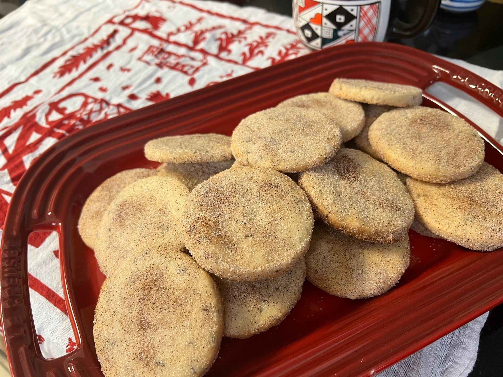

# Biscochitos

*New Mexico's anise-cinnamon shortbread cookies: a buttery shortbread dough flavoured with anise seeds, brandy and orange zest, rolled out and cut into shapes (fleur-de-lis, stars, ovals), baked till just pale gold, and dusted with cinnamon sugar. The official state cookie of New Mexico, Hispano-Pueblo Christmas tradition.*

**Serves:** Makes about 36 cookies

**Prep Time:** 30 minutes (plus 1 hour chilling)

**Cook Time:** 15 minutes

## Overview
Biscochitos are New Mexico's iconic anise-cinnamon shortbread cookies and the official state cookie of New Mexico (designated 1989) - the only state cookie in the US: a buttery shortbread dough (traditionally made with lard for the proper crumbly tender texture; substitute with butter for modern versions) flavoured with whole anise seeds, brandy (or whiskey), orange zest and ground cinnamon, rolled to 5 mm and cut into shapes (fleur-de-lis, stars, ovals, the traditional New Mexican shapes), baked till just pale gold, and dusted while still warm with a thick coat of cinnamon sugar. The dish is a Hispano-New Mexico-Pueblo tradition, particularly associated with Christmas baking, every New Mexican Christmas spread, every wedding cookie table, every Día de los Muertos altar.

## Ingredients

### Dough
- 500 g plain flour
- 200 g lard (or unsalted butter; the lard version is traditional New Mexican)
- 200 g caster sugar
- 1 large egg
- 4 tablespoons brandy (or whiskey)
- Zest of 1 orange
- 1 ½ teaspoons baking powder
- 1 teaspoon fine sea salt
- 1 ½ tablespoons whole anise seeds
- 1 teaspoon ground cinnamon

### Cinnamon sugar coating
- 80 g caster sugar
- 2 tablespoons ground cinnamon

## Method

### Stage 1 - Cream lard and sugar
1. In a wide bowl, cream the lard (or butter) and caster sugar with an electric mixer for 4-5 minutes till fluffy.

### Stage 2 - Add egg and aromatics
1. Add the egg, brandy, orange zest and anise seeds.
2. Beat till combined.

### Stage 3 - Mix dry
1. In another bowl, whisk together flour, baking powder, salt and cinnamon.

### Stage 4 - Combine
1. Add the dry ingredients to the wet in 3 batches; mix to a soft dough.
2. Don't overwork.

### Stage 5 - Chill
1. Wrap in cling film; refrigerate 1 hour.

### Stage 6 - Roll and cut
1. Preheat oven to 180°C (350°F).
2. Line baking sheets with parchment.
3. Roll dough on a lightly floured surface to 5 mm thickness.
4. Cut into shapes (fleur-de-lis, stars, ovals).
5. Place on baking sheets.

### Stage 7 - Bake
1. Bake 12-15 minutes till just pale gold (not deeply browned).

### Stage 8 - Cinnamon sugar coating
1. While cookies are still warm, mix sugar and cinnamon.
2. Dust the cookies generously with the cinnamon sugar.

### Stage 9 - Cool and serve
1. Cool on a wire rack.
2. Serve with strong coffee, hot chocolate or champagne.

## Notes
- **Lard traditional:** for proper texture.
- **Whole anise seeds:** distinct from ground.
- **Don't overbake:** pale gold.
- **Coat warm:** so the sugar adheres.

## Variations
- **Butter version:** swap lard for butter; less traditional but accessible.
- **Larger biscochitos:** roll thicker; cut larger.
- **Without brandy:** use orange juice for non-alcoholic version.
- **Iced biscochitos:** dip in a simple icing instead of cinnamon sugar.

## Serving
- At New Mexico Christmas, weddings, Día de los Muertos. With Mexican hot chocolate.

## Storage
- Keeps in sealed container at room temp 2 weeks.
- Freezes 3 months; defrost at room temperature.
