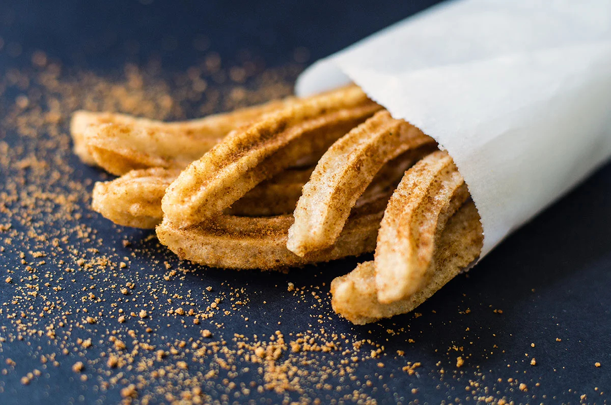

# Southwest Churros

*The Southwest's fried dough sticks: a piped choux-style dough fried in oil till deeply golden and crisp outside, soft and tender inside. Rolled in cinnamon sugar and served with thick Mexican chocolate sauce for dipping. The canonical Southwest dessert across Arizona, New Mexico, Texas border culture.*

**Serves:** 6 (about 18 churros)

**Prep Time:** 20 minutes

**Cook Time:** 20 minutes

## Overview
Churros in the Southwest United States are the iconic Mexican-American street dessert and bar-restaurant classic: a thick choux-style dough (made from water, butter, salt, sugar, flour and eggs) piped through a star-tipped piping bag directly into hot oil to form long fluted sticks, fried till deeply golden and crispy outside while staying soft and tender inside, then rolled while still warm in cinnamon sugar. Served with thick Mexican-style hot chocolate sauce (much thicker than typical hot chocolate; made with Mexican chocolate, cinnamon and cornstarch) for dipping. The dish has roots in Spanish and Mexican churros traditions; the Southwestern American version has become a fixture of Tex-Mex restaurants, state fairs and weekend brunches.

## Ingredients

### Dough
- 250 ml water
- 80 g unsalted butter
- 1 tablespoon caster sugar
- 1 teaspoon fine sea salt
- 1 teaspoon vanilla extract
- 250 g plain flour
- 2 large eggs
- 1 teaspoon ground cinnamon (optional in dough)

### Frying
- Vegetable oil for deep-frying (1 litre; or enough for 7 cm depth)

### Cinnamon sugar coating
- 200 g caster sugar
- 3 tablespoons ground cinnamon

### Mexican chocolate sauce (for dipping)
- 200 g Mexican chocolate (Ibarra or Abuelita); or substitute with dark chocolate + 1 teaspoon ground cinnamon
- 300 ml whole milk
- 100 ml double cream
- 2 tablespoons cornstarch (for thickening)
- 1 tablespoon vanilla extract
- A pinch of salt

## Method

### Stage 1 - Make the dough
1. In a saucepan, combine water, butter, sugar, salt and vanilla.
2. Bring to a boil.
3. Take off heat; add flour all at once.
4. Stir vigorously with a wooden spoon till a smooth ball forms.
5. Return to low heat; cook 1 minute, stirring, to dry the dough slightly.
6. Take off heat; transfer to a bowl; cool 5 minutes.
7. Add eggs one at a time, beating thoroughly after each.
8. The dough should be glossy and pipeable.

### Stage 2 - Heat oil
1. Heat oil to 180°C (360°F).

### Stage 3 - Pipe and fry
1. Fit a piping bag with a large star tip.
2. Fill with the dough.
3. Pipe 10-cm lengths of dough directly into the hot oil; cut with scissors as you pipe.
4. Don't overcrowd.
5. Fry 3-4 minutes, turning, till deeply golden and crispy.
6. Lift out; drain on kitchen paper.

### Stage 4 - Coat in cinnamon sugar
1. Combine sugar and cinnamon in a wide shallow dish.
2. Roll warm churros in the mixture till coated.

### Stage 5 - Make chocolate sauce
1. In a saucepan, combine milk, cream and chopped chocolate.
2. Heat over medium-low till the chocolate melts and the mixture is smooth.
3. Mix cornstarch with 2 tablespoons cold milk to a slurry; whisk in.
4. Cook 2-3 minutes till the sauce thickens.
5. Stir in vanilla and salt.

### Stage 6 - Serve
1. Pile warm churros on a plate.
2. Pour chocolate sauce into a small bowl for dipping.
3. Eat immediately by dunking churros into chocolate.

## Notes
- **Piped through a star tip:** fluted shape.
- **180°C oil:** crucial for proper crisp.
- **Coat in cinnamon sugar warm:** sugar adheres.
- **Eat immediately:** lose crisp quickly.

## Variations
**With dulce de leche:** dip in dulce de leche instead of chocolate.
**Filled churros (relleno):** pipe a sweet filling into the centre after frying (with a long pastry tip): dulce de leche, chocolate, cream cheese.
**Smaller churros:** pipe 5 cm lengths; gives bite-sized.
**Spiced (Tex-Mex chocolate):** add a pinch of cayenne to the chocolate sauce.

## Serving
At Mexican-Southwestern parties, after dinner, at state fairs. With Mexican hot chocolate or strong coffee.

## Storage
- Best eaten immediately.
- The dough freezes 1 month uncooked; pipe directly from frozen.
- The sauce keeps refrigerated 1 week; reheat with extra milk.
