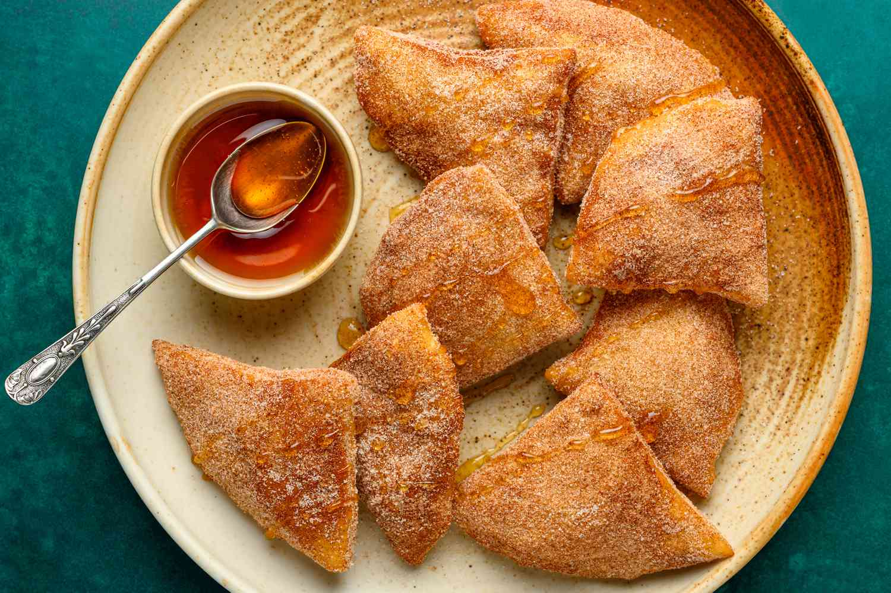

# Sopaipillas with Honey

*New Mexico's puffed dessert: warm puffed sopaipillas (the iconic New Mexican fried bread) drizzled inside with local honey and dusted with cinnamon sugar. The traditional New Mexican dessert and the proper end to any Southwestern meal, sweet, warm, deeply satisfying.*

**Serves:** 4-6

**Prep Time:** 20 minutes (sopaipilla recipe required as base)

**Cook Time:** 15 minutes

## Overview
Sopaipillas with honey is New Mexico's traditional dessert and the most traditional sweet ending to any Southwestern meal: warm sopaipillas fresh from the fryer (see the sopaipillas side recipe), torn at a corner to reveal the hollow inside, then drizzled with local honey (New Mexico honey is the traditional choice; or any pure honey) and dusted with cinnamon sugar. The combination is simple, warm puffed bread, sweet honey, fragrant cinnamon, but defines New Mexican dessert culture. Often served with a scoop of vanilla ice cream alongside for the modern restaurant version.

## Ingredients

- 12 fresh hot sopaipillas (see sopaipillas recipe in side-dishes)
- 200 g local honey (New Mexico honey; or any pure honey)
- 4 tablespoons caster sugar
- 1 tablespoon ground cinnamon

### Optional
- Vanilla ice cream
- Whipped cream
- Fresh berries
- Chocolate sauce

## Method

### Stage 1 - Make the sopaipillas
1. Follow the sopaipillas recipe; fry till puffed and golden.
2. Drain briefly; serve immediately.

### Stage 2 - Mix cinnamon sugar
1. Combine sugar and cinnamon in a small bowl.

### Stage 3 - Serve
1. Pile warm sopaipillas on a plate.
2. Dust the outsides generously with cinnamon sugar.
3. Each diner tears a corner of their sopaipilla and pours honey inside.
4. Eat while warm.
5. Optional: serve alongside vanilla ice cream and a drizzle of chocolate.

## Notes
- **Sopaipillas must be hot and fresh.**
- **Honey added at the table.**
- **Tear a corner to pour honey inside.**

## Variations
- **With chocolate sauce:** drizzle instead of honey.
- **Stuffed (sopaipilla relleno):** fill with sweetened cream cheese or fruit before frying.
- **With ice cream:** dessert version with a scoop of vanilla.
- **Mexican spiced sugar (azúcar especial):** dust with cinnamon sugar plus a pinch of cayenne.

## Serving
- After New Mexican meals, green chile stew, carne adovada, enchiladas. At the centre of a Southwest restaurant table.

## Storage
- Best eaten immediately.
- The dough alone keeps refrigerated 24 hours; fry fresh.
