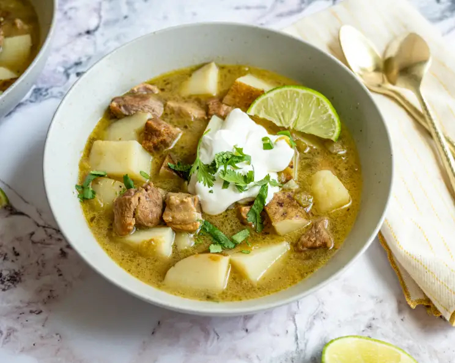

# Green Chile Stew

*The Southwest's pork-and-Hatch-chile stew: cubes of pork shoulder slow-cooked with roasted-and-peeled green chillies (Hatch from New Mexico, or Anaheim), potato, onion, garlic and chicken stock into a hot vibrant green stew. The Southwestern winter classic, eaten with warm flour tortillas and a sprinkle of cheese.*

**Serves:** 6

**Prep Time:** 30 minutes

**Cook Time:** 1 hour 30 minutes

## Overview
Green chile stew (or "carne verde" in Spanish-Southwest vernacular) is the iconic Southwest-Native American-Hispanic comfort stew and the canonical use of New Mexico's famous Hatch green chillies: cubes of pork shoulder browned then slow-cooked with onion, garlic, cubed potato, fresh roasted-and-peeled green chillies (Hatch from New Mexico are the gold standard; substitute with Anaheim, or poblano + canned green chillies), chicken stock, cumin and Mexican oregano till the pork is tender and the broth thickens slightly. Served in deep bowls with warm flour tortillas, sliced fresh chile, sour cream and grated cheese. Three details define proper green chile stew. First, roasted-and-peeled green chillies. Char the skins on a flame or under a grill; let steam; peel. The roasting is essential for proper flavour. Second, pork shoulder. Cubed and slow-cooked for tender results. Third, plenty of chile.

## Ingredients

- 1 kg pork shoulder (cubed into 3 cm pieces)
- 1 ½ teaspoons fine sea salt
- 1 teaspoon ground black pepper
- 4 tablespoons vegetable oil
- 2 large onions (chopped)
- 8 garlic cloves (crushed)
- 1 kg fresh green chillies (Hatch, Anaheim, or poblano; or substitute with 700 g fresh + 300 g canned drained green chillies)
- 4 medium potatoes (cubed)
- 1.5 litres hot chicken stock
- 1 tablespoon ground cumin
- 1 tablespoon dried Mexican oregano
- 2 bay leaves
- 1 small bunch fresh coriander (chopped)

### To serve
- Warm flour tortillas
- Grated Monterey Jack or pepper jack
- Sour cream
- Sliced fresh chillies
- Lime wedges

## Method

### Stage 1 - Roast and peel chillies
1. Heat grill (broiler) to high or use a gas flame.
2. Char chillies all over till blackened (8-10 minutes).
3. Transfer to a bowl; cover; steam 10 minutes.
4. Peel; deseed; chop.

### Stage 2 - Brown the pork
1. Season pork with salt and pepper.
2. Heat oil in heavy pot; brown pork in batches 4 minutes per side.
3. Set aside.

### Stage 3 - Sauté aromatics
1. Reduce heat; cook chopped onions 8 minutes.
2. Add garlic; cook 30 seconds.
3. Stir in cumin and oregano; cook 1 minute.

### Stage 4 - Combine
1. Return pork to pot.
2. Add chopped green chillies, potato chunks, hot stock and bay leaves.
3. Bring to simmer.
4. Cover slightly ajar; cook 1 hour till pork is tender.

### Stage 5 - Finish
1. Mash some potatoes against the side to thicken.
2. Taste; adjust salt.
3. Stir in coriander.

### Stage 6 - Serve
1. Ladle into bowls.
2. Top with grated cheese, sour cream, sliced fresh chillies, coriander.
3. Warm flour tortillas on the side.

## Notes
- **Roasted Hatch chillies essential.**
- **Char and peel properly.**
- **Slow-cook pork to tender.**
- **Mash some potato to thicken.**

## Variations
**With chicken:** swap pork for chicken thigh.
**Vegetarian:** skip pork; use 600 g extra potato + 1 tin pinto beans + vegetable stock.
**Spicier:** include hot Hatch chillies; add 2 fresh habaneros.

## Serving
With flour tortillas, cheese, sour cream. Drink: cold beer or sweet tea.

## Storage
- Keeps refrigerated 5 days; flavour deepens.
- Freezes 3 months.
- Day-after green chile stew is excellent.
