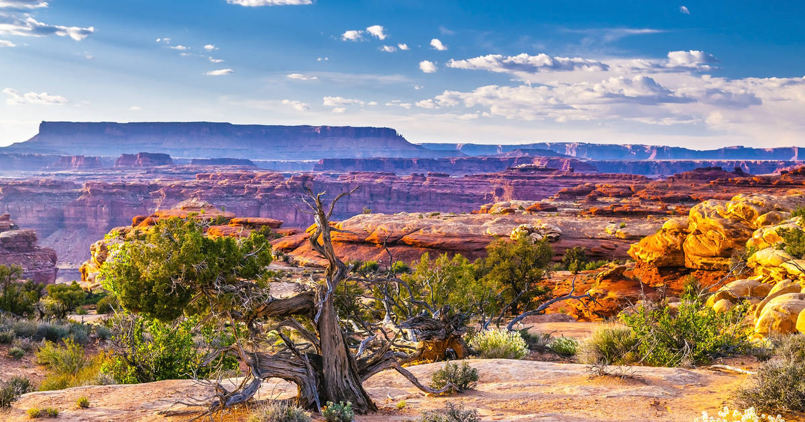

# Southwest Cuisine

American Southwest cooking: the cross-border meeting of Mexican, Native American (Navajo, Pueblo, Hopi) and Anglo-frontier cuisines spanning Arizona, southern Colorado and the Mexican borderlands beyond New Mexico's distinct chile tradition. Green chile stew, Navajo tacos on frybread, Pueblo posole, Sonoran hot dogs wrapped in bacon, chimichangas from Tucson, carne adovada slow-braised in red chile. Sopaipillas with honey, biscochitos, jalapeño poppers, tortilla soup and refried pinto beans cover the rest. Cumin, oregano, cilantro, and a generous hand of dried red and green chiles drive the seasoning across every plate.
