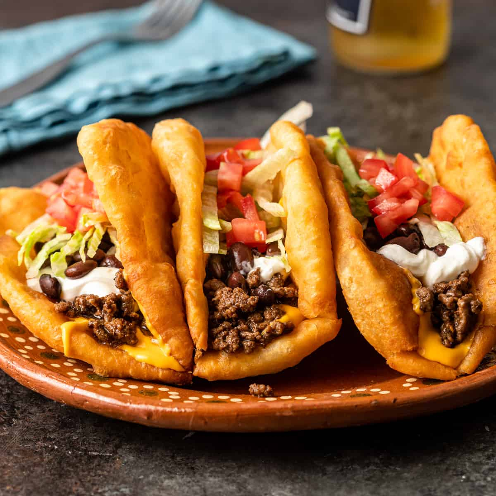

# Navajo Tacos

*The Southwest's frybread-based open-face taco: a piece of warm fried Navajo frybread topped with seasoned ground beef (or beans), shredded lettuce, diced tomato, grated cheese, sour cream, sliced jalapeños and salsa. The Native American-Southwest staple, the traditional "frybread taco" of every Pueblo and Navajo Nation feast.*

**Serves:** 4

**Prep Time:** 25 minutes (plus 30 minutes frybread dough resting)

**Cook Time:** 30 minutes

## Overview
Navajo tacos (or "Indian tacos", "frybread tacos") are the iconic Native American Southwest dish, particularly associated with the Navajo Nation and the Pueblo peoples of New Mexico and Arizona: a piece of warm Navajo frybread (the traditional Native American fried bread, a yeasted-or-soda-leavened flour dough rolled into a round and deep-fried till puffed golden) topped with seasoned ground beef (cooked with onion, garlic, chili powder, cumin), pinto beans (or refried), shredded iceberg lettuce, diced tomato, grated cheddar, sour cream, sliced jalapeños and salsa. The dish has roots in the dark history of the Navajo Long Walk (1864) when displaced Native Americans were given rations of flour and lard, which became frybread; today frybread tacos are the traditional Southwestern Native American food, served at every Pueblo feast day, every Navajo Nation gathering, and every state fair across the Southwest. Frybread, not tortilla, is the base. The taco is open-face; toppings sit on top, the bread is never folded. Multiple toppings are the point.

## Ingredients

### Frybread dough
- 500 g plain flour
- 1 tablespoon baking powder
- 1 ½ teaspoons fine sea salt
- 300 ml warm water
- 2 tablespoons vegetable oil
- 1 litre vegetable oil for frying

### Meat topping
- 500 g ground beef
- 1 large onion (chopped)
- 4 garlic cloves (crushed)
- 1 tin (400 g) pinto beans (drained)
- 1 tin (400 g) diced tomatoes
- 2 tablespoons chili powder
- 1 tablespoon ground cumin
- 1 tablespoon dried Mexican oregano
- 1 ½ teaspoons fine sea salt
- 1 teaspoon ground black pepper

### Toppings
- 200 g shredded iceberg lettuce
- 2 large tomatoes (diced)
- 200 g grated sharp cheddar
- 200 ml sour cream
- 2 fresh jalapeños (sliced)
- 1 ripe avocado (sliced)
- Salsa (red or green)
- Hot sauce
- Lime wedges
- Fresh coriander

## Method

### Stage 1 - Make the frybread dough
1. In a wide bowl, whisk together flour, baking powder and salt.
2. Add warm water and oil; stir to combine.
3. Knead lightly 2-3 minutes.
4. Cover; rest 30 minutes.

### Stage 2 - Make the meat topping
1. Brown the ground beef in a wide pan over medium heat for 6-7 minutes, breaking up.
2. Add chopped onion; cook 6 minutes till soft.
3. Add garlic; cook 30 seconds.
4. Add chili powder, cumin, oregano, salt and pepper; cook 1 minute.
5. Add diced tomatoes; simmer 10 minutes.
6. Stir in pinto beans; warm 3 minutes.
7. Keep warm.

### Stage 3 - Shape and fry the frybread
1. Heat the vegetable oil in a deep heavy pot to 175°C (350°F).
2. Divide the dough into 4 equal pieces.
3. Roll each into a round about 20 cm wide and 5 mm thick.
4. Fry one at a time for 90 seconds per side till deeply golden and puffed.
5. Drain on kitchen paper.

### Stage 4 - Assemble
1. Place a warm frybread on each plate.
2. Top generously with the meat-and-bean mixture.
3. Add lettuce, tomato, cheese, sour cream, jalapeños, avocado.
4. Drizzle with salsa and hot sauce.
5. Scatter coriander.
6. Lime wedges on the side.

## Notes
- **Frybread, not tortilla:** the traditional base.
- **Open-face:** toppings on top, not folded.
- **Multiple toppings:** abundance is the point.
- **Fry frybread fresh:** essential for proper texture.
- **Iceberg lettuce:** the traditional crunch.

## Variations
**Vegetarian:** skip the beef; double the pinto beans + add black beans.
**Spicier:** double the jalapeños; add chopped habanero.
**With green chile:** swap the chili-powder seasoned beef for ground beef cooked with chopped roasted green chillies (New Mexico-style).
**Mini Navajo tacos:** smaller frybreads (10 cm); makes 8 tacos.

## Serving
On wide plates as a substantial meal. At Pueblo feast days, Navajo Nation gatherings, Southwest fairs.

## Storage
- Best eaten immediately; frybread loses crispness.
- Components separately keep 3 days.
- Don't refrigerate assembled.
