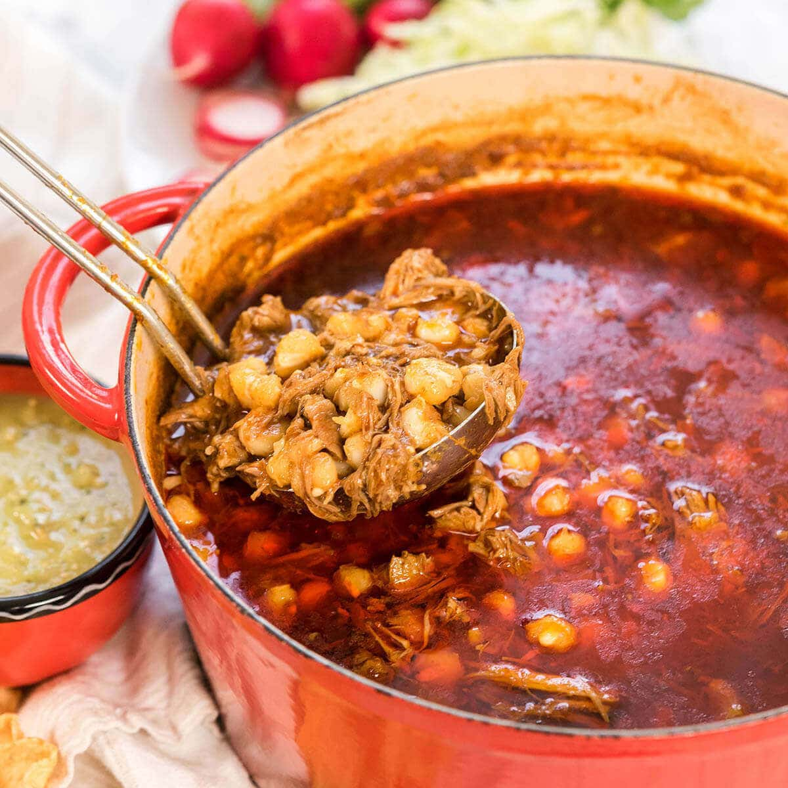

# Pueblo Posole

*The Southwest's hominy stew: dried or canned hominy (large-kernel corn) slow-cooked with cubed pork, onion, garlic, dried red chillies, oregano and bay leaves into a brothy red corn-and-pork stew. The Pueblo-New Mexico Christmas Eve classic and Native American Southwest staple, finished with shredded cabbage, lime and oregano at the table.*

**Serves:** 6-8

**Prep Time:** 25 minutes (plus overnight soaking if dried hominy)

**Cook Time:** 2 hours 30 minutes

## Overview
Posole (or "pozole") in the Pueblo-Southwest tradition is the canonical winter stew of New Mexican Pueblo peoples and a Christmas Eve / feast-day staple across the Southwest: hominy (large-kernel corn treated with lime; either dried-and-soaked-and-cooked, or canned for convenience) slow-simmered with cubed pork shoulder, sliced onion, crushed garlic, rehydrated dried red chillies (ancho, guajillo, New Mexico chile), bay leaves and Mexican oregano till the pork falls apart and the broth thickens slightly. Served in deep bowls with the canonical Southwest accompaniments: shredded cabbage, sliced radish, chopped onion, lime wedges, dried oregano and tortillas. Three details: hominy is the corn (large-kernel; chewy; nutty), red chille paste is the colour and flavour, garnishes at the table are not optional.

## Ingredients

- 800 g pork shoulder (cubed)
- 800 g canned hominy (drained, rinsed); OR 400 g dried hominy soaked overnight and pre-cooked
- 6 dried New Mexico red chillies (or ancho + guajillo mix)
- 500 ml hot water (for soaking chillies)
- 4 tablespoons vegetable oil
- 2 large onions (chopped)
- 8 garlic cloves (crushed)
- 1.5 litres hot pork or chicken stock
- 2 bay leaves
- 1 tablespoon ground cumin
- 1 tablespoon dried Mexican oregano
- 1 ½ teaspoons fine sea salt
- 1 teaspoon ground black pepper

### Garnishes (table-side; canonical)
- 200 g shredded green cabbage
- 4-5 radishes (thinly sliced)
- 1 small white onion (finely chopped)
- 1 small bunch fresh coriander (chopped)
- Lime wedges
- Dried Mexican oregano (for sprinkling)
- Hot sauce
- Warm corn tortillas

## Method

### Stage 1 - Toast and soak chillies
1. Toast dried chillies briefly in dry pan.
2. Soak in hot water 30 minutes.

### Stage 2 - Blend chille paste
1. Place soaked chillies in blender with 200 ml soaking liquid, half the garlic.
2. Blitz smooth.

### Stage 3 - Brown pork
1. Heat oil in heavy pot.
2. Brown pork in batches 4 minutes per side.
3. Set aside.

### Stage 4 - Sauté aromatics
1. Add chopped onions; cook 8 minutes.
2. Add remaining garlic; cook 30 seconds.
3. Add chille paste; cook 4 minutes.

### Stage 5 - Combine and simmer
1. Return pork; add hominy, hot stock, bay leaves, cumin, oregano, salt, pepper.
2. Simmer 90 minutes till pork is tender.

### Stage 6 - Serve
1. Ladle into deep bowls.
2. Provide cabbage, radish, onion, coriander, lime, oregano, hot sauce on the side.
3. Diners customise their own bowls.

## Notes
- **Hominy canonical:** the large-kernel corn.
- **Dried chillies for proper colour.**
- **Garnishes at the table:** the canonical Pueblo serving.

## Variations
**White posole (posole blanco):** skip dried chillies; use chicken stock; gives a milder version.
**Green posole:** swap red chillies for tomatillos, jalapeños, coriander; gives green posole.
**With chicken:** swap pork for chicken thighs.

## Serving
In deep bowls with table-side garnishes. Pueblo feast days, Christmas Eve, Southwest winter dinners.

## Storage
- Keeps refrigerated 5 days; flavour deepens.
- Freezes 3 months.
