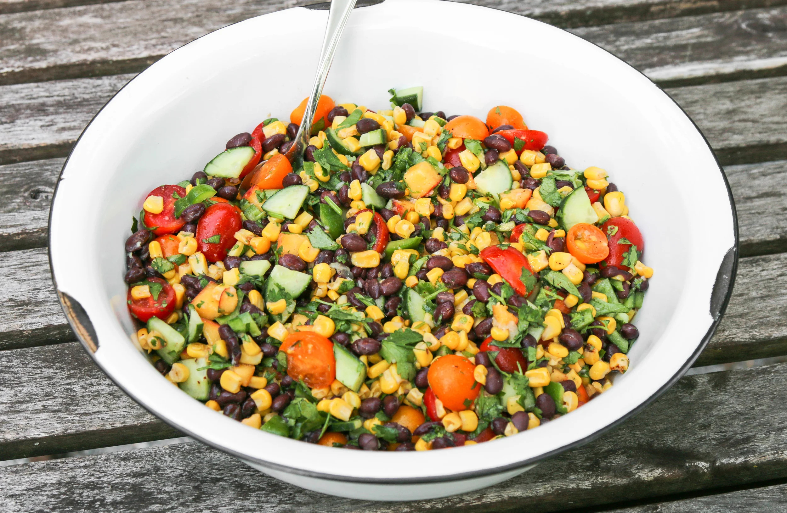

# Southwest Black Bean Salad

*The Southwest's vibrant bean salad: black beans tossed with corn, red bell pepper, red onion, jalapeño, fresh coriander, lime juice, olive oil and cumin. The Southwest-style cold salad - fresh, vegetarian, the canonical potluck side.*

**Serves:** 6

**Prep Time:** 15 minutes

**Cook Time:** 0 minutes (with canned beans)

## Overview
Southwest black bean salad is one of the most beloved cold sides in Southwestern American cooking: drained black beans tossed with sweet corn kernels, chopped red bell pepper, finely chopped red onion, finely chopped jalapeño, fresh coriander, with a dressing of fresh lime juice, olive oil, ground cumin, garlic and salt. The salad is fresh, vibrant, vegetarian, takes 15 minutes, and is the canonical Southwestern picnic-and-potluck contribution. Three details: ripe ingredients (corn, peppers), generous lime, rest 30 minutes for flavours to marry.

## Ingredients

- 2 tins (each 400 g) black beans (drained, rinsed)
- 300 g sweet corn kernels (fresh or frozen; if frozen, thaw)
- 1 large red bell pepper (finely chopped)
- 1 medium red onion (finely chopped)
- 2 fresh jalapeños (deseeded; finely chopped)
- 1 ripe avocado (cubed; optional, add just before serving)
- 1 large bunch fresh coriander (chopped)
- 4 spring onions (sliced)

### Dressing
- Juice of 3 limes
- 6 tablespoons olive oil
- 4 garlic cloves (crushed)
- 1 tablespoon ground cumin
- 1 teaspoon dried Mexican oregano
- 1 teaspoon ground chili powder
- 1 ½ teaspoons fine sea salt
- ½ teaspoon ground black pepper
- 1 teaspoon caster sugar (balances acidity)

## Method

### Stage 1 - Combine vegetables
1. In a wide bowl, combine drained beans, corn, chopped red pepper, red onion, jalapeños, spring onions and coriander.

### Stage 2 - Make dressing
1. Whisk together lime juice, olive oil, garlic, cumin, oregano, chili powder, salt, pepper and sugar.

### Stage 3 - Toss
1. Pour dressing over the salad; toss thoroughly.
2. Rest 30 minutes for flavours to marry.

### Stage 4 - Finish and serve
1. Stir in avocado just before serving (so it doesn't brown).
2. Taste; adjust salt.

## Notes
- **Drain and rinse the beans.**
- **Fresh corn in season:** frozen works too.
- **Generous lime juice.**
- **Add avocado at the last minute.**

## Variations
**With mango:** add 1 diced mango; tropical twist.
**Spicier:** double the jalapeños; add chopped serrano.
**With queso fresco:** crumble over the top.
**With charred corn:** char the corn on a grill; gives smoky depth.

## Serving
As a side at picnics, BBQs, potlucks. With grilled meats, tacos, fajitas.

## Storage
- Keeps refrigerated 3 days (without avocado).
- Add fresh avocado each time.
- Don't freeze.
