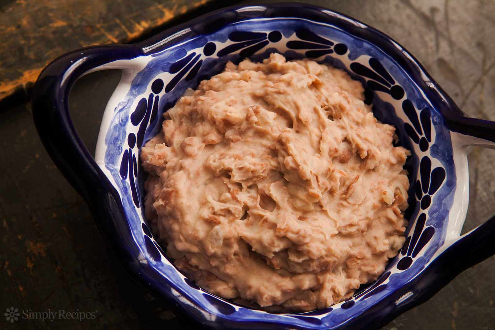

# Southwest Refried Pinto Beans

*The Southwest's mashed-and-fried pinto beans: cooked pinto beans mashed and fried in bacon fat or oil with onion, garlic and cumin till thick and creamy. The traditional Southwest side, alongside every burrito, enchilada and Tex-Mex plate.*

**Serves:** 6

**Prep Time:** 10 minutes (with pre-cooked beans)

**Cook Time:** 25 minutes

## Overview
The traditional Southwest-Tex-Mex bean side and one of the foundational dishes of the borderlands cooking: cooked pinto beans mashed and slow-fried in bacon fat with chopped onion, crushed garlic, ground cumin and salt till the beans thicken into a creamy paste with deep savoury flavour. The name "frijoles refritos" is a slight misnomer; "refritos" doesn't mean "refried" in Spanish but "well-fried" or "intensely-fried", and the beans get one long pan-cook rather than two. Pinto beans are the traditional Mexican-American choice; black beans give a darker version more common in Oaxacan and central Mexican cooking. The fat matters: bacon fat or lard gives the proper depth; vegetable oil works for vegetarian and substitutes acceptably but the flavour is less interesting. Eat alongside virtually every Southwest plate, smeared into burritos, spooned onto enchiladas, smashed onto tostadas.

## Ingredients

- 800 g cooked pinto beans (4 cups; about 2 tins drained); or 350 g dried pinto beans soaked overnight and cooked
- 4 tablespoons bacon fat (or lard, or vegetable oil for vegetarian)
- 1 medium onion (finely chopped)
- 6 garlic cloves (crushed)
- 2 teaspoons ground cumin
- 1 teaspoon dried Mexican oregano
- 1 ½ teaspoons fine sea salt
- 1 teaspoon ground black pepper
- 200-300 ml bean cooking liquid (or chicken stock)

### To finish
- 100 g grated Monterey Jack or cheddar (optional)
- Fresh coriander (chopped)

## Method

### Stage 1 - Sauté aromatics
1. Heat fat in a wide pan over medium heat.
2. Add chopped onion; cook 6 minutes till soft.
3. Add garlic; cook 30 seconds.
4. Add cumin and oregano; cook 1 minute.

### Stage 2 - Add beans
1. Add the cooked pinto beans.
2. Mash with a potato masher (or wooden spoon) - leave some beans whole for texture.

### Stage 3 - Fry
1. Cook 10-15 minutes, stirring frequently, till the beans thicken and the bottom starts to caramelise.
2. Add bean liquid (or stock) as needed to keep moist but not wet.
3. The texture should be thick, creamy, holdable on a spoon.

### Stage 4 - Season
1. Add salt and pepper.
2. Taste; adjust.

### Stage 5 - Serve
1. Tip onto a serving plate or alongside main dish.
2. Top with grated cheese (it melts from residual heat).
3. Scatter coriander.

## Notes
- **Bacon fat for proper flavour:** lard or oil substitute.
- **Mash partially:** keep some bean texture.
- **Fry properly:** the caramelisation is the point.

## Variations
**Black beans (frijoles negros refritos):** swap pinto for black beans.
**With chorizo:** add 100 g crumbled cooked chorizo to the onion.
**Spicier:** add chopped jalapeño.
**With cream:** add 50 ml double cream at the end for creamier texture.

## Serving
Alongside burritos, tacos, enchiladas, eggs. Top with cheese.

## Storage
- Keeps refrigerated 5 days.
- Reheat with splash of water.
- Freezes 3 months.
