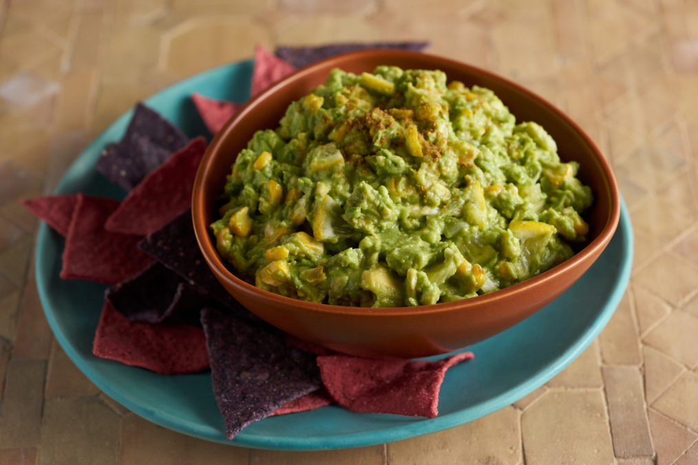

# Sonoran Guacamole

*The Southwest's mashed avocado dip: ripe avocados mashed with finely chopped onion, fresh jalapeño, garlic, lime juice, salt and fresh cilantro. The Sonoran-Arizona-New Mexico-Texas canonical guacamole - fresh, chunky, bright.*

**Serves:** 6

**Prep Time:** 15 minutes

**Cook Time:** 0 minutes

## Overview
Sonoran guacamole is the canonical Southwestern American guacamole: ripe Hass avocados mashed (some chunky, some smoother) with finely chopped white onion, fresh jalapeño (or serrano), crushed garlic, fresh lime juice, salt and fresh coriander. Distinct from Mexican Oaxacan style (which may include tomatillos), or restaurant table-side guacamole (often with too much added). The Sonoran version is the canonical American: ripe avocado, lime, salt, onion, jalapeño, coriander.

## Ingredients

- 4 large ripe Hass avocados (peeled, pitted)
- 1 small white onion (very finely chopped)
- 2 fresh jalapeños (deseeded; finely chopped)
- 4 garlic cloves (crushed)
- Juice of 2 limes
- 1 large bunch fresh coriander (chopped)
- 1 ½ teaspoons fine sea salt
- ½ teaspoon ground black pepper
- 1 teaspoon ground cumin (optional)

### Optional additions
- 1 small ripe tomato (deseeded, diced)
- 1 small fresh chilli (sliced; for spicier)

## Method

### Stage 1 - Mash avocados
1. Place avocado flesh in a wide bowl.
2. Mash with a fork - keep some chunks; not smooth purée.

### Stage 2 - Add other ingredients
1. Add chopped onion, jalapeños, crushed garlic, lime juice, chopped coriander, salt, pepper and cumin.
2. Fold gently together.

### Stage 3 - Taste and adjust
1. Add more lime, salt, or jalapeño to taste.

### Stage 4 - Serve immediately
1. Tip into serving bowl.
2. Surface with a thin layer of lime juice (prevents oxidation).
3. Serve with tortilla chips, or as topping.

## Notes
- **Ripe avocados only.**
- **Mash, don't purée.**
- **Eat within 30 minutes of making.**
- **Lime juice on top prevents browning.**

## Variations
**With tomato:** add diced tomato.
**Spicier:** double jalapeños.
**With pomegranate (modern variation):** scatter pomegranate seeds on top.

## Serving
With chips, on tacos, on burritos, on Southwest plates.

## Storage
- Eat the day made.
- Refrigerate with cling film pressed directly on surface 1 day.
- Don't freeze.
