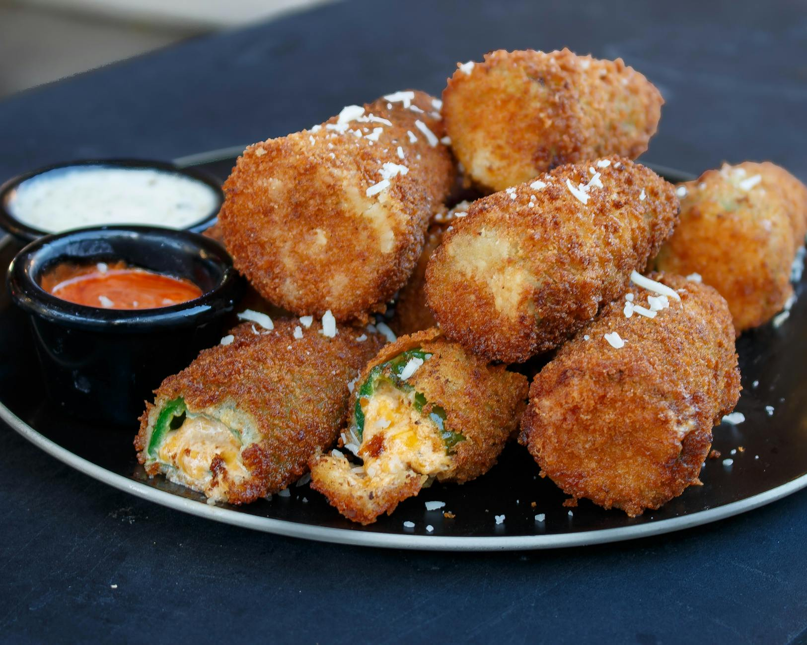

# Jalapeño Poppers

*The Southwest's stuffed fried jalapeños: fresh jalapeño peppers halved and deseeded, stuffed with cream cheese and grated cheddar, wrapped in bacon, and either baked or deep-fried till the bacon crisps and the cheese melts. The American Southwest bar-food classic.*

**Serves:** 6 (12 poppers)

**Prep Time:** 25 minutes

**Cook Time:** 25 minutes

## Overview
Jalapeño poppers are the iconic Southwestern bar-and-grill appetiser: fresh jalapeño peppers halved lengthwise and deseeded, stuffed with a mixture of cream cheese, grated sharp cheddar, garlic powder, smoked paprika and chopped spring onions, wrapped in a half-strip of streaky bacon, secured with a toothpick, and baked (the modern preference) or deep-fried (the traditional 1970s American style) till the bacon crisps to deep golden and the cheese inside is molten. Served hot with ranch dressing or sour cream for dipping. The dish is the canonical Southwestern bar food - Friday night football, Super Bowl parties, bar appetisers across Arizona, New Mexico and Texas.

## Ingredients

### Jalapeños
- 12 large fresh jalapeño peppers (about 6-8 cm long)

### Filling
- 250 g cream cheese (room temperature)
- 200 g grated sharp cheddar
- 100 g grated Monterey Jack
- 4 garlic cloves (crushed)
- 2 spring onions (finely chopped)
- 1 teaspoon smoked paprika
- 1 teaspoon ground cumin
- 1 ½ teaspoons fine sea salt
- 1 teaspoon ground black pepper

### Bacon wrap
- 12 strips streaky bacon (sliced lengthwise into halves; you'll need 24 half-strips)

### To finish (optional crunchy coating)
- 50 g panko breadcrumbs
- 2 tablespoons grated Parmesan

### To serve
- Ranch dressing
- Blue cheese dressing
- Hot sauce
- Lime wedges

## Method

### Stage 1 - Prep jalapeños
1. Wash jalapeños; pat dry.
2. Use gloves (handles).
3. Cut each lengthwise; scrape out seeds and white ribs with a small spoon (the seeds and ribs are the hottest part; scraping reduces heat).

### Stage 2 - Make filling
1. In a wide bowl, combine cream cheese, both cheeses, garlic, spring onions, smoked paprika, cumin, salt and pepper.
2. Mix till smooth.

### Stage 3 - Stuff and wrap
1. Stuff each jalapeño half with the cheese mixture; mound slightly above the edge.
2. Wrap each stuffed jalapeño in a half-strip of bacon (spiraling from one end to the other).
3. Secure with a toothpick if needed.
4. Place on a baking sheet lined with parchment.

### Stage 4 - Optional panko coating
1. Mix panko with Parmesan.
2. Press the bacon-wrapped poppers gently into the breadcrumb mixture (only the top); gives extra crunch.

### Stage 5 - Bake
1. Preheat oven to 200°C (400°F).
2. Bake 22-25 minutes till the bacon is deeply crispy and the cheese is melted and bubbling.
3. Optional: finish under the grill for 2 minutes for extra crisp.

### Stage 6 - Serve
1. Let cool 2 minutes (the filling is molten).
2. Serve hot with ranch or blue cheese dressing.

## Notes
- **Scrape out seeds and ribs:** reduces heat.
- **Don't overfill:** the cheese spills out otherwise.
- **Bake at high heat:** ensures bacon crisps.
- **Eat warm:** cheese cools.

## Variations
**Without bacon:** vegetarian; brush with oil before baking.
**With sausage filling:** add cooked crumbled chorizo.
**Air-fried version:** air fryer at 200°C for 15-18 minutes.
**Deep-fried:** dip in beaten egg, then panko; deep-fry at 175°C for 4 minutes (the traditional 1970s American style).

## Serving
At parties, bars, Super Bowl gatherings, BBQs. Cold beer.

## Storage
- Best eaten fresh.
- Refrigerated 2 days; reheat in oven.
- Uncooked stuffed poppers freeze 3 months; cook from frozen at 200°C for 30 minutes.
