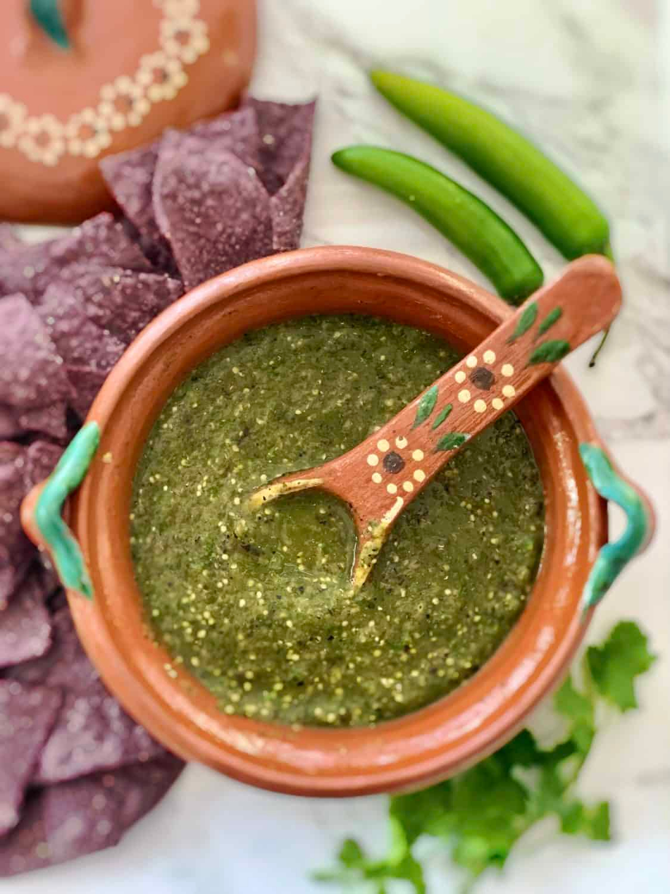

# Southwest Salsa Verde

*The Southwest's green table salsa: roasted tomatillos, fresh jalapeños, garlic, cilantro and lime, blitzed to a chunky bright green salsa. The canonical Southwest table condiment, on tacos, enchiladas, eggs.*

**Serves:** Makes 500 ml

**Prep Time:** 15 minutes

**Cook Time:** 8 minutes

## Overview
Southwest salsa verde is the canonical green table salsa across the Southwestern United States, distinct from the smoother cooked-then-blended Mexican version: tomatillos (the Mexican husk tomato; canned or fresh) briefly cooked, then blitzed with fresh jalapeño, garlic, raw chopped white onion, fresh cilantro, lime juice, ground cumin and salt into a chunky vibrant green salsa. Eaten as table condiment, in enchiladas suizas, drizzled on tacos, with chips.

## Ingredients

- 600 g tomatillos (husks removed); or 1 large tin tomatillos drained
- 4 fresh jalapeños (deseed for milder)
- 6 garlic cloves
- 1 medium white onion (half chopped fine for blender, half raw for finishing)
- 1 large bunch fresh coriander
- Juice of 2 limes
- 1 tablespoon ground cumin
- 1 teaspoon dried Mexican oregano
- 1 ½ teaspoons fine sea salt
- 1 teaspoon caster sugar (balances)

## Method

### Stage 1 - Cook tomatillos
1. Place tomatillos in saucepan with water to cover; bring to boil; simmer 8 minutes till olive-green. Drain.

### Stage 2 - Blend
1. Place cooked tomatillos in blender with chillies, garlic, half the onion (chopped), coriander, lime juice, cumin, oregano, salt, sugar.
2. Blitz to a chunky salsa; keep some texture.

### Stage 3 - Add raw onion
1. Stir in the finely chopped raw onion.
2. Taste; adjust salt.

### Stage 4 - Rest and serve
1. Rest 20 minutes for flavours to marry.

## Notes
- **Tomatillos canonical.**
- **Chunky texture, not smooth.**
- **Eat fresh.**

## Variations
**Smoother:** blend fully.
**Spicier:** double chillies.
**With avocado:** add 1 ripe avocado; gives a creamier version.

## Serving
With tortilla chips, on tacos, in enchiladas suizas, on eggs.

## Storage
- Keeps refrigerated 5 days.
- Don't freeze.
