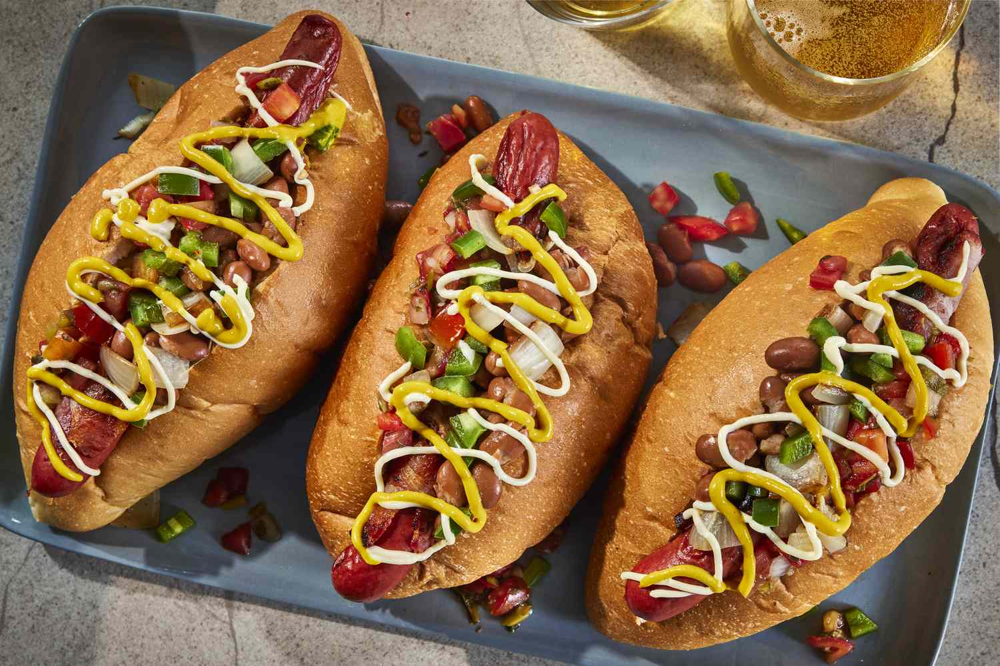

# Sonoran Hot Dog

*Arizona's bacon-wrapped hot dog: a hot dog wrapped in bacon, grilled till the bacon crisps, served in a Mexican bolillo bread roll with pinto beans, diced tomato, chopped onion, mayonnaise, mustard, jalapeño salsa and a whole roasted yellow chile. The Tucson border classic, Mexican-American street food at its most excessive.*

**Serves:** 4

**Prep Time:** 20 minutes

**Cook Time:** 20 minutes

## Overview
The Sonoran hot dog is Arizona's most beloved street food and a Tucson-Phoenix specialty borrowed from the Sonora region of Mexico just across the border: an American beef hot dog wrapped in a strip of bacon, grilled or pan-fried till the bacon crisps to deep golden, then nestled into a soft Mexican bolillo bread roll (the traditional bun; or substitute with a soft hot dog bun) which has been hollowed out slightly. Topped with: warm pinto beans, finely chopped raw onion, diced fresh tomato, generous lines of mayonnaise and yellow mustard, jalapeño salsa (verde or roja), and finished with a whole roasted yellow chile pepper (chile güero) on top. Each bite gives bacon-crisp, juicy hot dog, sweet bun, savoury beans, fresh vegetables, creamy mayo and chile heat, the traditional Tucson "Sonoran". The dish became iconic in Tucson in the 1980s and has spread across Arizona and into California.

## Ingredients

### Hot dogs
- 4 good-quality beef hot dogs
- 4 strips smoked bacon

### Buns
- 4 bolillo rolls (Mexican; or substitute with soft hot dog buns or French-style baguette pieces)

### Toppings
- 400 g warm pinto beans (cooked from dried, or canned drained-and-warmed)
- 1 medium onion (finely chopped)
- 2 medium tomatoes (diced)
- 4 tablespoons mayonnaise (the traditional Mexican-style mayo with lime works well)
- 3 tablespoons yellow mustard
- 4 tablespoons salsa verde (or red salsa)
- 4 fresh güero (banana) peppers (roasted): or substitute with pickled jalapeños

### Optional
- Crumbled queso fresco
- Sour cream
- Hot sauce
- Sliced avocado
- Lime wedges
- Crushed Fritos (for crunch)

## Method

### Stage 1 - Wrap the hot dogs
1. Wrap each hot dog in a strip of bacon, spiraling around the hot dog.
2. Secure with toothpicks if needed.

### Stage 2 - Grill or pan-fry
1. Heat a heavy frying pan or grill over medium heat.
2. Cook bacon-wrapped hot dogs 8-10 minutes, turning frequently, till bacon is deeply crisp on all sides and the hot dog is heated through.

### Stage 3 - Toast the buns
1. Toast or warm the bolillo rolls briefly.
2. Slit each lengthwise but not all the way through; hollow out a small channel in the centre.

### Stage 4 - Build the dog
1. In each warm bun, lay a generous spoonful of warm pinto beans.
2. Place the bacon-wrapped hot dog on top.
3. Add lines of chopped onion, diced tomato, mayonnaise, mustard.
4. Drizzle salsa verde.
5. Top with a whole roasted güero pepper or pickled jalapeño.
6. Optional: add sliced avocado, sour cream, queso fresco, crushed Fritos.

### Stage 5 - Serve immediately
1. Provide napkins (it's a messy dish).
2. Cold Mexican beer or Mexican coke.

## Notes
- **Bacon-wrapped non-negotiable.**
- **Bolillo roll traditional:** the Mexican bread.
- **Multiple toppings:** the heap is the point.
- **Whole chile on top:** the Sonoran signature.

## Variations
**Spicier:** add chopped habanero salsa; double the jalapeños.
**With Fritos:** sprinkle crushed Fritos over for crunch.
**Vegetarian:** swap hot dog for grilled vegetable sausage; bacon for crispy fried tofu strips.
**Mini Sonoran dogs:** smaller hot dogs and buns; party canapé size.

## Serving
At the centre of a Tucson street-cart or as a Sunday weekend dinner. Cold Mexican beer (Pacifico, Modelo, Tecate), Mexican coke, or fresh limeade.

## Storage
- Best eaten fresh.
- Cooked bacon-wrapped hot dogs reheat briefly in pan.
- Don't refrigerate assembled.
