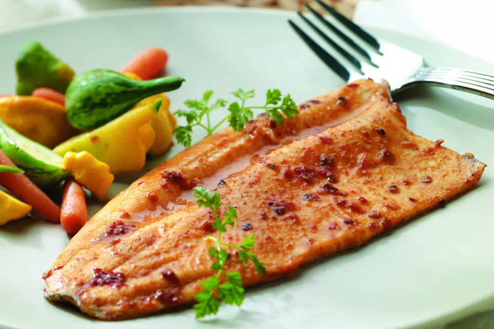

# Southwest Grilled Trout

*The Southwest's chile-rubbed grilled trout: whole rainbow trout (a high-altitude Southwest favourite) rubbed with a spice blend of cumin, paprika, chili powder and lime zest, stuffed with lemon, garlic and herbs, then grilled over hot charcoal till the skin crisps and the flesh flakes easily. The mountain-Southwest dish, Colorado, Northern New Mexico and Arizona high country.*

**Serves:** 4

**Prep Time:** 15 minutes

**Cook Time:** 15 minutes

## Overview
Southwest grilled trout celebrates the rainbow trout that swims in the high-altitude streams of the Rocky Mountain Southwest (Colorado, northern New Mexico, Arizona's high country): whole rainbow trout (the traditional regional fish; substitute with any whole trout, sea bass, or red snapper) rubbed inside and out with a Southwest spice blend (cumin, paprika, chili powder, dried Mexican oregano, garlic powder, lime zest, salt, pepper), stuffed with lemon slices, crushed garlic and fresh herbs (parsley, thyme, sage), then grilled over hot charcoal (or pan-grilled) for 5-6 minutes per side till the skin crisps and the flesh inside flakes easily. Served with a wedge of lemon and a sprinkle of fresh coriander.

## Ingredients

- 4 whole rainbow trout (about 350 g each; cleaned, scaled, head on)

### Spice rub
- 2 tablespoons ground cumin
- 2 tablespoons paprika (sweet)
- 1 tablespoon chili powder
- 2 teaspoons dried Mexican oregano
- 1 teaspoon garlic powder
- 1 teaspoon onion powder
- 1 teaspoon ground cayenne pepper
- Zest of 2 limes (finely grated)
- 1 tablespoon fine sea salt
- 1 teaspoon ground black pepper

### Stuffing
- 2 lemons (sliced)
- 8 garlic cloves (lightly crushed)
- Small bunch fresh parsley
- Small bunch fresh thyme
- 8 sage leaves

### Cooking
- 4 tablespoons olive oil

### To serve
- Lime wedges
- Fresh coriander
- Salsa verde
- Crusty bread
- Grilled vegetables (corn on the cob, sliced zucchini)

## Method

### Stage 1 - Prep the fish
1. Rinse trout; pat dry inside and out.
2. Score the skin in 3 diagonal cuts on each side (helps even cooking).

### Stage 2 - Mix spice rub
1. Combine all rub ingredients.

### Stage 3 - Apply rub and stuff
1. Rub the spice blend all over the fish (outside and inside the cavity).
2. Stuff each fish with 2-3 lemon slices, 2 crushed garlic cloves, sprigs of parsley, thyme, and a few sage leaves.
3. Drizzle with olive oil.

### Stage 4 - Prepare the grill
1. Light a charcoal grill; let burn to glowing embers.
2. Brush grill grates with oil.

### Stage 5 - Grill
1. Place fish on the hot grill.
2. Cook 5-6 minutes on the first side without moving.
3. Carefully flip with a wide spatula (or use a fish-grilling basket).
4. Cook 4-5 minutes on the second side.
5. The flesh should flake easily; the eyes should be opaque.

### Stage 6 - Serve
1. Transfer to plates.
2. Squeeze lime over.
3. Scatter coriander.
4. Salsa verde on the side.
5. Crusty bread, grilled vegetables.

## Notes
- **Whole fish for proper flavour.**
- **Score the skin for even cooking.**
- **Stuff the cavity for fragrance.**
- **Don't overcook:** 10-12 minutes total.

## Variations
**Cedar-plank grilled:** soak a cedar plank; cook the trout on the plank for a smoky flavour.
**Spicier:** double the cayenne.
**With pine nuts and currants:** add toasted pine nuts and currants to the cavity stuffing; gives Native American Southwest twist.

## Serving
With grilled corn, salsa verde, beans, rice. Cold beer or white wine.

## Storage
- Best eaten fresh.
- Flesh keeps refrigerated 2 days; cold trout flakes are excellent in salads.
