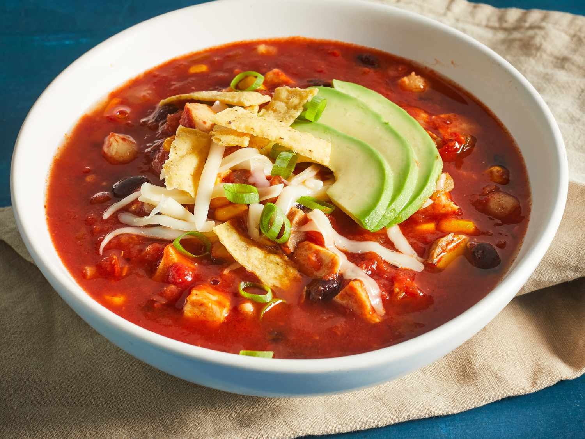

# Southwest Tortilla Soup

*The Southwest's chicken-tomato soup: a deeply spiced chicken broth with shredded chicken, tomato, garlic, cumin, chili and lime, finished at the table with fried tortilla strips, sliced avocado, grated cheese and sour cream. The Sonoran-Arizona-New Mexico traditional bowl.*

**Serves:** 6

**Prep Time:** 20 minutes

**Cook Time:** 45 minutes

## Overview
Tortilla soup is the Southwestern American answer to the Yucatecan sopa de lima (the Mexican lime chicken soup): a richly spiced chicken broth with shredded chicken, blended tomatoes, onion, garlic, chipotle in adobo, cumin, chili powder, and Mexican oregano, finished at the table with crispy fried tortilla strips, sliced avocado, grated cheese, sour cream, fresh coriander and lime wedges. The dish is the traditional Southwestern restaurant soup and a comfort-food classic across Arizona, New Mexico and Texas.

## Ingredients

### Broth
- 1.2 kg whole chicken (or 6 bone-in thighs)
- 3 litres water
- 1 large onion (halved)
- 8 garlic cloves
- 4 bay leaves
- 1 tablespoon whole peppercorns
- 1 ½ teaspoons fine sea salt

### Soup base
- 4 tablespoons vegetable oil
- 1 large onion (chopped)
- 8 garlic cloves (crushed)
- 6 ripe tomatoes (chopped); or 1 tin chopped tomatoes
- 2 chipotle peppers in adobo (chopped) + 1 tablespoon adobo sauce
- 4 tablespoons tomato paste
- 2 tablespoons chili powder
- 1 tablespoon ground cumin
- 1 tablespoon dried Mexican oregano
- 1 teaspoon smoked paprika
- 1 ½ teaspoons fine sea salt
- 1 teaspoon ground black pepper

### Tortilla strips
- 8 corn tortillas (cut into thin strips)
- 200 ml vegetable oil
- 1 teaspoon flaky sea salt

### To finish
- Juice of 2 limes
- 1 large bunch fresh coriander (chopped)

### Table garnishes
- 1 ripe avocado (sliced)
- 200 g grated Monterey Jack
- 200 ml sour cream
- Fresh sliced jalapeños
- Lime wedges
- Hot sauce
- Sliced spring onions

## Method

### Stage 1 - Cook the chicken
1. Place chicken in large pot with water, onion, garlic, bay leaves, peppercorns and salt.
2. Bring to simmer; cook 35 minutes till chicken is tender.
3. Lift out; shred meat from bones; reserve broth.

### Stage 2 - Build soup base
1. Heat oil in wide pot; sauté onion 8 minutes.
2. Add garlic; cook 30 seconds.
3. Add tomato paste; cook 2 minutes.
4. Add chopped tomatoes; cook 5 minutes.
5. Add chipotles and adobo; chili powder, cumin, oregano, smoked paprika, salt, pepper.

### Stage 3 - Combine
1. Pour 2 litres of the chicken broth into the pot.
2. Add the shredded chicken.
3. Simmer 15 minutes.

### Stage 4 - Fry tortilla strips
1. Heat 200 ml oil; fry tortilla strips 2 minutes till crispy.
2. Drain; salt.

### Stage 5 - Finish broth
1. Squeeze lime juice into soup.
2. Stir in coriander.

### Stage 6 - Serve at the table
1. Ladle soup into deep bowls.
2. Provide tortilla strips, avocado, cheese, sour cream, jalapeños, lime, hot sauce, spring onions.
3. Each diner garnishes their own bowl.

## Notes
- **Tortilla strips at the table:** stay crispy.
- **Chipotle gives smoky depth.**
- **Hot broth over fresh garnishes.**

## Variations
**Smoother base:** blend the soup base before adding chicken; gives a creamier texture.
**With black beans:** add tin of drained black beans.
**Spicier:** double the chipotles.
**With corn:** add fresh corn kernels.

## Serving
In deep bowls with all the traditional garnishes. Mexican beer.

## Storage
- Soup base keeps refrigerated 5 days; flavour deepens.
- Freezes 3 months without garnishes.
- Tortilla strips don't keep; fry fresh.
