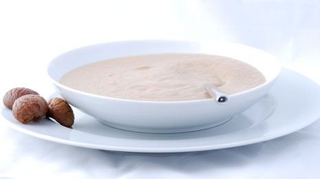

# Chestnut and Chorizo Soup

*Sopa de Castañas*

**Serves:** 4

**Prep Time:** 20 minutes

**Cook Time:** 30 minutes

## Overview
Sopa de castañas is the slow autumn soup of Spain's mountain regions, where sweet chestnuts thrive on the slopes and the larders carry chorizo, saffron and dried chillies through the cold months. The whole thing turns on a single technique: a long slow caramelisation of finely diced onion, carrot, celery and cubed chorizo in olive oil over 20 minutes till everything softens to deep gold and the chorizo releases its smoky paprika-stained fat into the pan. In go thinly sliced garlic, ground cumin, fresh thyme and a couple of small dried chillies for a minute, then chopped tomatoes for another two till they break down. The chestnuts (cooked and peeled from a vacuum pack, the most reasonable shortcut) join with hot water and saffron strands steeped in boiling water, and the whole pot simmers gently for ten minutes till the flavours bind. Off the heat, rest five minutes, then crush gently with a potato masher till the soup is smooth with some texture still showing through (don't blitz it to puree, the bits of chestnut are the pleasure). Taste, season generously, ladle into deep bowls with crusty bread alongside and a glass of something Spanish next to it.

## Ingredients

### Base
- 4 tablespoons olive oil

### Aromatics
- 1 onion (large)
- 1 carrot (medium)
- 1 celery stalk
- 2 garlic cloves

### Protein
- 120 grams chorizo

### Vegetables
- 2 tomatoes
- 500 grams cooked chestnuts (peeled)

### Seasonings
- 1 teaspoon ground cumin
- 2 teaspoons fresh thyme leaves
- 2 dried red chillies (small)
- 20 saffron strands
- salt
- pepper

### Liquid/Broth
- 1 litre water

## Method

### Stage 1 - Prepare ingredients
1. Finely dice the onion, carrot and celery stalk.
2. Cut the chorizo into 1 cm cubes.
3. Thinly slice the garlic.
4. Finely chop the thyme leaves.
5. Crush the garlic.
6. Roughly chop the tomatoes.
7. Add the saffron strands to 4 tablespoons of boiling water.

### Stage 2 - Caramelize vegetables
1. In a large saucepan, heat the oil over a low to medium heat.
2. Add the onion, carrot, celery and chorizo with a pinch of salt.
3. Fry the vegetables, stirring occasionally for about 20 minutes until everything caramelises.

### Stage 3 - Build soup
1. Add the garlic, cumin, thyme and chilli and cook for a further minute.
2. Add the tomato and cook for a further 2 minutes.
3. Add the chestnuts, and stir everything together.
4. Add the saffron infused liquid along with the water.
5. Simmer for about 10 minutes.
6. Remove from the heat and allow to cool for 5 minutes.

### Stage 4 - Finish and serve
1. Using a potato masher, mash the soup until it is smooth with a little texture.
2. Season with salt and pepper.

## Notes
- **Chestnuts:** Use cooked and peeled chestnuts for convenience; fresh can be roasted if preferred.
- **Chorizo:** Spanish chorizo adds spice and smokiness; adjust for heat level.
- **Saffron:** Infuse in hot water to release flavor; it's expensive but essential for authenticity.
- **Mashing:** Leave some texture for interest; blend if you prefer smoother.

## Serving
Serve hot with crusty bread or a dollop of sour cream. Garnish with extra thyme if desired.

## Storage
- Refrigerate up to 3 days; flavors improve overnight.
- Freezes well for up to 2 months.
- Best eaten warm; reheat gently.

*This recipe is based on the classic flavours of the mountainous regions of Spain where sweet chestnuts thrive, producing a warm and comforting autumnal soup.*
