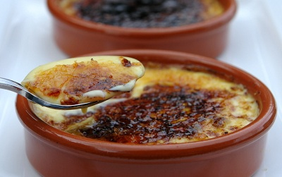

# Crema Catalana

*Catalonia's burnt-cream pudding: a chilled custard scented with lemon zest and cinnamon.*

**Serves:** 4

**Prep Time:** 10 minutes

## Ingredients
- 750 ml milk (ideally goats)
- 1 heaped teaspoon fennel seeds (crushed)
- 1 cinnamon stick (small, broken)
- 150 grams caster sugar
- 1 orange zest (finely grated)
- 1 lemon zest (finely grated)
- 2 eggs
- 6 egg yolks
- 40 grams cornflour
- 80 grams demerara sugar

## Overview
Crema catalana is Catalonia's answer to crème brûlée, an older dish by some accounts, a silky chilled custard scented with fennel seeds, cinnamon and the zest of both orange and lemon, finished with a thin crackling layer of burnt demerara sugar. The Middle Eastern influences come through in the spice mix; the dish belongs to the long Catalan tradition of using citrus and cinnamon together. Bring milk to a boil with fennel seeds, a small broken cinnamon stick and 100 g of caster sugar, then off the heat add the orange and lemon zests and let everything infuse covered for five to ten minutes. Whisk two whole eggs and six yolks with the remaining sugar for 30 seconds, work in cornflour to a smooth paste, then slowly strain the infused milk into the egg mixture while whisking continuously. Return everything to the pan and cook over gentle heat for three minutes, whisking constantly, till the custard thickens and coats the back of a wooden spoon. Spoon into shallow individual dishes (about 14 cm across, 3 cm deep) and smooth lightly with the back of a spoon, then cool and chill at least two hours till set. Just before serving, sprinkle half the demerara across each crema and torch lightly to caramelise (or set briefly under a hot grill), wait five minutes for the heat to settle, then repeat with the rest of the sugar for a generous double layer. Serve at once while the caramel is warm and crisp and the custard underneath stays cold, the contrast in both temperature and texture being the whole pleasure.

## Method
1. Put the milk, fennel seeds, cinnamon and 100 grams of the caster sugar in a saucepan and bring to the boil. 
1. As soon as it boils, add the citrus zests. Take off the heat, cover and leave to infuse for 5 - 10 minutes.
1. Put the eggs, egg yolks and remaining 50 grams of the caster sugar into a bowl and mix with a balloon whisk for 30 seconds.
1. Add the cornflour and mix well. 
1. Slowly strain the milk through a chinois or sieve into the egg mixture, stirring with a whisk as you do so, then return to the pan.
1. Cook the mixture over a gentle heat for 3 minutes, until thickened, stirring all the time with a whisk. 
1. Spoon into shallow individual dishes, about 14 cm in diameter and 3 cm deep, smoothing it lightly and evenly with the back of a spoon. 
1. Leave to cool, then chill in the fridge for at least 2 hours.
1. Sprinkle half the demerara sugar evenly over the cremas, then wave a cooks blowtorch over the surface to caramelise lightly, or place briefly under a hot grill. 
1. Wait 5 minutes, then repeat to create a generous caramel layer. 
1. Serve at once, to fully appreciate the contrast of the warm, crisp caramel and the cold crema underneath.

## Notes
- The infusion of fennel seeds, cinnamon, and citrus zests imparts distinctive warm spice flavor; the 5-10 minute infusion time is sufficient without over-infusing
- The cornflour-thickened custard is less silky than traditional custard but sets properly without gelatine, creating a unique texture that is essential to the dish
- The double torching (creating two layers of caramel) produces a more satisfying thickness and flavor than a single torch round; waiting 5 minutes between applications prevents over-heating the custard underneath
- Serving immediately while the contrast between warm, crisp caramel and cold cream is maximum enhances the appeal

## Serving
Spoon from the individual dishes directly into serving bowls, breaking through the caramel crust to reveal the spiced cream within. Serve immediately, enjoying the textural and temperature contrast. no accompaniment is necessary.

## Storage
The custard bases can be made 1 day ahead and refrigerated in their chilling dishes, covered with plastic film. The caramelized sugar coating must be applied no more than 30 minutes before serving; beyond that, the sugar coating gradually softens from the custard's moisture. These are best served the day they are made.
