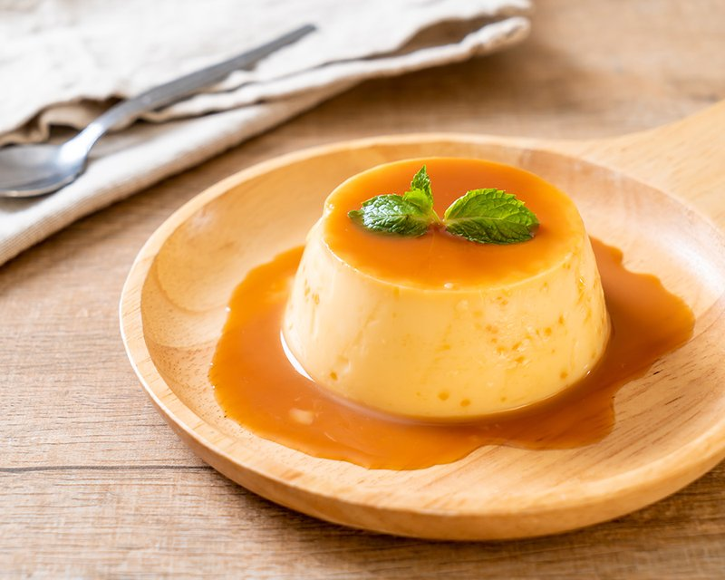

# Flan de Huevo (Spanish Egg Flan)

*Spain's national pudding: a lighter caramel custard of whole eggs and milk, inverted onto a plate so the amber caramel pours down the dome.*

**Serves:** 6

**Prep Time:** 20 minutes

**Cook Time:** 45 minutes (plus 4 hours chilling)

## Overview
Sugar caramelises in a small heavy pan until amber; tilts to coat the bottom of 6 ramekins. Milk warms with lemon zest and a vanilla pod. Eggs whisk gently with sugar; the warm milk drizzles in, tempering. Strain through a fine sieve to remove zest and any cooked egg. Pour over the caramel in the ramekins. Bake in a water bath at 150°C 40 minutes (the custards should be just-set with a slight wobble). Cool; chill at least 4 hours. Invert at service.

## Ingredients

### Caramel
- 150 g caster sugar
- 2 tablespoons water

### Custard
- 600 ml whole milk
- 1 strip lemon peel (yellow zest only)
- 1 vanilla pod (split, seeds scraped, or 1 teaspoon vanilla extract)
- 4 eggs (large)
- 2 egg yolks (extra)
- 100 g caster sugar

## Method

### Stage 1 - Caramel
1. Combine the 150 g sugar and 2 tablespoons water in a small heavy pan.
1. Heat over medium without stirring; swirl occasionally as the sugar dissolves.
1. Cook 6-8 minutes until amber-mahogany.
1. Working quickly, pour the caramel into 6 ramekins (about 150 ml each), tilting to coat the bottom of each.
1. Set aside to harden.

### Stage 2 - Infuse milk
1. In a small pan, warm the milk with the lemon peel and split vanilla pod (and seeds).
1. Bring to just-simmering; remove from heat; cover; infuse 15 minutes.

### Stage 3 - Custard
1. In a wide bowl, whisk the 4 eggs and 2 extra yolks gently with the 100 g sugar - don't aerate (air bubbles spoil the surface).
1. Strain the warm infused milk through a fine sieve into the eggs, whisking continuously.
1. Strain the whole mixture again through a fine sieve into a jug.

### Stage 4 - Fill the ramekins
1. Pour the custard mixture over the hardened caramel in each ramekin.
1. Cover each ramekin with foil (keeps water out, gives even cooking).

### Stage 5 - Water bath bake
1. Heat the oven to 150°C (130°C fan).
1. Place ramekins in a deep baking dish; pour hot water around them halfway up the sides.
1. Bake 40-45 minutes - the custards should be just set with a slight wobble in the centre.
1. Test with a knife inserted at the edge: should come out clean.

### Stage 6 - Cool and chill
1. Lift the ramekins out of the water; remove foil.
1. Cool to room temperature; cover; chill at least 4 hours (overnight is better).

### Stage 7 - Serve
1. Run a thin knife around the edge of each flan.
1. Invert onto a small plate; lift the ramekin away.
1. The caramel will pour down like a glaze.
1. Serve cold.

## Notes
- **Whole eggs, not just yolks:** Spanish flan uses whole eggs, giving a lighter, slightly more eggy custard than the French (yolks only) or Filipino (yolks + condensed milk) versions. The extra 2 yolks add richness without making it dense.
- **Don't aerate the eggs:** whisk gently with a fork. Beaten with an electric whisk you get bubbles in the set custard.
- **Strain twice:** removes lemon zest fragments, vanilla seeds clumps and any chalazae from the eggs. Silky flan is non-negotiable.
- **150°C is the right oven temp:** higher and the custard curdles; lower and it doesn't set properly. The water bath stabilises the temperature.

## Storage
- Keeps 4 days refrigerated, covered.
- Tastes best on day 2 as the caramel sets fully.
- Doesn't freeze well - texture goes grainy.
