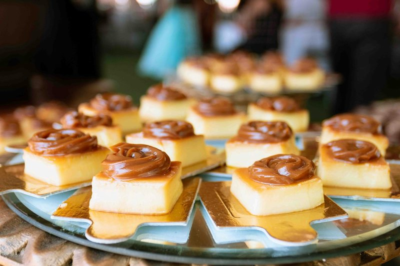

# Leche Frita (Fried Milk)

*Spain's fried milk: a thick milk custard set firm, dredged in flour and egg, then fried crisp gold and dusted in cinnamon sugar.*

**Serves:** 6 (makes 18 squares)

**Prep Time:** 30 minutes (plus 4 hours chilling)

**Cook Time:** 15 minutes

## Overview
Leche frita is the Spanish dessert with the deceptive name ("fried milk"): squares of thick cinnamon-and-lemon custard set firm, breadcrumbed and pan-fried in olive oil till the outside cracks crisp and the inside is still soft and almost melting, then tossed in cinnamon sugar while still hot. The whole dish hinges on getting the custard cooked firm enough to cube: standard pastry cream is too soft; you want it like wallpaper paste with the spoon standing up in it. Milk infuses with lemon peel and a cinnamon stick, strains into a thick paste of sugar, cornflour, plain flour and egg yolks that cooks over gentle heat for six to eight minutes, whisked constantly, past the point of normal custard till it holds a spoon. Set in a 20 cm tray to 1½ cm depth and chilled at least four hours till firm enough to cut into squares. Floured, egg-dipped, fried in 175 °C olive oil till deep gold, tossed hot in cinnamon sugar. Eat warm so the soft-melting middle meets the crisp amber shell.

## Ingredients

### Custard base
- 600 ml whole milk
- 1 strip lemon peel
- 1 cinnamon stick
- 100 g caster sugar
- 40 g cornflour
- 40 g plain flour
- 4 egg yolks (large)
- 30 g unsalted butter
- 1 teaspoon vanilla extract

### Coating
- 80 g plain flour
- 2 eggs (large, beaten)

### Frying
- 400 ml mild olive oil (or neutral oil)

### Finishing
- 4 tablespoons caster sugar
- 2 teaspoons ground cinnamon

## Method

### Stage 1 - Infuse milk
1. Combine the milk, lemon peel and cinnamon stick in a saucepan.
1. Warm to just below a simmer; off heat; cover; infuse 15 minutes.
1. Strain (discard solids).

### Stage 2 - Make custard
1. In a wide bowl, whisk the sugar, cornflour and plain flour.
1. Add the egg yolks; whisk to a thick paste.
1. Pour in a quarter of the warm infused milk; whisk smooth.
1. Pour in the remaining milk; whisk smooth.
1. Return the mixture to the saucepan over medium-low heat.
1. Whisk continuously for 6-8 minutes; the custard will thicken dramatically. Keep going past "thick custard" to "wallpaper paste" consistency, it needs to set firm.
1. Off heat; whisk in the butter and vanilla.

### Stage 3 - Set
1. Line a small square tray (20 × 20 cm) with parchment.
1. Pour the custard in; smooth the surface with a spatula to 1 ½ cm depth.
1. Cover the surface directly with cling film (prevents skin).
1. Chill at least 4 hours (overnight is better).

### Stage 4 - Cut
1. Lift the set custard out of the tray using the parchment.
1. Cut into squares about 4 × 4 cm (you should get 18-20).

### Stage 5 - Coat
1. Spread the 80 g plain flour on a plate.
1. Whisk the 2 eggs in a wide bowl.
1. Dredge each custard square in flour (very gently, they're fragile); dip in egg; the coating should be even.

### Stage 6 - Fry
1. Heat the oil in a wide pan to 175°C.
1. Lower 4-5 squares at a time.
1. Fry 1-2 minutes per side, turning carefully, until deep golden.
1. The squares are fragile; use two spoons or a slotted spatula.
1. Lift onto a wire rack lined with kitchen paper.

### Stage 7 - Finish
1. Combine the 4 tablespoons caster sugar and 2 teaspoons cinnamon in a wide bowl.
1. Toss the hot fried squares in the cinnamon sugar.

### Stage 8 - Serve
1. Pile on a plate; eat warm.
1. The interior should be soft, almost melting custard; the exterior crisp and amber.

## Notes
- **Cook the custard FIRM:** standard creme pat consistency is too soft to cube. Cook until it's like thick wallpaper paste, the spoon stands up in it.
- **Chill long enough:** under-set custard collapses during the dredge-and-fry. 4 hours minimum at fridge temperature.
- **HANDLE GENTLY:** the squares are fragile. Use two spatulas or a wide slotted spoon. A delicate touch keeps them intact.
- **Eat warm:** the soft-inside / crisp-outside contrast is the soul of the dish. Cold leche frita is good but lacks the magic.

## Storage
- Best within 30 minutes of frying.
- The custard base alone keeps 2 days refrigerated; fry to order.
- Don't freeze the custard, texture goes grainy.
- Don't refrigerate fried leche frita, the crust softens.
